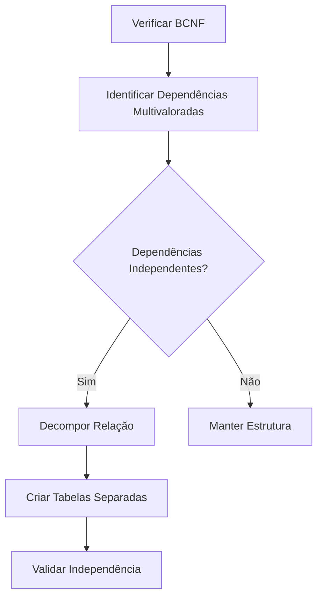

# Quarta Forma Normal (4FN)

## Definição

A Quarta Forma Normal (4FN) é um nível avançado de normalização que exige:
1. A tabela deve estar na BCNF
2. Não deve haver dependências multivaloradas não-triviais

## Conceitos Fundamentais

### 1. Dependência Multivalorada
- Ocorre quando um atributo determina um conjunto de valores de outro atributo
- Representada como A →→ B (A determina múltiplos valores de B)
- Independente de outros atributos na relação

### 2. Independência Mútua
- Atributos multivalorados devem ser independentes entre si
- Não deve haver correlação entre conjuntos de valores
- Base para identificação de violações 4FN

## Exemplos Práticos

### Exemplo 1: Funcionário e Habilidades

#### Violação da 4FN
```sql
-- Tabela não normalizada
CREATE TABLE Funcionario_Habilidade_Projeto (
    funcionario_id INT,
    habilidade VARCHAR(50),
    projeto VARCHAR(100),
    PRIMARY KEY (funcionario_id, habilidade, projeto)
);
-- Problema: habilidades e projetos são independentes
```

#### Aplicação da 4FN
```sql
-- Tabelas normalizadas
CREATE TABLE Funcionario_Habilidade (
    funcionario_id INT,
    habilidade VARCHAR(50),
    PRIMARY KEY (funcionario_id, habilidade)
);

CREATE TABLE Funcionario_Projeto (
    funcionario_id INT,
    projeto VARCHAR(100),
    PRIMARY KEY (funcionario_id, projeto)
);
```

### Exemplo 2: Estudante e Atividades

#### Violação da 4FN
```sql
-- Tabela não normalizada
CREATE TABLE Estudante_Curso_Atividade (
    estudante_id INT,
    curso VARCHAR(100),
    atividade_extra VARCHAR(100),
    PRIMARY KEY (estudante_id, curso, atividade_extra)
);
```

#### Aplicação da 4FN
```sql
-- Tabelas normalizadas
CREATE TABLE Estudante_Curso (
    estudante_id INT,
    curso VARCHAR(100),
    PRIMARY KEY (estudante_id, curso)
);

CREATE TABLE Estudante_Atividade (
    estudante_id INT,
    atividade_extra VARCHAR(100),
    PRIMARY KEY (estudante_id, atividade_extra)
);
```

## Processo de Normalização

### 1. Identificação de Dependências


### 2. Passos para Normalização
1. Confirmar BCNF
2. Identificar dependências multivaloradas
3. Verificar independência
4. Decompor quando necessário
5. Validar decomposição

## Benefícios

### 1. Estrutura de Dados
- Eliminação de redundância
- Melhor organização
- Relacionamentos claros

### 2. Integridade
- Dados consistentes
- Atualizações simplificadas
- Menor risco de anomalias

## Considerações Práticas

### 1. Implementação
```sql
-- Exemplo de migração para 4FN
INSERT INTO Funcionario_Habilidade (funcionario_id, habilidade)
SELECT DISTINCT funcionario_id, habilidade
FROM funcionario_habilidade_projeto;

INSERT INTO Funcionario_Projeto (funcionario_id, projeto)
SELECT DISTINCT funcionario_id, projeto
FROM funcionario_habilidade_projeto;
```

### 2. Performance
- Análise de impacto
- Necessidade de joins
- Otimização de consultas

## Checklist de Validação

### 1. Verificação
- [ ] Tabela está em BCNF?
- [ ] Dependências multivaloradas identificadas?
- [ ] Independência verificada?
- [ ] Decomposição adequada?

### 2. Testes
- [ ] Integridade mantida
- [ ] Dados consistentes
- [ ] Consultas eficientes
- [ ] Atualizações corretas

## Anti-Padrões

### 1. Violações Comuns
```sql
-- Anti-padrão: Dependências multivaloradas misturadas
CREATE TABLE Professor_Disciplina_Livro (
    professor_id INT,
    disciplina VARCHAR(100),
    livro_referencia VARCHAR(200),
    PRIMARY KEY (professor_id, disciplina, livro_referencia)
);

-- Correção
CREATE TABLE Professor_Disciplina (
    professor_id INT,
    disciplina VARCHAR(100),
    PRIMARY KEY (professor_id, disciplina)
);

CREATE TABLE Professor_Livro (
    professor_id INT,
    livro_referencia VARCHAR(200),
    PRIMARY KEY (professor_id, livro_referencia)
);
```

### 2. Soluções
- Identificar dependências independentes
- Separar em relações distintas
- Manter rastreabilidade
- Documentar decisões

## Conclusão

A Quarta Forma Normal é essencial para:
- Eliminar redundâncias complexas
- Garantir independência de dados
- Facilitar manutenção
- Melhorar integridade

Deve ser implementada considerando:
- Complexidade do domínio
- Requisitos de consulta
- Necessidades de performance
- Facilidade de manutenção