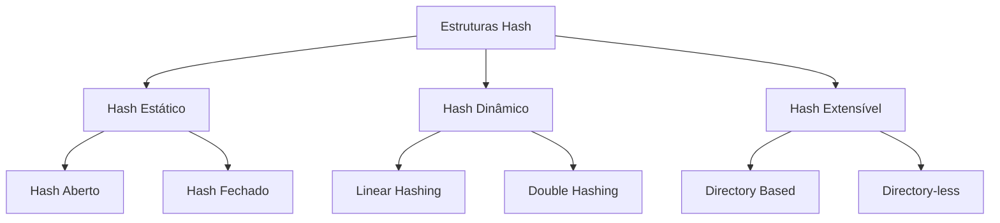
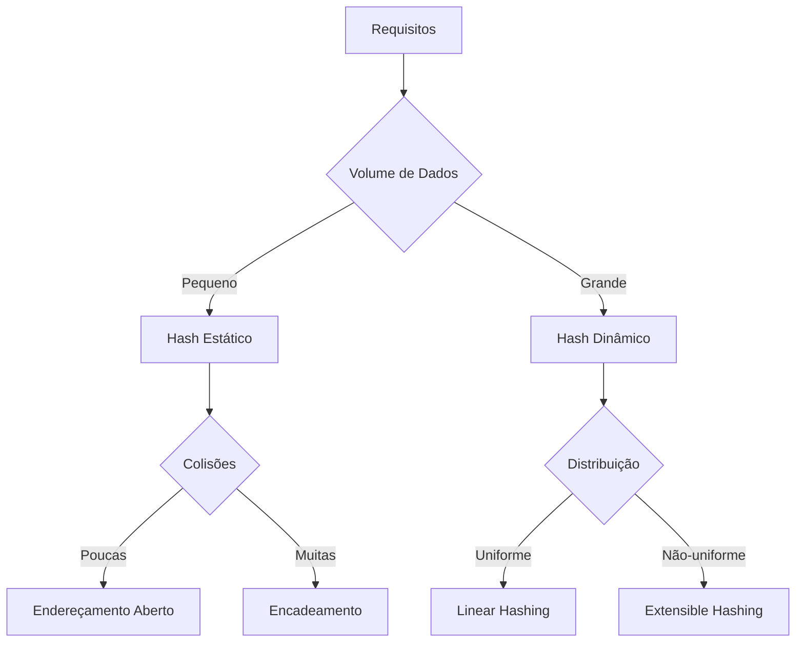
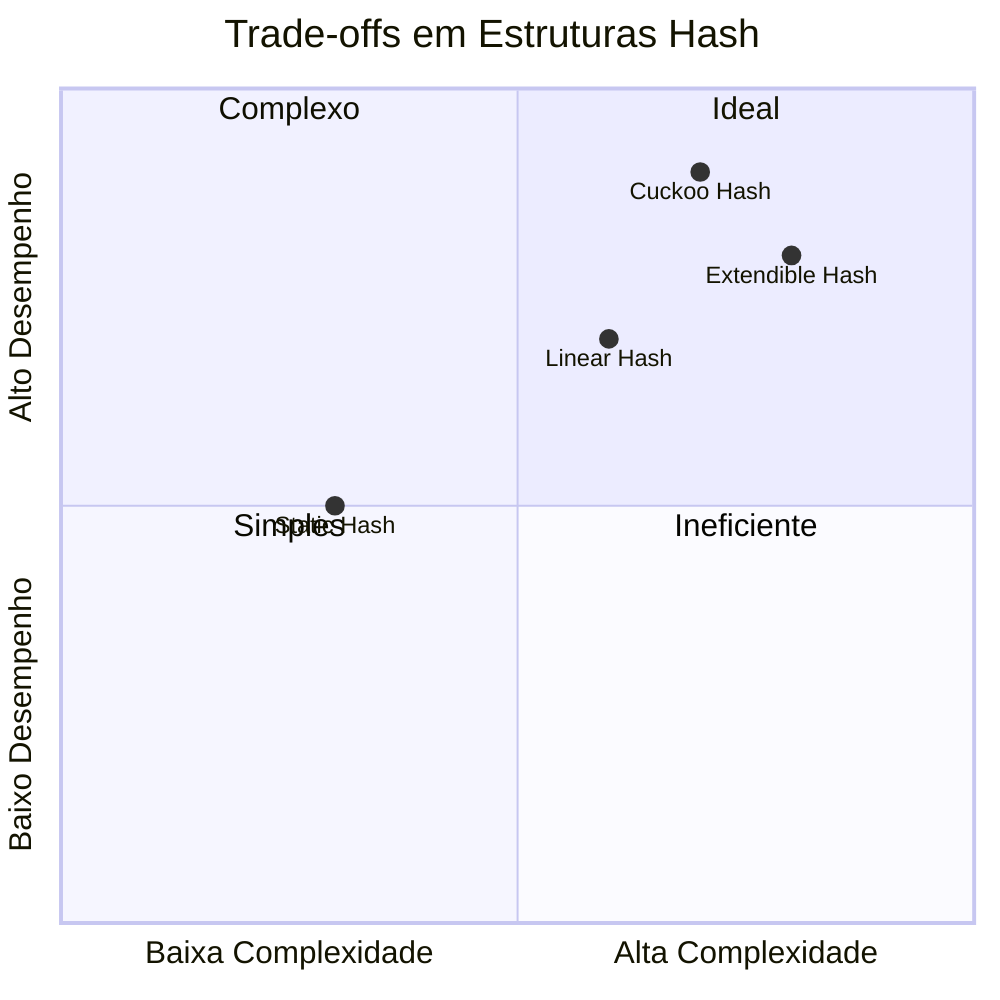

# Estruturas Hash

## Fundamentos



### 1. Funções Hash
```java
class HashFunction {
    // Multiplicação
    long multiplyHash(String key, int tableSize) {
        long hash = 0;
        for (char c : key.toCharArray()) {
            hash = 31 * hash + c;
        }
        return Math.abs(hash % tableSize);
    }
    
    // FNV Hash
    long fnvHash(byte[] data) {
        long hash = 0xcbf29ce484222325L;
        for (byte b : data) {
            hash *= 0x100000001b3L;
            hash ^= b;
        }
        return hash;
    }
}
```

### 2. Tratamento de Colisões
#### Encadeamento Externo
```java
class Node<K,V> {
    K key;
    V value;
    Node<K,V> next;
    
    Node(K key, V value) {
        this.key = key;
        this.value = value;
    }
}

class HashTable<K,V> {
    private Node<K,V>[] table;
    private int size;
    
    @SuppressWarnings("unchecked")
    public HashTable(int capacity) {
        table = (Node<K,V>[]) new Node[capacity];
        size = 0;
    }
    
    public void put(K key, V value) {
        int index = hash(key);
        Node<K,V> node = table[index];
        
        while (node != null) {
            if (node.key.equals(key)) {
                node.value = value;
                return;
            }
            node = node.next;
        }
        
        Node<K,V> newNode = new Node<>(key, value);
        newNode.next = table[index];
        table[index] = newNode;
        size++;
    }
}
```

#### Endereçamento Aberto
```java
class OpenAddressingHash<K,V> {
    private Entry<K,V>[] table;
    private int size;
    private static final double LOAD_FACTOR = 0.75;
    
    private static class Entry<K,V> {
        K key;
        V value;
        boolean isDeleted;
        
        Entry(K key, V value) {
            this.key = key;
            this.value = value;
        }
    }
    
    public V get(K key) {
        int index = findKey(key);
        return index != -1 ? table[index].value : null;
    }
    
    private int findKey(K key) {
        int hash = hash(key);
        int i = 0;
        
        while (i < table.length) {
            int j = (hash + probe(i)) % table.length;
            
            if (table[j] == null) return -1;
            if (!table[j].isDeleted && 
                table[j].key.equals(key)) {
                return j;
            }
            i++;
        }
        return -1;
    }
    
    private int probe(int i) {
        return i * i;  // Quadratic probing
    }
}
```

## Hash Dinâmico

### 1. Linear Hashing
```java
class LinearHash<K,V> {
    private ArrayList<Bucket<K,V>> buckets;
    private int splitPointer;
    private int level;
    private double loadFactor;
    
    private static class Bucket<K,V> {
        Map<K,V> entries;
        int localDepth;
        
        Bucket(int depth) {
            entries = new HashMap<>();
            localDepth = depth;
        }
    }
    
    public void insert(K key, V value) {
        int bucketIndex = getBucketIndex(key);
        Bucket<K,V> bucket = buckets.get(bucketIndex);
        
        bucket.entries.put(key, value);
        
        if (shouldSplit()) {
            split();
        }
    }
    
    private void split() {
        Bucket<K,V> oldBucket = buckets.get(splitPointer);
        Bucket<K,V> newBucket = new Bucket<>(level);
        
        // Redistribuir entradas
        Map<K,V> oldEntries = oldBucket.entries;
        oldBucket.entries = new HashMap<>();
        
        for (Map.Entry<K,V> entry : oldEntries.entrySet()) {
            int newIndex = getBucketIndex(entry.getKey());
            if (newIndex == splitPointer) {
                oldBucket.entries.put(entry.getKey(), 
                                    entry.getValue());
            } else {
                newBucket.entries.put(entry.getKey(), 
                                    entry.getValue());
            }
        }
        
        buckets.add(newBucket);
        splitPointer++;
        
        if (splitPointer == Math.pow(2, level)) {
            splitPointer = 0;
            level++;
        }
    }
}
```

### 2. Extendible Hashing
```java
class ExtendibleHash<K,V> {
    private Directory<K,V> directory;
    private int globalDepth;
    
    private static class Directory<K,V> {
        Bucket<K,V>[] buckets;
        int size;
        
        @SuppressWarnings("unchecked")
        Directory(int size) {
            this.size = size;
            buckets = new Bucket[size];
        }
    }
    
    private static class Bucket<K,V> {
        Map<K,V> entries;
        int localDepth;
        static final int CAPACITY = 4;
        
        Bucket(int depth) {
            entries = new HashMap<>();
            localDepth = depth;
        }
        
        boolean isFull() {
            return entries.size() >= CAPACITY;
        }
    }
    
    public void insert(K key, V value) {
        int dirIndex = hash(key) & ((1 << globalDepth) - 1);
        Bucket<K,V> bucket = directory.buckets[dirIndex];
        
        if (bucket.isFull()) {
            if (bucket.localDepth == globalDepth) {
                doubleDirectory();
            }
            split(dirIndex);
            insert(key, value);
        } else {
            bucket.entries.put(key, value);
        }
    }
    
    private void split(int bucketIndex) {
        Bucket<K,V> oldBucket = directory.buckets[bucketIndex];
        Bucket<K,V> newBucket = new Bucket<>(oldBucket.localDepth + 1);
        
        Map<K,V> oldEntries = oldBucket.entries;
        oldBucket.entries = new HashMap<>();
        oldBucket.localDepth++;
        
        int mask = 1 << (oldBucket.localDepth - 1);
        for (Map.Entry<K,V> entry : oldEntries.entrySet()) {
            int newIndex = hash(entry.getKey()) & ((1 << oldBucket.localDepth) - 1);
            if ((newIndex & mask) == 0) {
                oldBucket.entries.put(entry.getKey(), entry.getValue());
            } else {
                newBucket.entries.put(entry.getKey(), entry.getValue());
            }
        }
        
        // Atualizar diretório
        for (int i = 0; i < directory.size; i++) {
            if (directory.buckets[i] == oldBucket && (i & mask) != 0) {
                directory.buckets[i] = newBucket;
            }
        }
    }
}
```

## Otimizações

### 1. Cache-Conscious Hashing
```java
class CacheOptimizedHash<K,V> {
    private static final int CACHE_LINE_SIZE = 64;
    private static final int ENTRIES_PER_BUCKET = 
        CACHE_LINE_SIZE / (8 + 8); // key + value ptr
    
    private static class Bucket<K,V> {
        long[] keys;
        V[] values;
        int size;
        
        @SuppressWarnings("unchecked")
        Bucket() {
            keys = new long[ENTRIES_PER_BUCKET];
            values = (V[]) new Object[ENTRIES_PER_BUCKET];
        }
    }
}
```

### 2. Concurrent Hashing
```java
class ConcurrentHash<K,V> {
    private static final int SHARD_COUNT = 16;
    private final HashTable<K,V>[] shards;
    private final ReentrantLock[] locks;
    
    @SuppressWarnings("unchecked")
    public ConcurrentHash() {
        shards = new HashTable[SHARD_COUNT];
        locks = new ReentrantLock[SHARD_COUNT];
        
        for (int i = 0; i < SHARD_COUNT; i++) {
            shards[i] = new HashTable<>();
            locks[i] = new ReentrantLock();
        }
    }
    
    public V put(K key, V value) {
        int shardIndex = getShard(key);
        locks[shardIndex].lock();
        try {
            return shards[shardIndex].put(key, value);
        } finally {
            locks[shardIndex].unlock();
        }
    }
    
    private int getShard(K key) {
        return Math.abs(key.hashCode() % SHARD_COUNT);
    }
}
```

## Estruturas Especializadas

### 1. Bloom Filter
```java
class BloomFilter<T> {
    private BitSet bitset;
    private int size;
    private int numHashFunctions;
    private HashFunction[] hashFunctions;
    
    public BloomFilter(int size, int numHash) {
        this.size = size;
        this.numHashFunctions = numHash;
        this.bitset = new BitSet(size);
        this.hashFunctions = new HashFunction[numHash];
        
        for (int i = 0; i < numHash; i++) {
            hashFunctions[i] = new HashFunction(i);
        }
    }
    
    public void add(T item) {
        for (HashFunction hf : hashFunctions) {
            bitset.set(hf.hash(item) % size);
        }
    }
    
    public boolean mightContain(T item) {
        for (HashFunction hf : hashFunctions) {
            if (!bitset.get(hf.hash(item) % size)) {
                return false;
            }
        }
        return true;
    }
}
```

### 2. Cuckoo Hashing
```java
class CuckooHash<K,V> {
    private static final int MAX_LOOP = 100;
    private Entry<K,V>[][] tables;
    private HashFunction[] hashFunctions;
    
    private static class Entry<K,V> {
        K key;
        V value;
        
        Entry(K key, V value) {
            this.key = key;
            this.value = value;
        }
    }
    
    @SuppressWarnings("unchecked")
    public CuckooHash(int capacity) {
        tables = new Entry[2][capacity];
        hashFunctions = new HashFunction[]{
            new HashFunction(0),
            new HashFunction(1)
        };
    }
    
    public boolean insert(K key, V value) {
        Entry<K,V> entry = new Entry<>(key, value);
        
        for (int i = 0; i < MAX_LOOP; i++) {
            for (int j = 0; j < 2; j++) {
                int pos = hashFunctions[j].hash(key) % tables[j].length;
                Entry<K,V> temp = tables[j][pos];
                tables[j][pos] = entry;
                
                if (temp == null) return true;
                entry = temp;
            }
        }
        
        // Rehash needed
        return false;
    }
}
```

## Monitoramento e Manutenção

### 1. Métricas
```java
class HashMetrics {
    private long collisions;
    private long resizes;
    private double loadFactor;
    private long[] bucketSizes;
    
    public void recordCollision() {
        collisions++;
    }
    
    public void recordResize() {
        resizes++;
    }
    
    public void updateLoadFactor(int entries, int capacity) {
        loadFactor = (double) entries / capacity;
    }
    
    public String getStats() {
        return String.format(
            "Collisions: %d\nResizes: %d\nLoad Factor: %.2f",
            collisions, resizes, loadFactor
        );
    }
}
```

### 2. Auto-tuning
```java
class AdaptiveHash<K,V> {
    private static final double RESIZE_THRESHOLD = 0.75;
    private static final double COLLISION_THRESHOLD = 0.1;
    
    private HashTable<K,V> table;
    private HashMetrics metrics;
    
    public void tune() {
        if (metrics.getLoadFactor() > RESIZE_THRESHOLD) {
            resize(table.capacity() * 2);
        }
        
        if (metrics.getCollisionRate() > COLLISION_THRESHOLD) {
            changeHashFunction();
        }
    }
    
    private void changeHashFunction() {
        HashFunction[] candidates = {
            new MultiplyHash(),
            new FNVHash(),
            new MurmurHash()
        };
        
        // Avaliar e selecionar a melhor função
        HashFunction best = evaluateHashFunctions(candidates);
        table.setHashFunction(best);
    }
}
```

## Considerações Práticas

### 1. Escolha da Estrutura


### 2. Trade-offs
- Memória vs. Velocidade
- Complexidade vs. Flexibilidade
- Concorrência vs. Consistência
- Localidade vs. Distribuição

