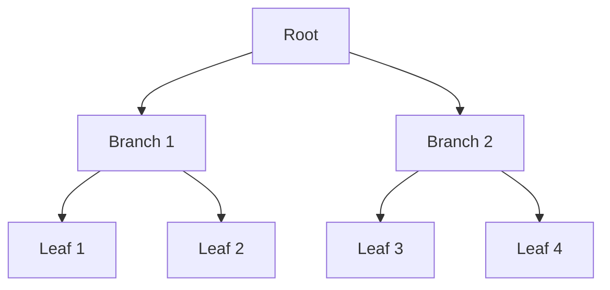

# Design de Índices

## Tipos de Índices

### 1. B-Tree


### 2. Hash
- Tabela de hash
- Função de hash
- Tratamento de colisões
- Casos de uso

### 3. Bitmap
```sql
-- Exemplo de índice bitmap
CREATE BITMAP INDEX idx_status
ON pedidos(status)
TABLESPACE index_tbs;
```

## Estratégias de Indexação

### 1. Seleção de Colunas
- Seletividade
- Frequência de acesso
- Padrões de consulta
- Cardinalidade

### 2. Manutenção
```sql
-- Reorganização de índice
ALTER INDEX idx_nome REBUILD;

-- Análise de estatísticas
ANALYZE TABLE tabela 
COMPUTE STATISTICS FOR ALL INDEXES;
```

### 3. Monitoramento
- Usage tracking
- Fragmentação
- Hit ratio
- I/O stats