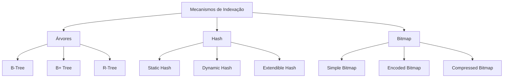
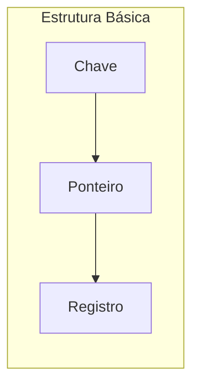
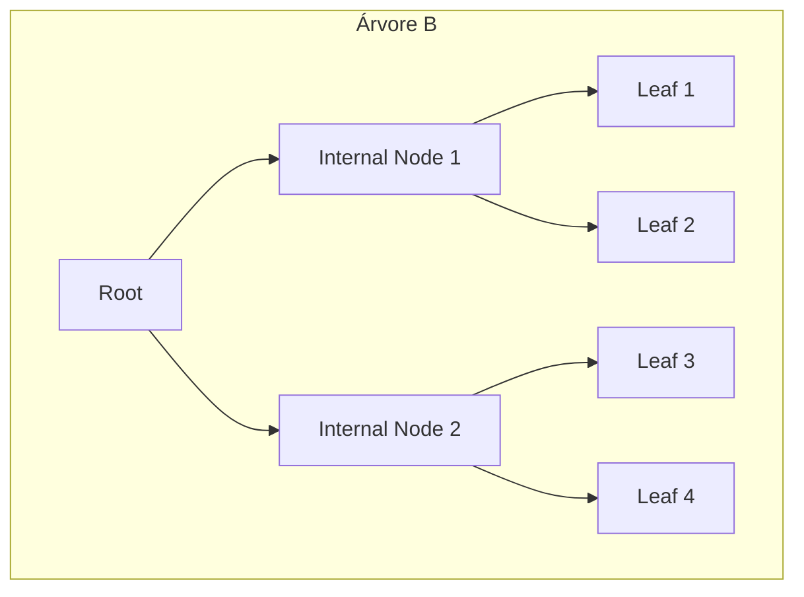
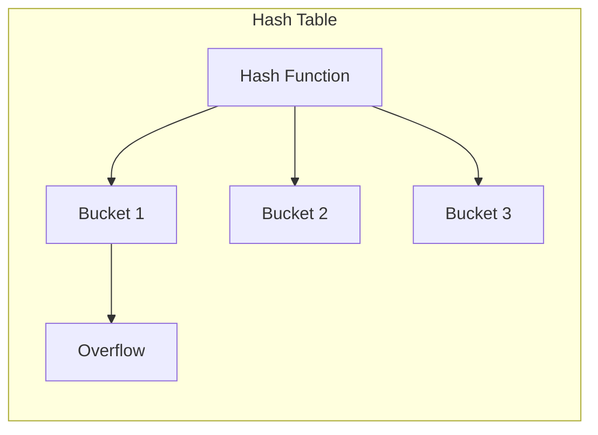
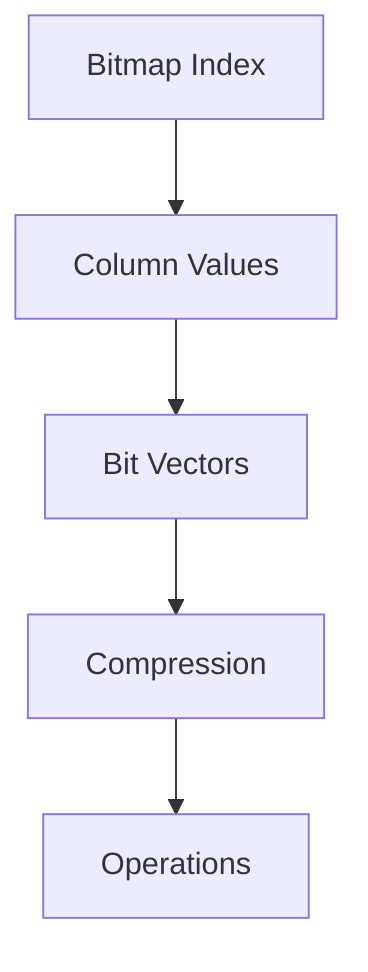
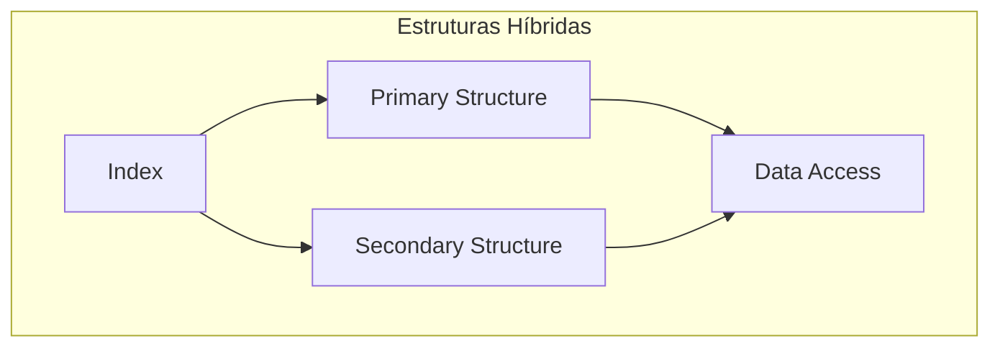
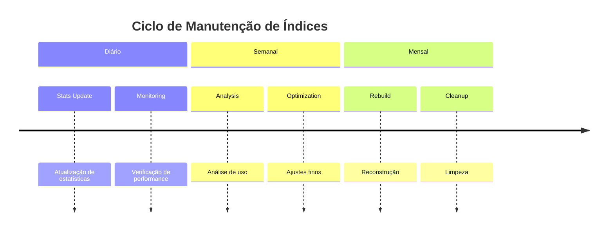
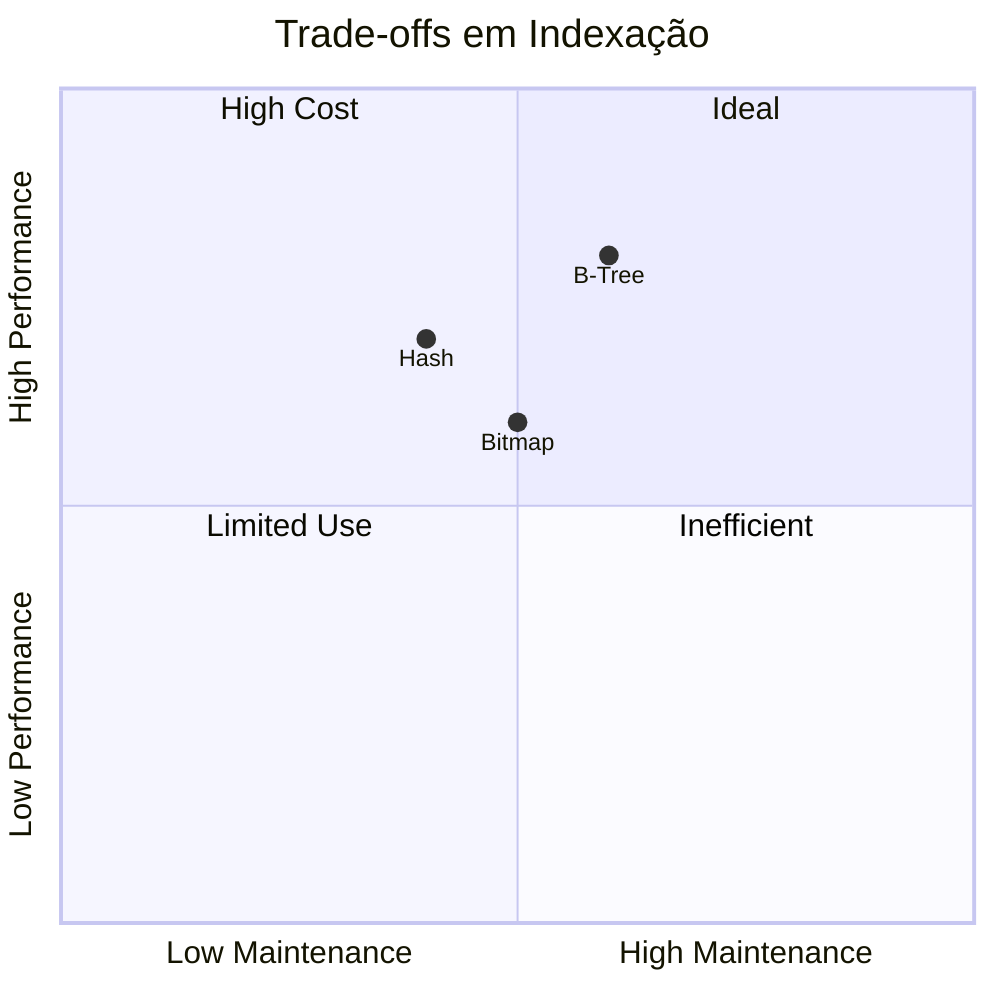

# Mecanismos de Indexação

Os mecanismos de indexação são estruturas fundamentais que otimizam o acesso aos dados em sistemas de banco de dados.

## Fundamentos de Indexação

### 1. Conceitos Básicos
- Chaves de busca
- Registros de índice
- Densidade de índice
- Seletividade

### 2. Classificação
- Primário vs. Secundário
- Denso vs. Esparso
- Clustered vs. Non-clustered
- Single-level vs. Multi-level

## Estruturas de Árvore

### 1. Árvores B
- Propriedades
- Operações básicas
- Balanceamento
- Split e Merge

### 2. Árvores B+
- Estrutura de folhas
- Sequência de folhas
- Range queries
- Bulk loading

## Estruturas Hash

### 1. Hashing Estático
- Funções hash
- Tratamento de colisões
- Fator de carga
- Overflow chains

### 2. Hashing Dinâmico
- Directory structure
- Split operations
- Merge operations
- Directory management

## Índices Bitmap

### 1. Estrutura Básica
- Vetores de bits
- Operações lógicas
- Compressão
- Atualização

### 2. Otimizações
- Encoding schemes
- Compression techniques
- Cardinality handling
- Update strategies

## Técnicas Avançadas

### 1. Índices Especializados
- Spatial indexes
- Temporal indexes
- Full-text indexes
- JSON indexes

### 2. Estruturas Híbridas
- Hash-tree combination
- Bitmap-tree indexes
- Multi-dimensional indexes
- Adaptive indexes

## Otimização e Manutenção

### 1. Estratégias de Criação
- Index selection
- Key selection
- Storage allocation
- Build optimization

### 2. Manutenção
- Statistics update
- Reorganization
- Rebuild operations
- Monitoring

## Performance e Trade-offs

### 1. Métricas de Avaliação
- Access time
- Storage overhead
- Maintenance cost
- Query impact

### 2. Considerações Práticas
- Workload analysis
- Storage constraints
- Update frequency
- Query patterns

## Tendências e Inovações

### 1. Novas Tecnologias
- Machine learning indexes
- Learned index structures
- Hardware-aware indexes
- Cloud-optimized indexes

### 2. Otimizações Emergentes
- Auto-indexing
- Adaptive indexing
- Predictive maintenance
- Quantum-resistant structures

