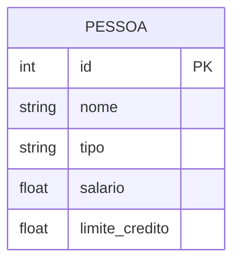
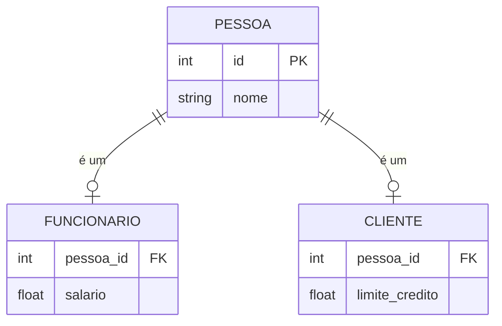
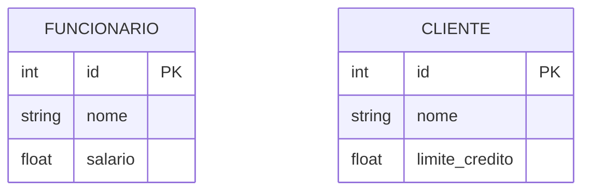

# Padrões de Herança

## Single Table Inheritance



### Implementação
```sql
CREATE TABLE pessoa (
    id INT PRIMARY KEY,
    nome VARCHAR(100),
    tipo VARCHAR(20),
    salario DECIMAL(10,2) NULL,
    limite_credito DECIMAL(10,2) NULL
);
```

## Class Table Inheritance



### Implementação
```sql
CREATE TABLE pessoa (
    id INT PRIMARY KEY,
    nome VARCHAR(100)
);

CREATE TABLE funcionario (
    pessoa_id INT PRIMARY KEY,
    salario DECIMAL(10,2),
    FOREIGN KEY (pessoa_id) REFERENCES pessoa(id)
);

CREATE TABLE cliente (
    pessoa_id INT PRIMARY KEY,
    limite_credito DECIMAL(10,2),
    FOREIGN KEY (pessoa_id) REFERENCES pessoa(id)
);
```

## Concrete Table Inheritance



### Implementação
```sql
CREATE TABLE funcionario (
    id INT PRIMARY KEY,
    nome VARCHAR(100),
    salario DECIMAL(10,2)
);

CREATE TABLE cliente (
    id INT PRIMARY KEY,
    nome VARCHAR(100),
    limite_credito DECIMAL(10,2)
);
```