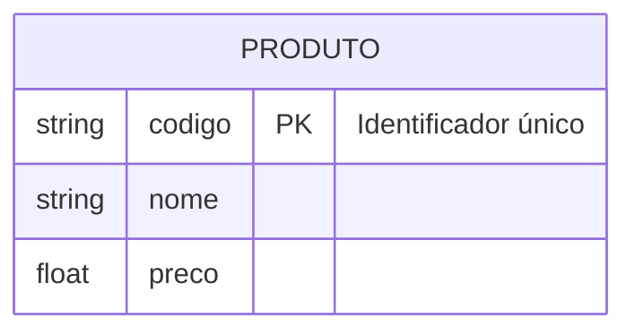
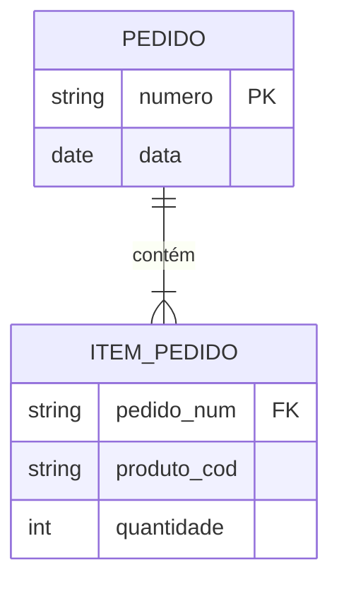
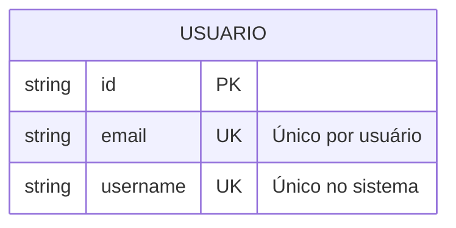
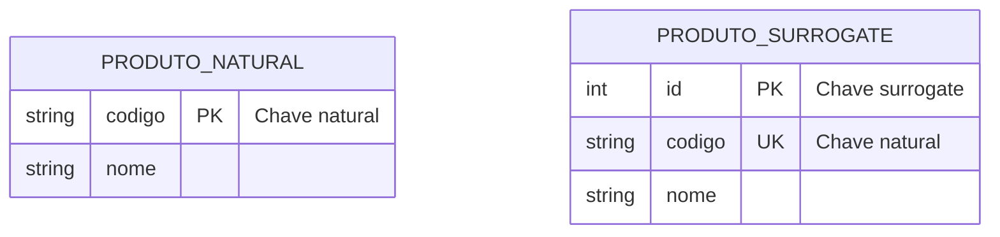
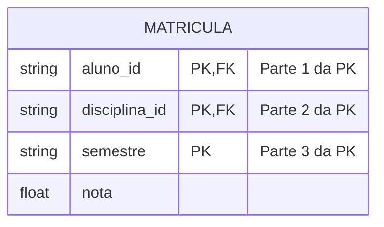

# Restrições de Chave

As restrições de chave são fundamentais para garantir a integridade e unicidade dos dados em um modelo ER.

## Tipos de Chaves

### 1. Chave Primária (PK)



#### Características
- Identifica unicamente cada registro
- Não pode conter valores nulos
- Deve ser imutável
- Pode ser simples ou composta

#### Exemplos
- CPF em uma tabela de clientes
- Número de matrícula de alunos
- ISBN para livros

### 2. Chave Estrangeira (FK)



#### Características
- Referencia uma chave primária
- Mantém integridade referencial
- Pode ser nula (relacionamento opcional)
- Pode participar de chave primária composta

#### Regras de Integridade
- Valor deve existir na tabela referenciada
- Atualização em cascata (opcional)
- Deleção em cascata (opcional)

### 3. Chave Única (UK)



#### Características
- Garante unicidade do valor
- Pode conter nulos (diferente da PK)
- Múltiplas por entidade
- Útil para campos alternativos de busca

## Implementação

### 1. SQL DDL

```sql
CREATE TABLE Cliente (
    cpf VARCHAR(11) PRIMARY KEY,
    email VARCHAR(100) UNIQUE,
    telefone VARCHAR(20) UNIQUE,
    CONSTRAINT valid_cpf CHECK (LENGTH(cpf) = 11)
);

CREATE TABLE Pedido (
    numero SERIAL PRIMARY KEY,
    cliente_cpf VARCHAR(11) REFERENCES Cliente(cpf),
    data DATE NOT NULL
);
```

### 2. Mapeamento Objeto-Relacional

```java
@Entity
public class Cliente {
    @Id
    private String cpf;
    
    @Column(unique = true)
    private String email;
    
    @Column(unique = true)
    private String telefone;
}
```

## Boas Práticas

### 1. Escolha de Chaves Primárias
- Prefira valores naturais e imutáveis
- Considere o tamanho do campo
- Evite chaves compostas complexas
- Use surrogate keys quando apropriado

### 2. Gestão de Chaves Estrangeiras
- Defina política de atualização/deleção
- Considere impacto na performance
- Planeje índices adequadamente
- Documente relacionamentos

### 3. Unicidade
- Identifique campos que exigem unicidade
- Considere unicidade combinada
- Planeje validações em múltiplas camadas
- Trate conflitos adequadamente

## Padrões Comuns

### 1. Chave Natural vs Surrogate



### 2. Chave Composta



## Considerações de Performance

### 1. Indexação
- Índices automáticos em PKs
- Índices opcionais em FKs
- Índices únicos para UKs
- Impacto em inserções/atualizações

### 2. Joins
- Otimização de consultas
- Cardinalidade das relações
- Estratégias de indexação
- Planos de execução

## Conclusão

Restrições de chave são essenciais para:
- Garantir integridade dos dados
- Estabelecer relacionamentos
- Otimizar consultas
- Manter consistência

Uma implementação adequada:
- Previne duplicidades
- Facilita manutenção
- Melhora performance
- Garante qualidade dos dados