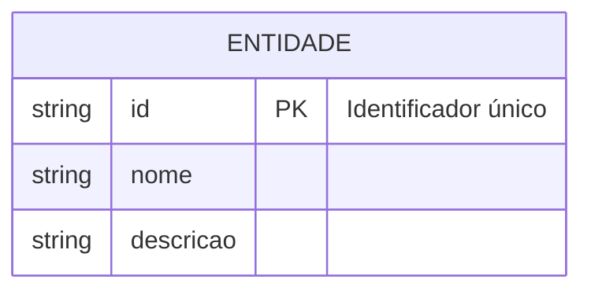
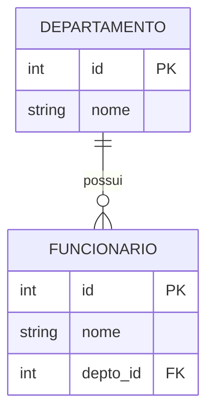
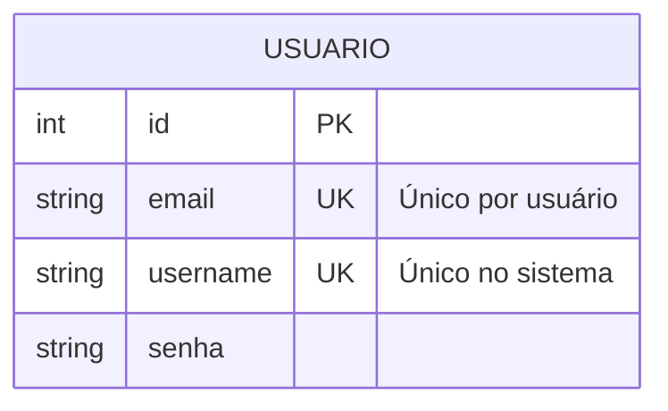
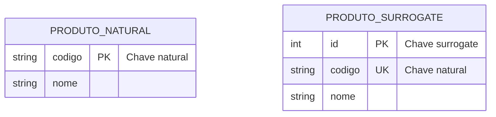
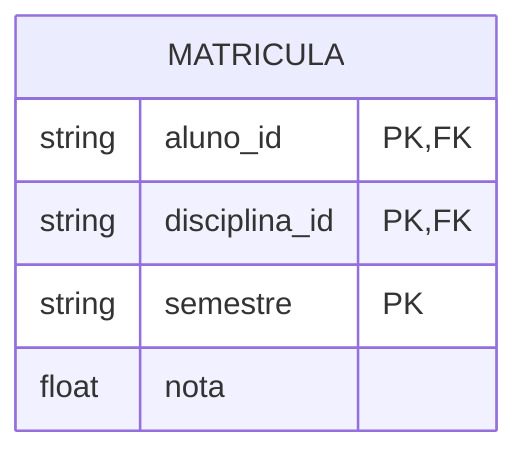

# Restrições de Chave

## Tipos de Chaves

### 1. Chave Primária (Primary Key - PK)



#### Características
- Identifica unicamente cada tupla
- Não permite valores nulos
- Imutável
- Pode ser simples ou composta

#### Exemplos
```sql
CREATE TABLE Produto (
    codigo SERIAL PRIMARY KEY,
    nome VARCHAR(100) NOT NULL,
    preco DECIMAL(10,2)
);

-- Chave composta
CREATE TABLE ItemPedido (
    pedido_id INTEGER,
    produto_id INTEGER,
    quantidade INTEGER,
    PRIMARY KEY (pedido_id, produto_id)
);
```

### 2. Chave Estrangeira (Foreign Key - FK)



#### Características
- Referencia chave primária de outra tabela
- Mantém integridade referencial
- Pode ser nula (relacionamento opcional)
- Suporta ações referenciais (CASCADE, SET NULL, etc.)

#### Exemplos
```sql
CREATE TABLE Funcionario (
    id INTEGER PRIMARY KEY,
    nome VARCHAR(100),
    depto_id INTEGER,
    FOREIGN KEY (depto_id) 
        REFERENCES Departamento(id)
        ON DELETE SET NULL
        ON UPDATE CASCADE
);
```

### 3. Chave Única (Unique Key - UK)



#### Características
- Garante unicidade dos valores
- Permite valores nulos (diferente da PK)
- Múltiplas por tabela
- Pode ser composta

#### Exemplos
```sql
CREATE TABLE Usuario (
    id SERIAL PRIMARY KEY,
    email VARCHAR(100) UNIQUE,
    username VARCHAR(50) UNIQUE,
    senha VARCHAR(255)
);
```

## Implementação em ORMs

### 1. JPA/Hibernate (Java)
```java
@Entity
public class Cliente {
    @Id
    @GeneratedValue(strategy = GenerationType.IDENTITY)
    private Long id;
    
    @Column(unique = true)
    private String email;
    
    @ManyToOne
    @JoinColumn(name = "categoria_id")
    private Categoria categoria;
}
```

### 2. Django ORM (Python)
```python
class Produto(models.Model):
    codigo = models.CharField(max_length=20, primary_key=True)
    sku = models.CharField(max_length=50, unique=True)
    categoria = models.ForeignKey(
        'Categoria',
        on_delete=models.CASCADE
    )
```

## Boas Práticas

### 1. Escolha de Chaves Primárias
- Use valores naturais quando apropriado
- Considere surrogate keys para flexibilidade
- Evite chaves compostas complexas
- Mantenha a imutabilidade

### 2. Gestão de Chaves Estrangeiras
- Defina ações referenciais apropriadas
- Considere o impacto na integridade
- Use índices para performance
- Documente relacionamentos

### 3. Unicidade
- Identifique campos que exigem unicidade
- Implemente validações em múltiplas camadas
- Considere unicidade combinada
- Trate conflitos adequadamente

## Padrões Comuns

### 1. Chaves Naturais vs Surrogate


### 2. Chaves Compostas


## Considerações de Performance

### 1. Indexação
- Índices automáticos em PKs
- Índices opcionais em FKs
- Índices únicos para UKs
- Impacto em inserções/atualizações

### 2. Joins
- Otimização de consultas
- Cardinalidade das relações
- Estratégias de indexação
- Planos de execução