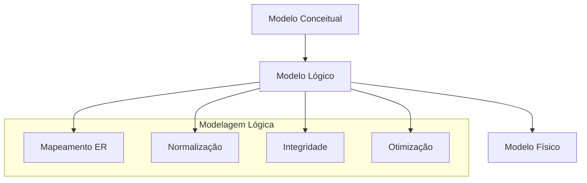
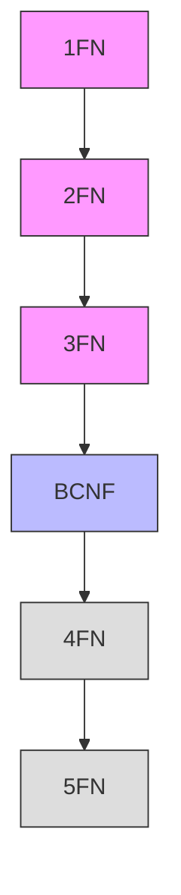
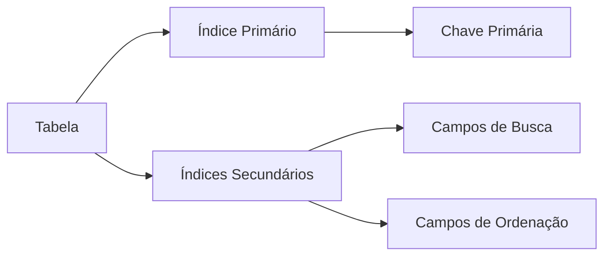

# Modelagem Lógica

A modelagem lógica representa a segunda fase do processo de modelagem de dados, transformando o modelo conceitual em uma estrutura mais próxima da implementação.

## Visão Geral



## Processo de Transformação

### 1. Mapeamento ER para Relacional

```mermaid
erDiagram
    CLIENTE ||--o{ PEDIDO : possui
    PEDIDO ||--|{ ITEM : contém
    
    CLIENTE {
        PK id
        nome
        email
    }
    
    PEDIDO {
        PK numero
        FK cliente_id
        data
        total
    }
    
    ITEM {
        PK pedido_id
        PK produto_id
        quantidade
        preco
    }
```

#### Regras de Mapeamento

1. **Entidades**
   - Cada entidade vira uma tabela
   - Atributos viram colunas
   - Identificadores viram chaves primárias

2. **Relacionamentos**
   - 1:1 → Chave estrangeira
   - 1:N → Chave estrangeira no lado N
   - N:M → Tabela associativa

## Normalização

### Formas Normais



### Exemplo de Normalização

#### Tabela Original
```
PEDIDO (numero_pedido, data, cliente_nome, cliente_email, produto_nome, quantidade, preco_unitario)
```

#### Após Normalização
```sql
CREATE TABLE Cliente (
    id INT PRIMARY KEY,
    nome VARCHAR(100),
    email VARCHAR(100)
);

CREATE TABLE Pedido (
    numero INT PRIMARY KEY,
    data DATE,
    cliente_id INT REFERENCES Cliente(id)
);

CREATE TABLE ItemPedido (
    pedido_numero INT,
    produto_id INT,
    quantidade INT,
    preco_unitario DECIMAL(10,2),
    PRIMARY KEY (pedido_numero, produto_id)
);
```

## Integridade de Dados

### 1. Restrições de Integridade

- **Entidade**
  - Chaves primárias
  - Valores únicos
  - Não nulos

- **Referencial**
  - Chaves estrangeiras
  - Ações referenciais
  - Consistência

- **Domínio**
  - Tipos de dados
  - Intervalos válidos
  - Regras de negócio

### 2. Exemplo de Restrições

```sql
CREATE TABLE Produto (
    id INT PRIMARY KEY,
    nome VARCHAR(100) NOT NULL,
    preco DECIMAL(10,2) CHECK (preco > 0),
    categoria_id INT,
    FOREIGN KEY (categoria_id) 
        REFERENCES Categoria(id)
        ON DELETE RESTRICT
        ON UPDATE CASCADE
);
```

## Otimização Lógica

### 1. Índices



### 2. Visões

```sql
CREATE VIEW PedidosCliente AS
SELECT 
    c.nome,
    COUNT(p.numero) as total_pedidos,
    SUM(p.valor) as valor_total
FROM 
    Cliente c
    LEFT JOIN Pedido p ON c.id = p.cliente_id
GROUP BY 
    c.id, c.nome;
```

## Considerações de Design

### 1. Performance
- Estrutura de tabelas
- Relacionamentos
- Índices
- Particionamento

### 2. Manutenibilidade
- Nomenclatura
- Documentação
- Versionamento
- Padrões

### 3. Escalabilidade
- Distribuição
- Replicação
- Particionamento
- Cache

## Ferramentas e Tecnologias

### 1. Modelagem
- MySQL Workbench
- Oracle SQL Developer
- ERwin
- PowerDesigner

### 2. Documentação
- Markdown
- PlantUML
- Mermaid
- Draw.io

## Melhores Práticas

1. **Nomenclatura**
   - Padrões consistentes
   - Nomes significativos
   - Prefixos/sufixos
   - Documentação

2. **Estruturação**
   - Normalização adequada
   - Índices eficientes
   - Relacionamentos claros
   - Integridade garantida

3. **Validação**
   - Testes de integridade
   - Verificação de performance
   - Revisão por pares
   - Prova de conceito