# Mapeamento de Herança

O mapeamento de hierarquias de herança do modelo ER para o modelo relacional requer estratégias específicas para preservar a semântica e garantir eficiência. Este capítulo apresenta as principais abordagens e suas implicações.

## Visão Geral das Estratégias

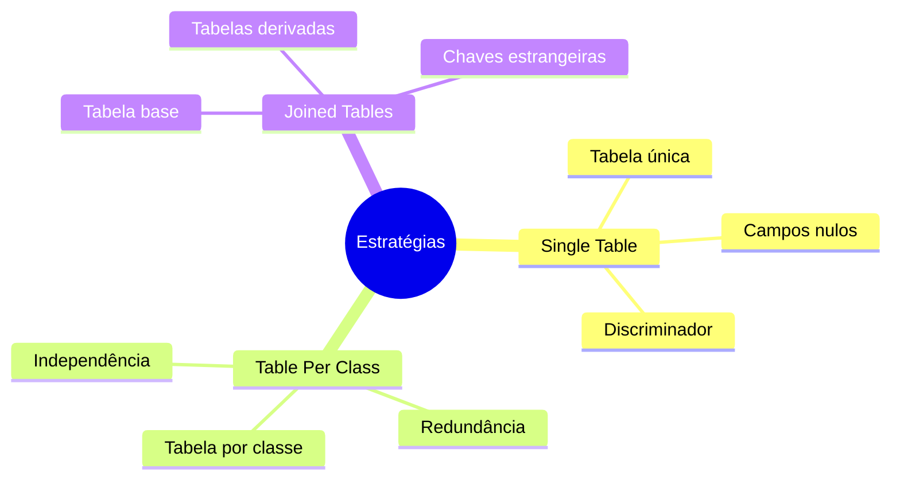

## Estratégias de Mapeamento

### 1. Single Table (Tabela Única)

#### Exemplo: Sistema Acadêmico

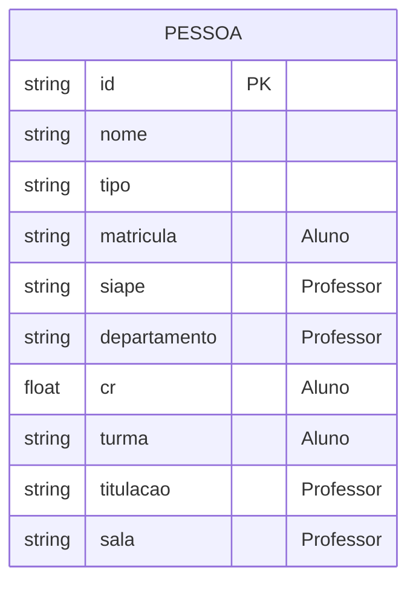

#### Exemplo: Sistema de Veículos

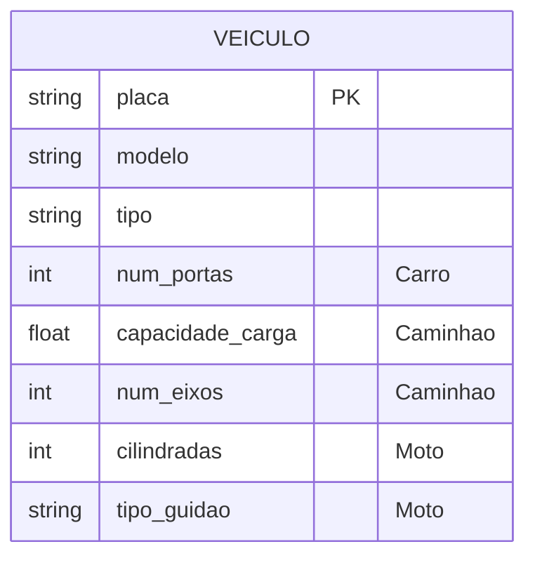

#### Características
- Todos os atributos em uma única tabela
- Campo discriminador para identificar subclasses
- Atributos específicos podem ser nulos

#### Vantagens
- Consultas simples
- Sem necessidade de junções
- Fácil manutenção

#### Desvantagens
- Desperdício de espaço
- Muitos campos nulos
- Menor integridade de dados

### 2. Table Per Class (Tabela por Classe)

#### Exemplo: Sistema Acadêmico

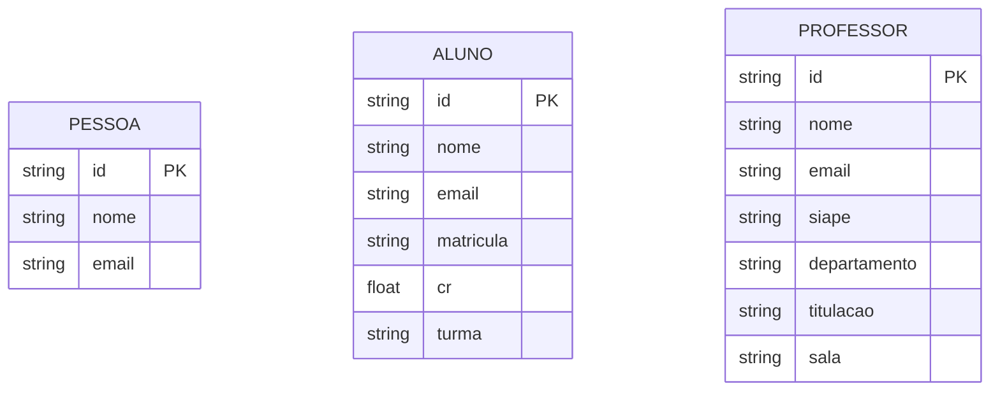

#### Exemplo: Sistema de Produtos

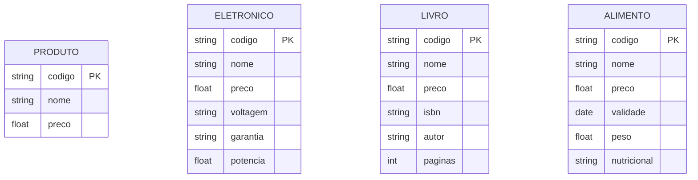

#### Características
- Cada classe tem sua própria tabela
- Todos os atributos são replicados
- Chaves independentes

#### Vantagens
- Modelo mais flexível
- Melhor integridade de dados
- Consultas específicas eficientes

#### Desvantagens
- Redundância de dados
- Consultas polimórficas complexas
- Maior espaço de armazenamento

### 3. Joined Tables (Tabelas Unidas)

#### Exemplo: Sistema Bancário

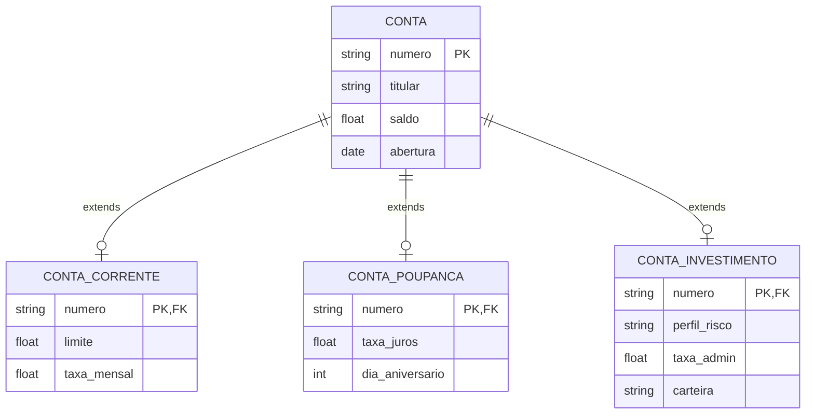

#### Exemplo: Sistema de Funcionários

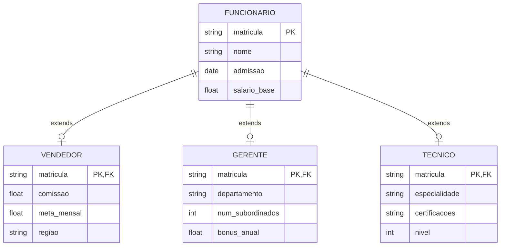

#### Características
- Tabela base para superclasse
- Tabelas separadas para subclasses
- Chaves estrangeiras para relacionamento

#### Vantagens
- Normalização completa
- Sem campos nulos
- Integridade referencial

#### Desvantagens
- Necessidade de junções
- Performance reduzida
- Complexidade de manutenção

## Casos Especiais

### 1. Herança Múltipla

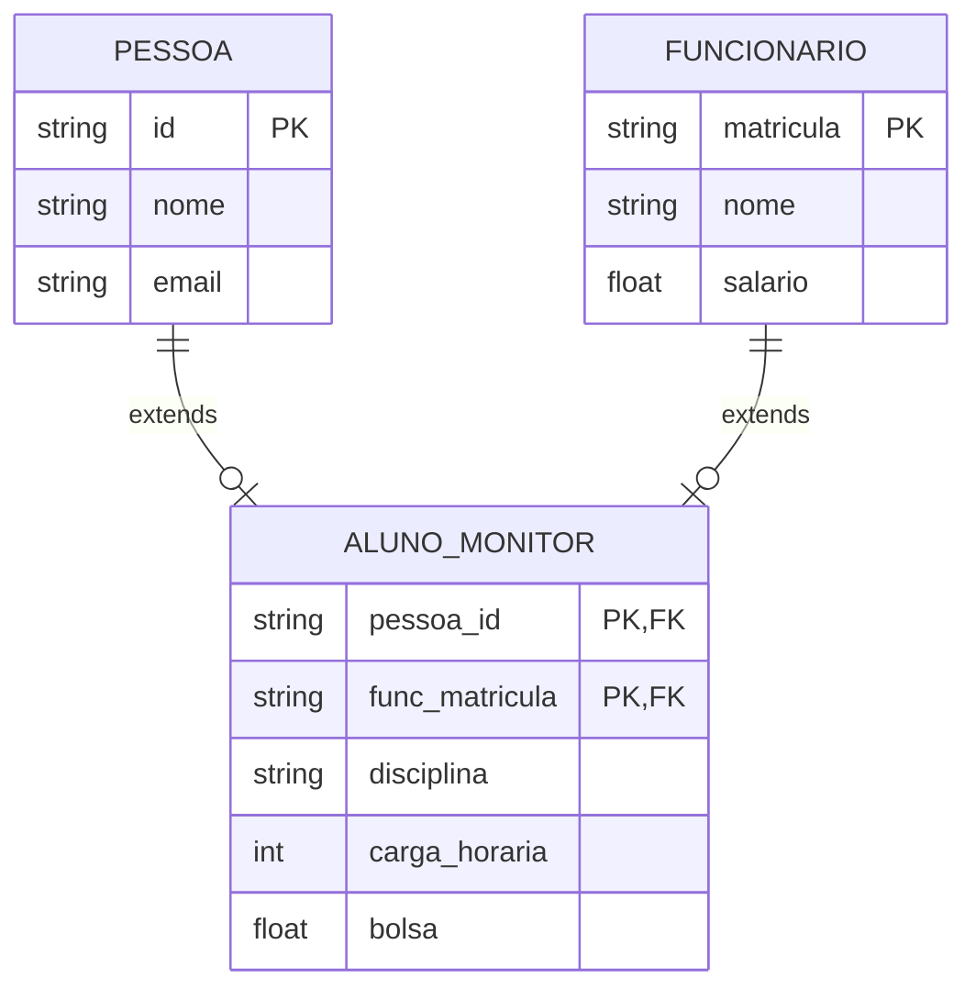

### 2. Herança Hierárquica

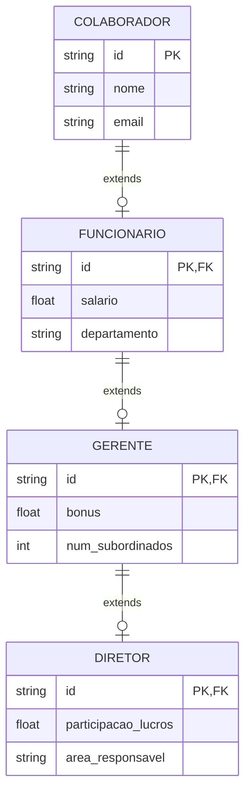

## Considerações de Design

### 1. Escolha da Estratégia

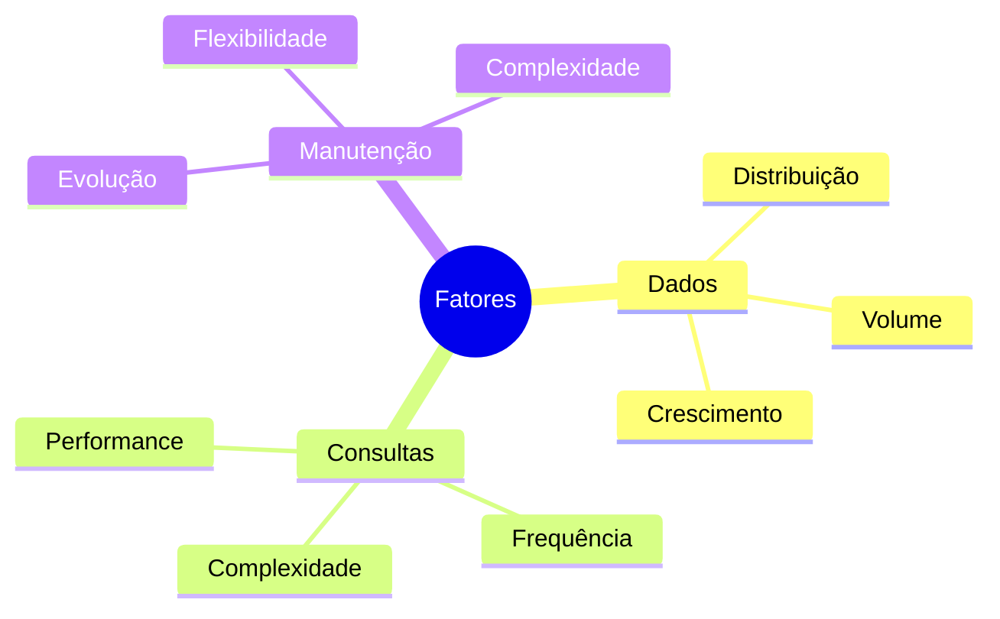

#### Fatores de Decisão
- Volume de dados
- Padrão de consultas
- Requisitos de integridade
- Flexibilidade necessária

#### Recomendações
1. **Single Table**
   - Hierarquias simples
   - Poucos atributos específicos
   - Consultas frequentes polimórficas

2. **Table Per Class**
   - Subclasses muito diferentes
   - Consultas específicas frequentes
   - Poucos dados compartilhados

3. **Joined Tables**
   - Alta normalização necessária
   - Dados compartilhados importantes
   - Evolução frequente do esquema

### 2. Impacto nas Operações

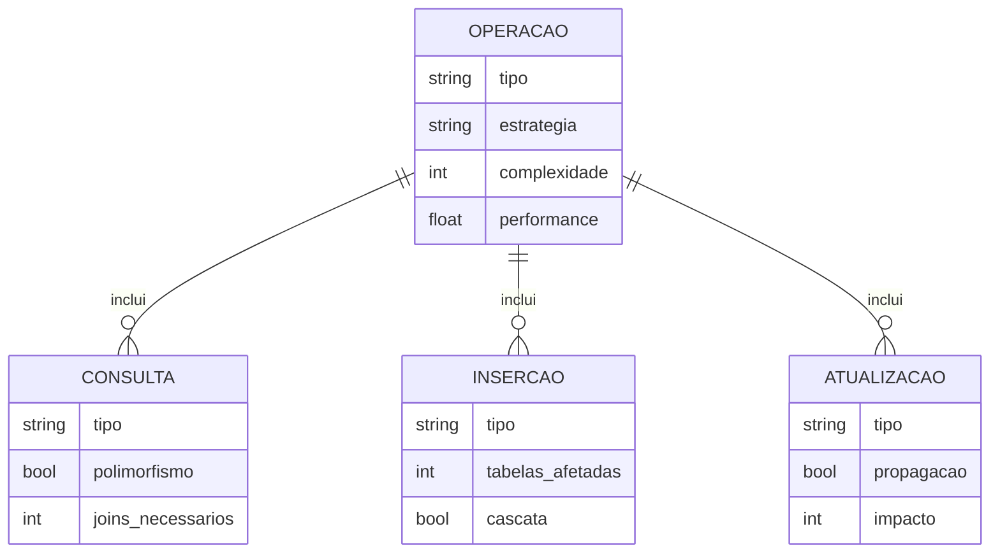

### 2. Otimizações

#### Índices
- Chaves primárias
- Campos discriminadores
- Chaves estrangeiras
- Campos de consulta frequente

#### Restrições
- Integridade referencial
- Validações de tipo
- Regras de negócio

## Padrões e Anti-padrões

### Padrões Recomendados

1. **Discriminador Explícito**
   - Campo tipo sempre presente
   - Validações consistentes
   - Documentação clara

2. **Nomenclatura Consistente**
   - Prefixos/sufixos padronizados
   - Relacionamentos claros
   - Convenções estabelecidas

### Anti-padrões

1. **Mistura de Estratégias**
   - Inconsistência no modelo
   - Complexidade desnecessária
   - Difícil manutenção

2. **Herança Profunda**
   - Muitos níveis hierárquicos
   - Performance degradada
   - Complexidade aumentada

## Conclusão

A escolha da estratégia de mapeamento de herança deve considerar:

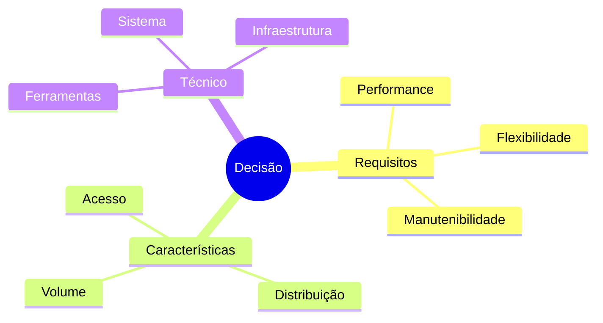
