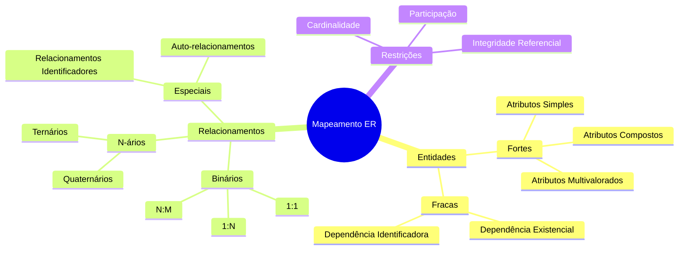
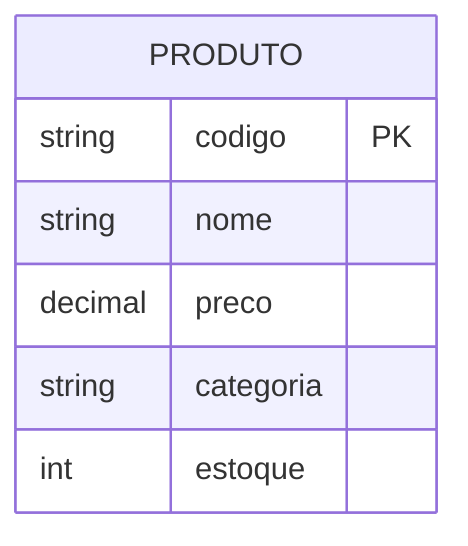
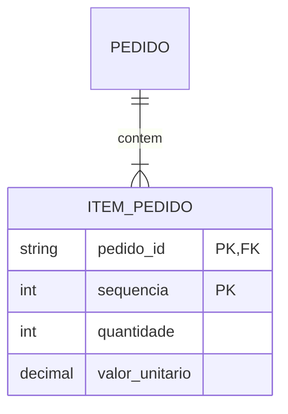
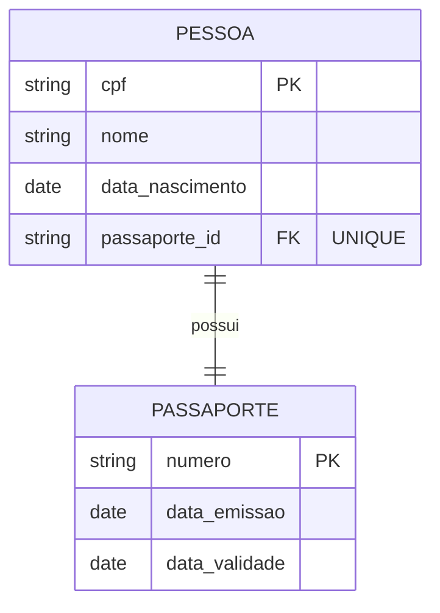
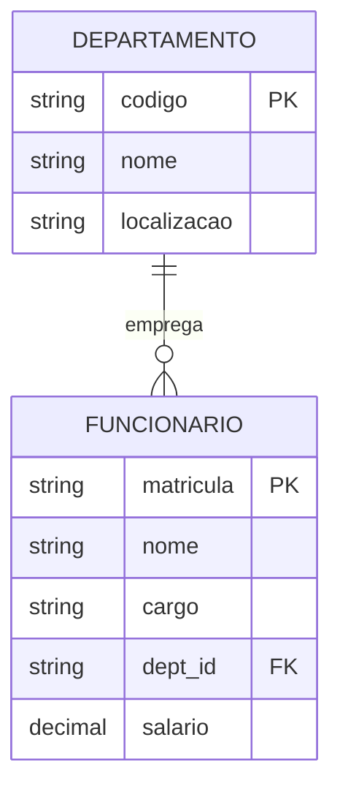
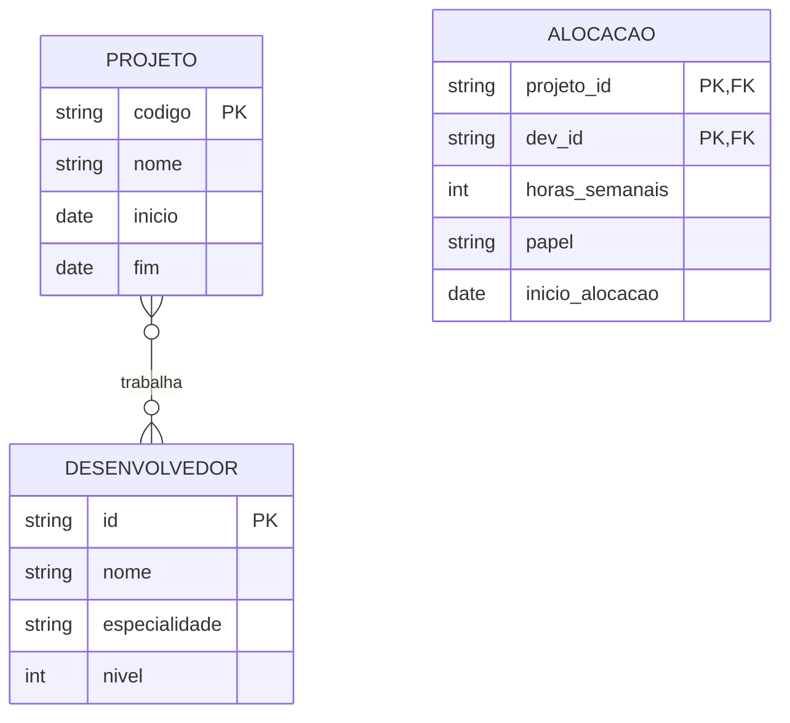
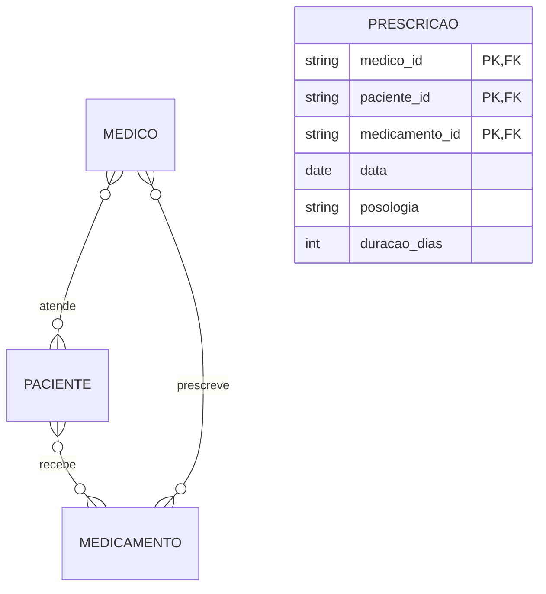
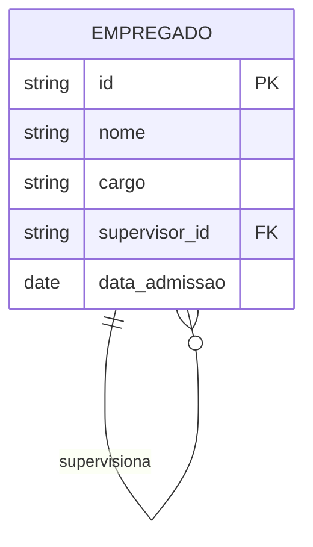

# Mapeamento do Modelo ER

O mapeamento do Modelo Entidade-Relacionamento (ER) para o modelo relacional é um processo sistemático que requer compreensão profunda de ambos os modelos. Este capítulo apresenta uma abordagem estruturada para realizar essa transformação.

## Fundamentos do Mapeamento

### Conceitos Básicos

### Princípios Fundamentais

1. **Preservação de Informação**
   - Manutenção de todos os dados
   - Conservação das relações
   - Integridade dos atributos

2. **Garantia de Consistência**
   - Restrições de integridade
   - Regras de negócio
   - Validações estruturais

3. **Otimização de Acesso**
   - Eficiência nas consultas
   - Minimização de junções
   - Estruturas de índice

## Mapeamento de Entidades

### 1. Entidades Fortes

#### Regras de Transformação
- Cada entidade forte torna-se uma tabela
- Atributos tornam-se colunas
- Chave primária é preservada
- Restrições são mapeadas para constraints

### 2. Entidades Fracas

#### Considerações Especiais
- Dependência da entidade forte
- Chave parcial como parte da PK
- Restrições de integridade referencial

## Mapeamento de Relacionamentos

### 1. Relacionamentos 1:1

#### Estratégias de Implementação
1. **Participação Total-Total**
   - Chave estrangeira em qualquer lado
   - Restrição UNIQUE na FK
   - Restrição NOT NULL

2. **Participação Total-Parcial**
   - FK no lado total
   - Restrição UNIQUE
   - Permite NULL no lado parcial

### 2. Relacionamentos 1:N

#### Regras de Mapeamento
1. **Participação Total**
   - FK NOT NULL no lado N
   - Índice na FK
   - Trigger para validação

2. **Participação Parcial**
   - FK permite NULL
   - Constraints específicas
   - Índices seletivos

### 3. Relacionamentos N:M

#### Técnicas de Implementação
1. **Tabela de Associação**
   - Chave composta
   - Atributos do relacionamento
   - Índices compostos

2. **Otimizações**
   - Índices específicos
   - Particionamento
   - Clustering

## Casos Especiais

### 1. Relacionamentos Ternários

### 2. Auto-relacionamentos

## Otimizações e Considerações

### 1. Performance

#### Estruturas de Índice
- Índices primários
- Índices secundários
- Índices compostos
- Índices parciais

#### Estratégias de Junção
- Inner joins otimizados
- Outer joins seletivos
- Semi-joins quando aplicável

### 2. Integridade

#### Restrições de Domínio
- CHECK constraints
- DEFAULT values
- Triggers de validação

#### Integridade Referencial
- ON DELETE actions
- ON UPDATE actions
- Deferrable constraints

## Validação do Esquema

### 1. Testes de Integridade

#### Verificações Básicas
- Chaves primárias
- Chaves estrangeiras
- Unicidade
- NOT NULL constraints

#### Testes Avançados
- Cardinalidade
- Participação
- Regras de negócio

### 2. Análise de Qualidade

#### Métricas
- Normalização
- Redundância
- Complexidade
- Performance

#### Otimizações
- Desnormalização seletiva
- Índices compostos
- Particionamento
- Clustering

## Conclusão

O mapeamento efetivo do modelo ER requer:

1. **Compreensão Profunda**
   - Modelo conceitual
   - Modelo relacional
   - Requisitos do sistema

2. **Abordagem Sistemática**
   - Metodologia clara
   - Documentação adequada
   - Validação rigorosa

3. **Considerações Práticas**
   - Performance
   - Manutenibilidade
   - Escalabilidade
   - Evolução futura

## Próximos Passos

1. **Implementação Física**
   - Escolha do SGBD
   - Scripts de criação
   - Migração de dados

2. **Monitoramento**
   - Performance
   - Integridade
   - Uso do sistema

3. **Manutenção**
   - Ajustes de esquema
   - Otimizações
   - Documentação
