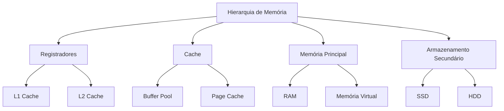
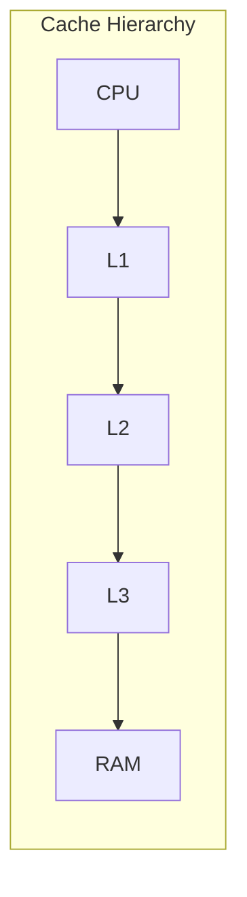
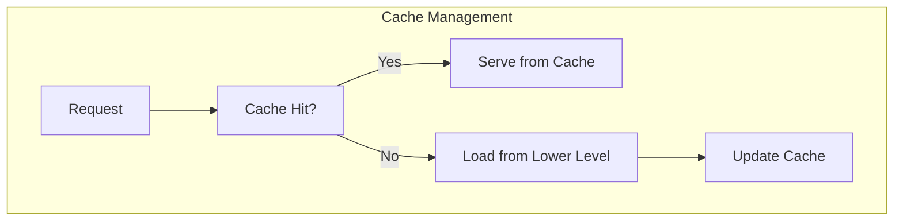
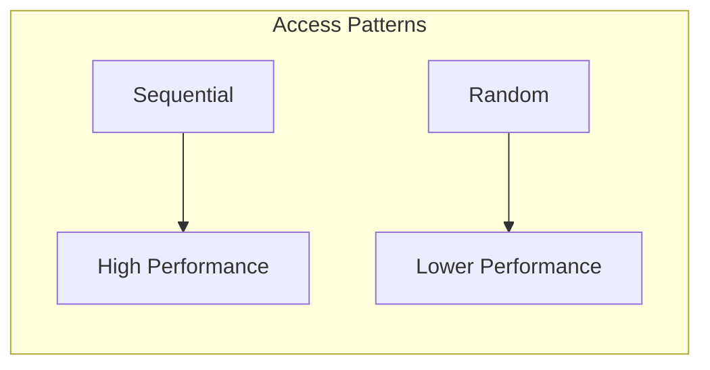
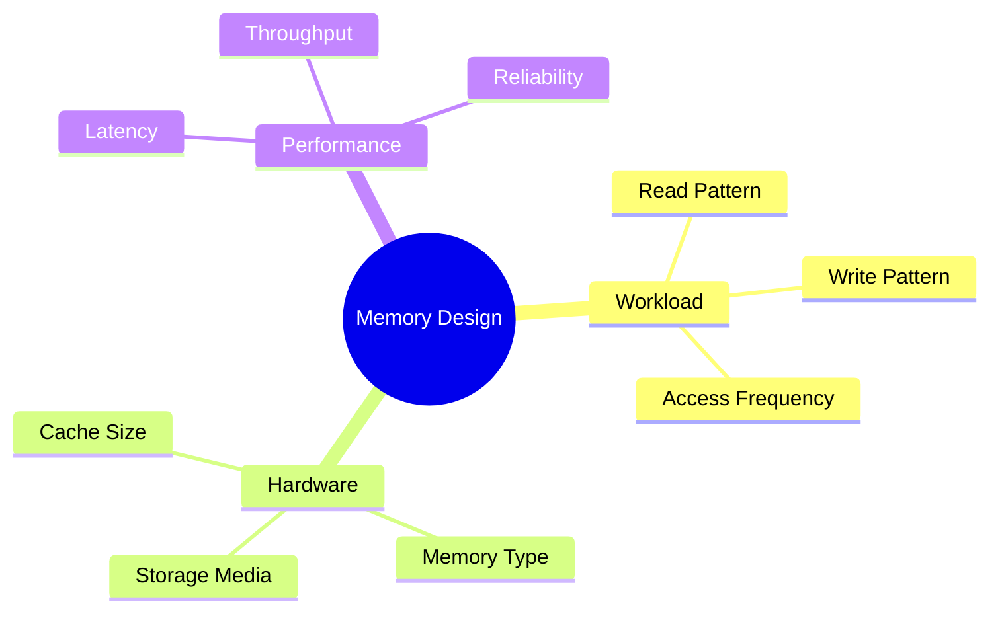
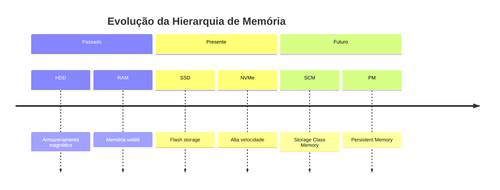

# Hierarquia de Memória

A hierarquia de memória é um conceito fundamental em sistemas de banco de dados que organiza diferentes níveis de armazenamento baseados em velocidade, custo e capacidade.

## Níveis de Hierarquia

### 1. Memória Primária
- **Registradores**
  - Velocidade: < 1ns
  - Capacidade: KB
  - Volatilidade: Sim
  - Custo: Muito Alto

- **Cache**
  - L1/L2/L3
  - Latência: 1-10ns
  - Capacidade: MB
  - Política de substituição

### 2. Memória Principal
- **RAM**
  - Acesso direto
  - Latência: ~100ns
  - Capacidade: GB
  - Gerenciamento dinâmico

- **Memória Virtual**
  - Paginação
  - Swapping
  - Page tables
  - TLB (Translation Lookaside Buffer)

### 3. Armazenamento Secundário
- **SSD**
  - Flash storage
  - Latência: µs
  - Wear leveling
  - TRIM support

- **HDD**
  - Discos magnéticos
  - Latência: ms
  - Fragmentação
  - Seek time

## Estratégias de Gerenciamento

### 1. Políticas de Cache
- LRU (Least Recently Used)
- MRU (Most Recently Used)
- CLOCK
- ARC (Adaptive Replacement Cache)

### 2. Buffer Management
- **Políticas de Substituição**
  - Page replacement
  - Dirty page handling
  - Prefetching
  - Write-back/Write-through

- **Otimizações**
  - Sequential prefetch
  - Random prefetch
  - Buffer pool partitioning
  - Multiple buffer pools

## Otimização de Performance

### 1. Técnicas de Otimização
- **Locality of Reference**
  - Temporal locality
  - Spatial locality
  - Sequential access
  - Random access

### 2. Monitoramento e Tuning
- **Métricas Chave**
  - Hit ratio
  - Miss ratio
  - Response time
  - Throughput

- **Ferramentas**
  - Performance counters
  - Memory profilers
  - I/O statistics
  - Cache analytics

## Considerações Práticas

### 1. Design Considerations
- **Workload Analysis**
  - Read/write patterns
  - Access frequency
  - Data volume
  - Concurrency requirements

### 2. Implementation Guidelines
- **Best Practices**
  - Memory alignment
  - Cache-conscious data structures
  - Memory barriers
  - NUMA awareness

- **Common Pitfalls**
  - Cache thrashing
  - Memory leaks
  - False sharing
  - Fragmentation

## Tendências e Inovações

### 1. Emerging Technologies
- **Persistent Memory**
  - NVDIMM
  - Intel Optane
  - Storage Class Memory

- **New Architectures**
  - In-memory databases
  - Hybrid memory systems
  - Disaggregated memory

