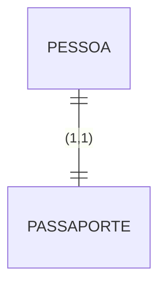
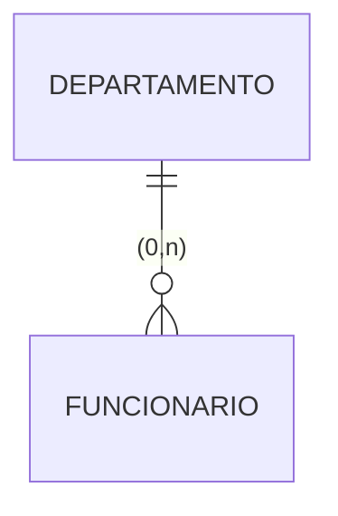
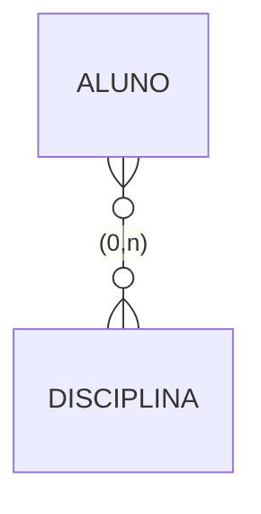
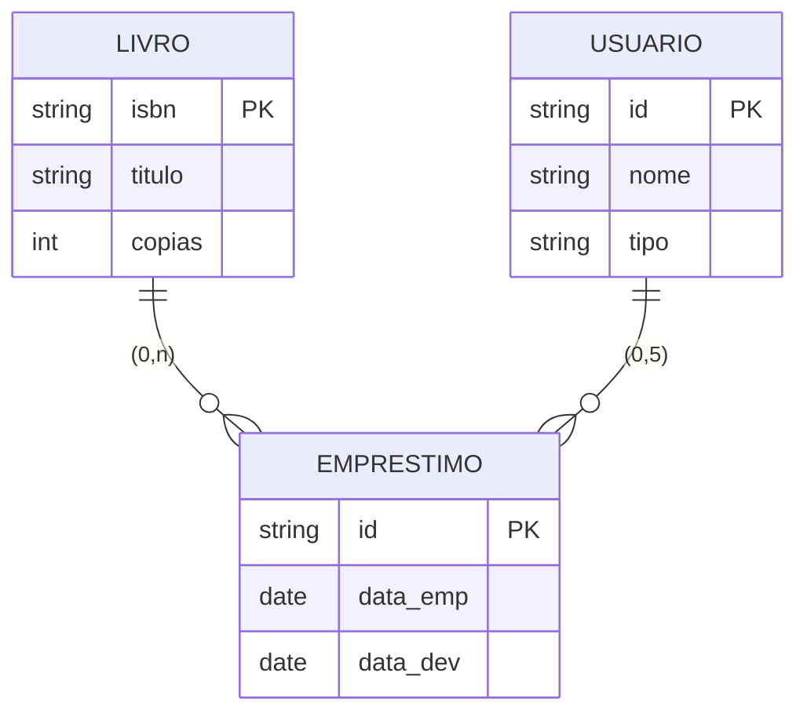
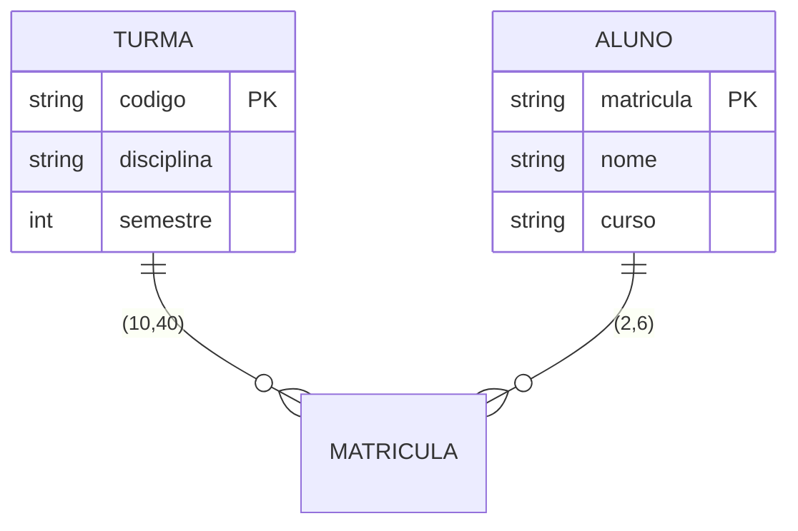

# Notação Min-Max

A notação Min-Max é uma abordagem precisa para representar cardinalidades em modelos de dados, usando pares ordenados (min,max) para especificar restrições de participação.

## Conceitos Básicos

### 1. Formato
- (min,max) onde:
  - min: participação mínima
  - max: participação máxima
  - n: representa infinito

### 2. Valores Comuns
| Notação | Significado |
|---------|-------------|
| (0,1) | Zero ou um |
| (1,1) | Exatamente um |
| (0,n) | Zero ou mais |
| (1,n) | Um ou mais |
| (m,n) | Mínimo m, máximo n |

## Exemplos Básicos

### 1. Relacionamento Um-para-Um



Significado:
- Pessoa tem exatamente um passaporte
- Passaporte pertence a exatamente uma pessoa

### 2. Relacionamento Um-para-Muitos



Significado:
- Departamento pode ter zero ou mais funcionários
- Funcionário pertence a exatamente um departamento

### 3. Relacionamento Muitos-para-Muitos



## Exemplos Complexos

### 1. Sistema de Biblioteca



Restrições:
- Livro pode ter 0 ou n empréstimos
- Usuário pode ter 0 a 5 empréstimos simultâneos

### 2. Sistema de Matrícula



Restrições:
- Turma deve ter entre 10 e 40 alunos
- Aluno deve cursar entre 2 e 6 disciplinas

## Vantagens

### 1. Precisão
- Restrições exatas
- Limites claros
- Regras explícitas
- Validação precisa

### 2. Flexibilidade
- Intervalos personalizados
- Restrições complexas
- Regras de negócio
- Validações específicas

### 3. Documentação
- Requisitos claros
- Especificações detalhadas
- Regras documentadas
- Manutenção facilitada

## Casos de Uso

### 1. Regras de Negócio
- Limites de participação
- Restrições operacionais
- Políticas organizacionais
- Requisitos regulatórios

### 2. Validações
- Integridade de dados
- Consistência
- Conformidade
- Qualidade

## Implementação

### 1. Banco de Dados
```sql
CREATE TABLE Turma (
    codigo VARCHAR(10) PRIMARY KEY,
    disciplina VARCHAR(100),
    semestre INTEGER,
    CONSTRAINT chk_alunos 
    CHECK (num_alunos >= 10 AND num_alunos <= 40)
);

CREATE TABLE Matricula (
    aluno_id VARCHAR(10),
    turma_id VARCHAR(10),
    CONSTRAINT chk_matriculas_por_aluno
    CHECK (
        (SELECT COUNT(*) 
         FROM Matricula 
         WHERE aluno_id = NEW.aluno_id) <= 6
    )
);
```

### 2. Validação em Código

```java
public class Turma {
    private List<Aluno> alunos;
    
    public void adicionarAluno(Aluno aluno) {
        if (alunos.size() >= 40) {
            throw new LimiteExcedidoException(
                "Turma não pode ter mais que 40 alunos");
        }
        alunos.add(aluno);
    }
    
    public boolean isValida() {
        return alunos.size() >= 10 && alunos.size() <= 40;
    }
}
```

## Boas Práticas

### 1. Modelagem
- Defina limites realistas
- Documente justificativas
- Valide com stakeholders
- Mantenha consistência

### 2. Implementação
- Implemente validações
- Monitore limites
- Trate exceções
- Mantenha logs

### 3. Manutenção
- Revise periodicamente
- Ajuste conforme necessário
- Atualize documentação
- Monitore impactos

## Ferramentas de Suporte

### 1. Modelagem
- ERwin
- MySQL Workbench
- Visual Paradigm
- Enterprise Architect

### 2. Validação
- Frameworks ORM
- Validadores de schema
- Ferramentas de teste
- Monitores de integridade

## Conclusão

A notação Min-Max é ideal para:
- Especificações precisas
- Regras complexas
- Validações rigorosas
- Documentação detalhada

Benefícios principais:
- Clareza
- Precisão
- Flexibilidade
- Manutenibilidade