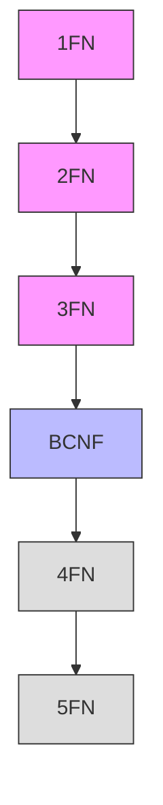

# Formas Normais

As formas normais são regras de design que ajudam a estruturar bancos de dados relacionais, reduzindo redundância e garantindo consistência dos dados.

## Visão Geral



## Primeira Forma Normal (1FN)

### Regras
- Valores atômicos
- Sem grupos repetitivos
- Identificador único para cada registro

### Exemplo
#### Antes da 1FN
```
Cliente(id, nome, telefones)
1, João Silva, "999999999, 888888888"
```

#### Depois da 1FN
```sql
Cliente(id, nome)
1, João Silva

Telefone(cliente_id, numero)
1, 999999999
1, 888888888
```

## Segunda Forma Normal (2FN)

### Regras
- Deve estar na 1FN
- Todos os atributos não-chave dependem totalmente da chave primária

### Exemplo
#### Antes da 2FN
```
Pedido(cliente_id, produto_id, data_pedido, valor_produto, nome_produto)
```

#### Depois da 2FN
```sql
Pedido(cliente_id, produto_id, data_pedido)
Produto(id, nome, valor)
```

## Terceira Forma Normal (3FN)

### Regras
- Deve estar na 2FN
- Sem dependências transitivas

### Exemplo
#### Antes da 3FN
```
Funcionario(id, nome, departamento_id, nome_departamento)
```

#### Depois da 3FN
```sql
Funcionario(id, nome, departamento_id)
Departamento(id, nome)
```

## Forma Normal de Boyce-Codd (BCNF)

### Regras
- Deve estar na 3FN
- Toda dependência funcional não-trivial é determinada por uma chave candidata

### Exemplo
#### Antes da BCNF
```
Professor_Disciplina(professor_id, disciplina, departamento)
```

#### Depois da BCNF
```sql
Professor_Departamento(professor_id, departamento)
Departamento_Disciplina(departamento, disciplina)
```

## Quarta Forma Normal (4FN)

### Regras
- Deve estar na BCNF
- Sem dependências multivaloradas

### Exemplo
#### Antes da 4FN
```
Funcionario_Habilidade_Projeto(func_id, habilidade, projeto)
```

#### Depois da 4FN
```sql
Funcionario_Habilidade(func_id, habilidade)
Funcionario_Projeto(func_id, projeto)
```

## Quinta Forma Normal (5FN)

### Regras
- Deve estar na 4FN
- Sem dependências de junção

### Considerações Práticas
- Raramente necessária
- Complexidade elevada
- Casos específicos

## Desnormalização

### Quando Considerar
- Performance crítica
- Dados predominantemente estáticos
- Consultas complexas frequentes
- Requisitos específicos de negócio

### Riscos
- Redundância de dados
- Anomalias de atualização
- Complexidade de manutenção
- Inconsistência potencial

## Recomendações

### 1. Análise de Requisitos
- Padrões de acesso
- Volume de dados
- Frequência de atualizações
- Requisitos de performance

### 2. Balanceamento
- Normalização vs. Performance
- Complexidade vs. Simplicidade
- Flexibilidade vs. Otimização
- Manutenibilidade vs. Eficiência

### 3. Documentação
- Decisões de design
- Exceções à normalização
- Justificativas
- Impactos e trade-offs