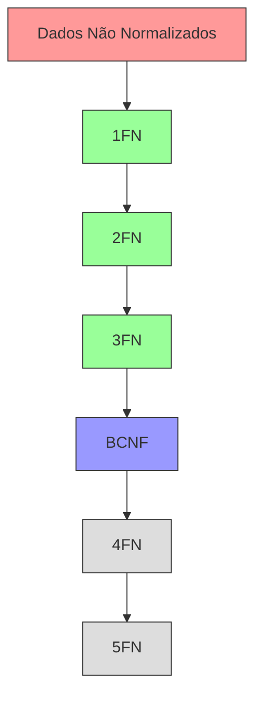

# Normalização de Bancos de Dados

## Visão Geral



## Conceitos Fundamentais

### 1. Objetivos da Normalização
- Eliminar redundância
- Garantir consistência
- Facilitar manutenção
- Reduzir anomalias

### 2. Dependências Funcionais
- Dependência total
- Dependência parcial
- Dependência transitiva
- Dependência multivalorada

## Formas Normais

### 1. Primeira Forma Normal (1FN)
```sql
-- Antes da 1FN
Contato(id, nome, telefones)
1, "João Silva", "999999999, 888888888"

-- Depois da 1FN
Contato(id, nome)
1, "João Silva"

Telefone(contato_id, numero)
1, "999999999"
1, "888888888"
```

### 2. Segunda Forma Normal (2FN)
```sql
-- Antes da 2FN
Pedido(cliente_id, produto_id, data_pedido, valor_produto, nome_produto)

-- Depois da 2FN
Pedido(cliente_id, produto_id, data_pedido)
Produto(id, nome, valor)
```

### 3. Terceira Forma Normal (3FN)
```sql
-- Antes da 3FN
Funcionario(id, nome, departamento_id, nome_departamento)

-- Depois da 3FN
Funcionario(id, nome, departamento_id)
Departamento(id, nome)
```

### 4. Forma Normal de Boyce-Codd (BCNF)
```sql
-- Antes da BCNF
Professor_Disciplina(professor_id, disciplina, departamento)

-- Depois da BCNF
Professor_Departamento(professor_id, departamento)
Departamento_Disciplina(departamento, disciplina)
```

### 5. Quarta Forma Normal (4FN)
```sql
-- Antes da 4FN
Funcionario_Habilidade_Projeto(func_id, habilidade, projeto)

-- Depois da 4FN
Funcionario_Habilidade(func_id, habilidade)
Funcionario_Projeto(func_id, projeto)
```

## Processo de Normalização

### 1. Análise de Requisitos
- Identificar entidades
- Mapear relacionamentos
- Definir atributos
- Estabelecer dependências

### 2. Aplicação Progressiva


### 3. Validação
- Testes de integridade
- Verificação de anomalias
- Análise de performance
- Revisão de requisitos

## Benefícios e Considerações

### 1. Vantagens
- Integridade de dados
- Consistência
- Facilidade de manutenção
- Flexibilidade

### 2. Desvantagens
- Complexidade de queries
- Overhead de joins
- Performance em leituras
- Complexidade de implementação

## Exemplos Práticos

### 1. Sistema de Vendas
```sql
-- Não normalizado
Venda(id, data, cliente_nome, cliente_email, produto_nome, quantidade, preco)

-- Normalizado
Cliente(id, nome, email)
Produto(id, nome, preco)
Venda(id, data, cliente_id)
ItemVenda(venda_id, produto_id, quantidade)
```

### 2. Sistema Acadêmico
```sql
-- Não normalizado
Matricula(aluno_nome, curso_nome, disciplina_nome, professor_nome, nota)

-- Normalizado
Aluno(id, nome)
Curso(id, nome)
Disciplina(id, nome, curso_id)
Professor(id, nome)
Matricula(aluno_id, disciplina_id, professor_id, nota)
```

## Melhores Práticas

### 1. Design
- Começar com modelo completo
- Normalizar progressivamente
- Documentar decisões
- Manter consistência

### 2. Implementação
- Usar ferramentas adequadas
- Seguir padrões
- Manter rastreabilidade
- Validar continuamente

### 3. Manutenção
- Monitorar performance
- Ajustar quando necessário
- Manter documentação
- Revisar periodicamente

## Ferramentas e Recursos

### 1. Design
- Modelagem ER
- CASE tools
- Diagramas UML
- Documentação

### 2. Validação
- Scripts de teste
- Ferramentas de análise
- Verificadores de dependência
- Analisadores de schema

## Conclusão

A normalização é um processo fundamental para:
- Garantir qualidade dos dados
- Facilitar manutenção
- Reduzir redundância
- Promover consistência

Deve ser aplicada considerando:
- Requisitos do sistema
- Performance necessária
- Complexidade aceitável
- Recursos disponíveis