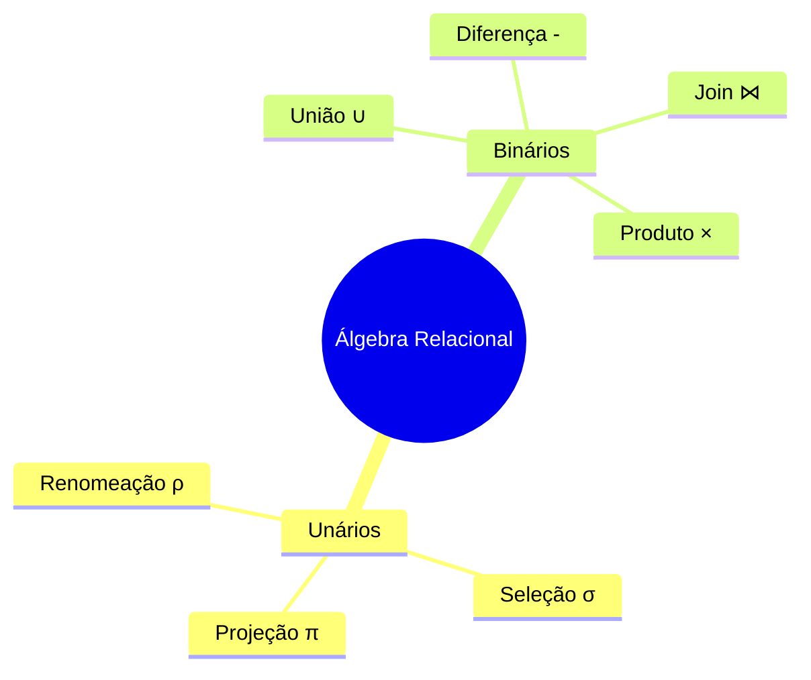

# Operadores da Álgebra Relacional

## Operadores Fundamentais



## Operadores Unários

### Seleção (σ)
```
┌────────────────────────────────────────────┐
│ SELEÇÃO (σ)                               │
├────────────────────────────────────────────┤
│ Sintaxe: σ<condição>(Relação)             │
│ Exemplo: σidade>18(Clientes)               │
└────────────────────────────────────────────┘
```

#### Exemplo SQL
```sql
SELECT * FROM Clientes WHERE idade > 18;
```

### Projeção (π)
```
┌────────────────────────────────────────────┐
│ PROJEÇÃO (π)                              │
├────────────────────────────────────────────┤
│ Sintaxe: π<atributos>(Relação)            │
│ Exemplo: πnome,email(Usuarios)             │
└────────────────────────────────────────────┘
```

#### Exemplo SQL
```sql
SELECT nome, email FROM Usuarios;
```

### Renomeação (ρ)
```
┌────────────────────────────────────────────┐
│ RENOMEAÇÃO (ρ)                            │
├────────────────────────────────────────────┤
│ Sintaxe: ρnovo_nome(Relação)              │
│ Exemplo: ρFunc(Funcionarios)               │
└────────────────────────────────────────────┘
```

#### Exemplo SQL
```sql
SELECT * FROM Funcionarios AS Func;
```

## Operadores Binários

### União (∪)
```
┌────────────────────────────────────────────┐
│ UNIÃO (∪)                                 │
├────────────────────────────────────────────┤
│ Sintaxe: Relação1 ∪ Relação2              │
│ Exemplo: Alunos2022 ∪ Alunos2023          │
└────────────────────────────────────────────┘
```

#### Exemplo SQL
```sql
SELECT * FROM Alunos2022
UNION
SELECT * FROM Alunos2023;
```

### Join Natural (⋈)
```
┌────────────────────────────────────────────┐
│ JOIN NATURAL (⋈)                          │
├────────────────────────────────────────────┤
│ Sintaxe: Relação1 ⋈ Relação2              │
│ Exemplo: Pedidos ⋈ Clientes               │
└────────────────────────────────────────────┘
```

#### Exemplo SQL
```sql
SELECT * FROM Pedidos 
NATURAL JOIN Clientes;
```

## Operadores Derivados

### Interseção (∩)
```sql
-- R ∩ S equivale a:
SELECT * FROM R
INTERSECT
SELECT * FROM S;
```

### Divisão (÷)
```sql
-- R ÷ S (mais complexo, requer subconsultas)
SELECT DISTINCT R1.A
FROM R R1
WHERE NOT EXISTS (
    SELECT S.B
    FROM S
    WHERE NOT EXISTS (
        SELECT *
        FROM R R2
        WHERE R2.A = R1.A
        AND R2.B = S.B
    )
);
```

## Exemplos Práticos

### Consulta Complexa
```
┌────────────────────────────────────────────┐
│ EXEMPLO COMPLETO                          │
├────────────────────────────────────────────┤
│ πnome,salario(σdept='TI'(Funcionarios))    │
└────────────────────────────────────────────┘
```

#### Equivalente SQL
```sql
SELECT nome, salario 
FROM Funcionarios 
WHERE dept = 'TI';
```

## Otimização de Consultas

### Regras de Transformação
1. Comutatividade
   - R ⋈ S = S ⋈ R
   - R ∪ S = S ∪ R

2. Associatividade
   - (R ⋈ S) ⋈ T = R ⋈ (S ⋈ T)
   - (R ∪ S) ∪ T = R ∪ (S ∪ T)

3. Distributividade
   - σc(R ⋈ S) = σc(R) ⋈ S
   - πa(R ⋈ S) = πa(πa,b(R) ⋈ S)

## Exercícios Práticos

1. Básico
```sql
-- Encontre todos os clientes de SP
σestado='SP'(Clientes)

-- SQL equivalente:
SELECT * FROM Clientes 
WHERE estado = 'SP';
```

2. Intermediário
```sql
-- Nome e email dos clientes que fizeram pedidos
πnome,email(Clientes ⋈ Pedidos)

-- SQL equivalente:
SELECT DISTINCT c.nome, c.email
FROM Clientes c
JOIN Pedidos p ON c.id = p.cliente_id;
```

3. Avançado
```sql
-- Clientes que compraram todos os produtos
Clientes_Produtos ÷ Produtos

-- SQL equivalente (aproximado):
SELECT c.nome
FROM Clientes c
WHERE NOT EXISTS (
    SELECT p.id
    FROM Produtos p
    WHERE NOT EXISTS (
        SELECT 1
        FROM Pedidos pe
        WHERE pe.cliente_id = c.id
        AND pe.produto_id = p.id
    )
);
```