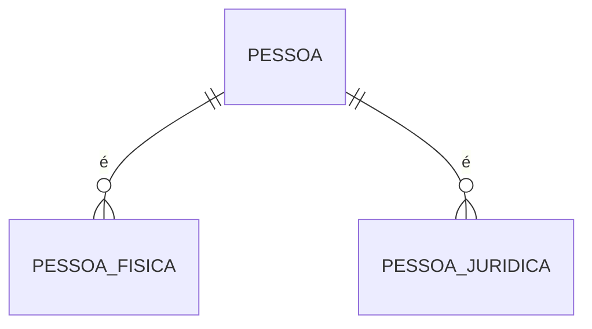
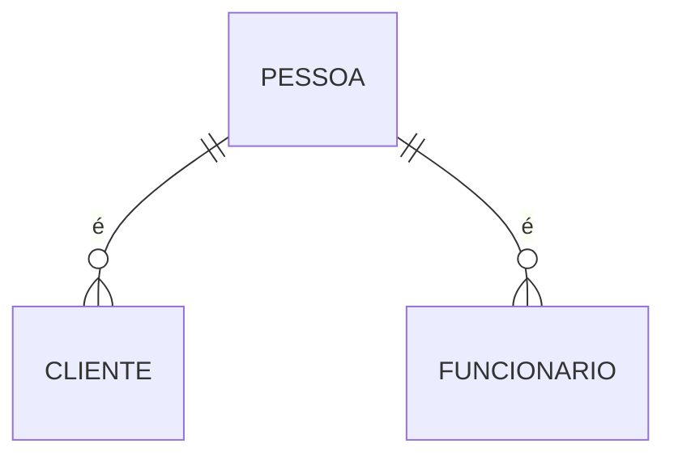
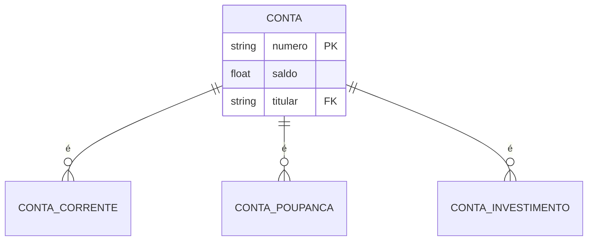
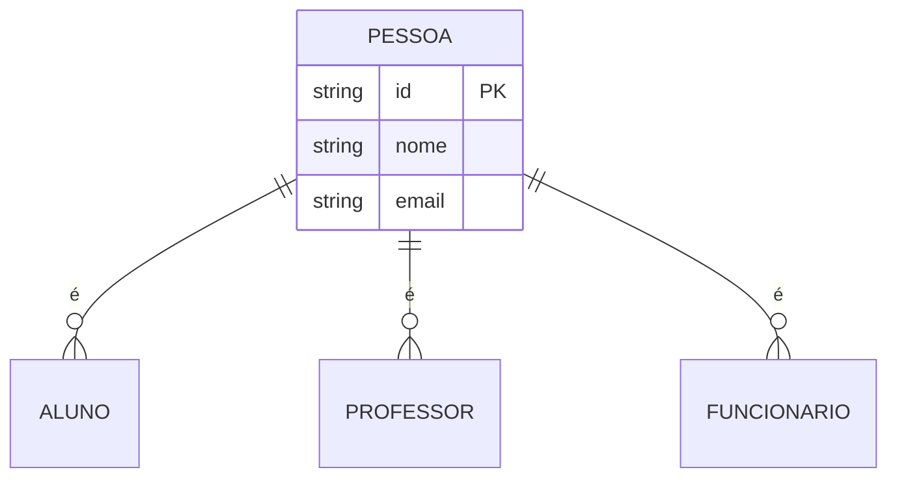
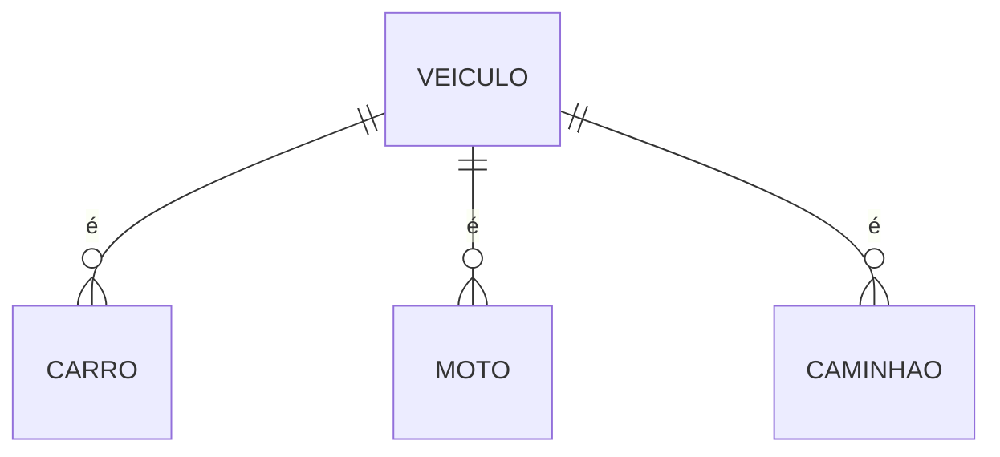
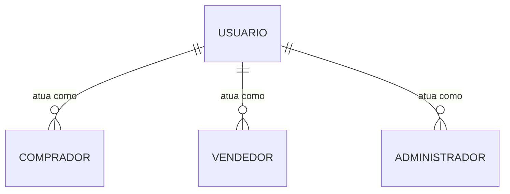

# Restrições de Sobreposição

As restrições de sobreposição definem como entidades podem participar em múltiplos relacionamentos ou subtipos, especificando se essa participação pode ser simultânea ou deve ser exclusiva.

## Tipos de Restrições

### 1. Disjunção (XOR)



#### Características
- Entidade participa em apenas um relacionamento/subtipo
- Mutuamente exclusivo
- Soma das participações = 1

#### Exemplos
- Uma pessoa só pode ser física OU jurídica
- Um funcionário só pode ser CLT OU PJ
- Uma conta só pode ser corrente OU poupança

### 2. Sobreposição (Overlap)



#### Características
- Entidade pode participar em múltiplos relacionamentos/subtipos
- Não exclusivo
- Participação simultânea permitida

#### Exemplos
- Uma pessoa pode ser cliente E funcionário
- Um professor pode lecionar em múltiplos departamentos
- Um produto pode pertencer a várias categorias

## Implementação

### 1. Disjunção em SQL

```sql
CREATE TABLE Pessoa (
    id SERIAL PRIMARY KEY,
    nome VARCHAR(100) NOT NULL
);

CREATE TABLE PessoaFisica (
    pessoa_id INTEGER PRIMARY KEY,
    cpf VARCHAR(11) UNIQUE NOT NULL,
    FOREIGN KEY (pessoa_id) REFERENCES Pessoa(id),
    CONSTRAINT unique_pessoa CHECK (
        NOT EXISTS (
            SELECT 1 FROM PessoaJuridica
            WHERE pessoa_id = PessoaFisica.pessoa_id
        )
    )
);

CREATE TABLE PessoaJuridica (
    pessoa_id INTEGER PRIMARY KEY,
    cnpj VARCHAR(14) UNIQUE NOT NULL,
    FOREIGN KEY (pessoa_id) REFERENCES Pessoa(id),
    CONSTRAINT unique_pessoa CHECK (
        NOT EXISTS (
            SELECT 1 FROM PessoaFisica
            WHERE pessoa_id = PessoaJuridica.pessoa_id
        )
    )
);
```

### 2. Sobreposição em SQL

```sql
CREATE TABLE Pessoa (
    id SERIAL PRIMARY KEY,
    nome VARCHAR(100) NOT NULL
);

CREATE TABLE Cliente (
    pessoa_id INTEGER PRIMARY KEY,
    codigo_cliente VARCHAR(10) UNIQUE NOT NULL,
    FOREIGN KEY (pessoa_id) REFERENCES Pessoa(id)
);

CREATE TABLE Funcionario (
    pessoa_id INTEGER PRIMARY KEY,
    matricula VARCHAR(10) UNIQUE NOT NULL,
    FOREIGN KEY (pessoa_id) REFERENCES Pessoa(id)
);
```

## Casos de Uso

### 1. Sistema Bancário



### 2. Sistema Acadêmico



## Boas Práticas

### 1. Modelagem
- Identifique claramente as regras de exclusividade
- Documente as restrições
- Valide com stakeholders
- Considere evolução futura

### 2. Implementação
- Use constraints apropriadas
- Implemente validações em múltiplas camadas
- Considere performance
- Mantenha consistência

### 3. Manutenção
- Monitore violações
- Atualize conforme necessidade
- Mantenha documentação
- Revise periodicamente

## Considerações Importantes

### 1. Performance
- Impacto das verificações de constraints
- Estratégias de indexação
- Otimização de consultas
- Cache e performance

### 2. Flexibilidade
- Mudanças nas regras de negócio
- Evolução do sistema
- Migração de dados
- Manutenibilidade

### 3. Integridade
- Consistência dos dados
- Validações
- Tratamento de erros
- Recuperação de falhas

## Padrões Comuns

### 1. Herança Exclusiva



### 2. Papéis Múltiplos



## Conclusão

Restrições de sobreposição são essenciais para:
- Integridade do modelo
- Regras de negócio
- Consistência dos dados
- Qualidade da informação

Uma modelagem adequada:
- Reflete requisitos reais
- Facilita implementação
- Melhora manutenibilidade
- Garante consistência