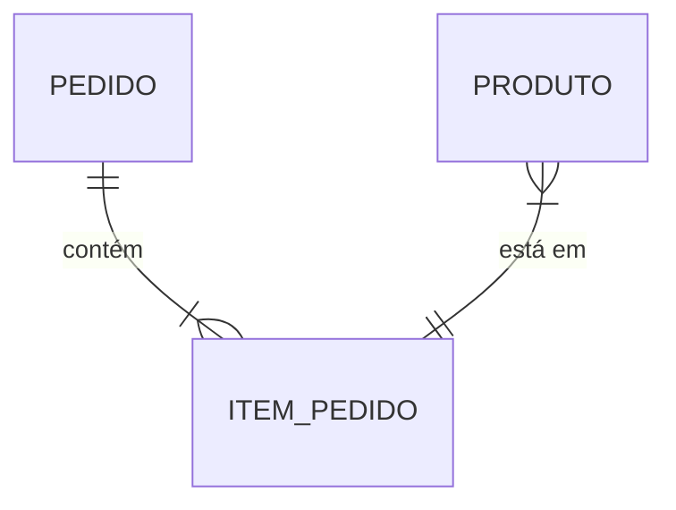
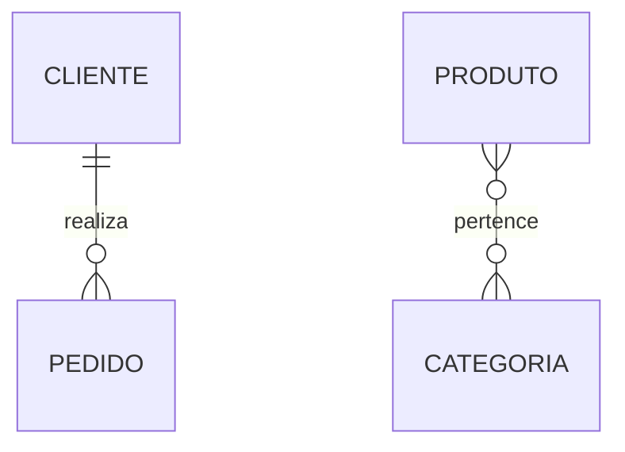
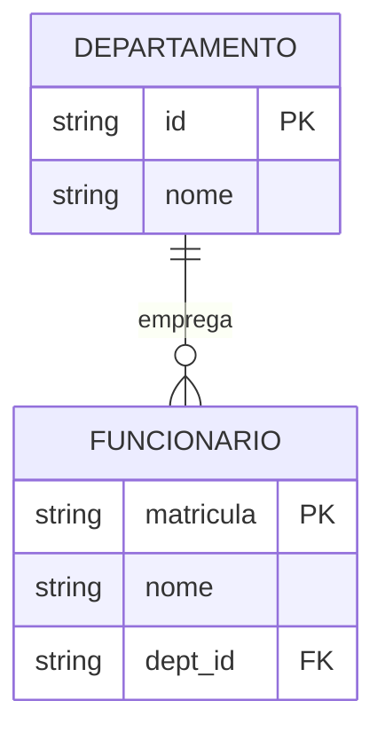
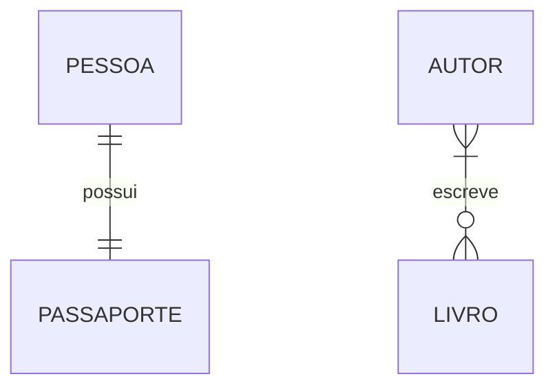
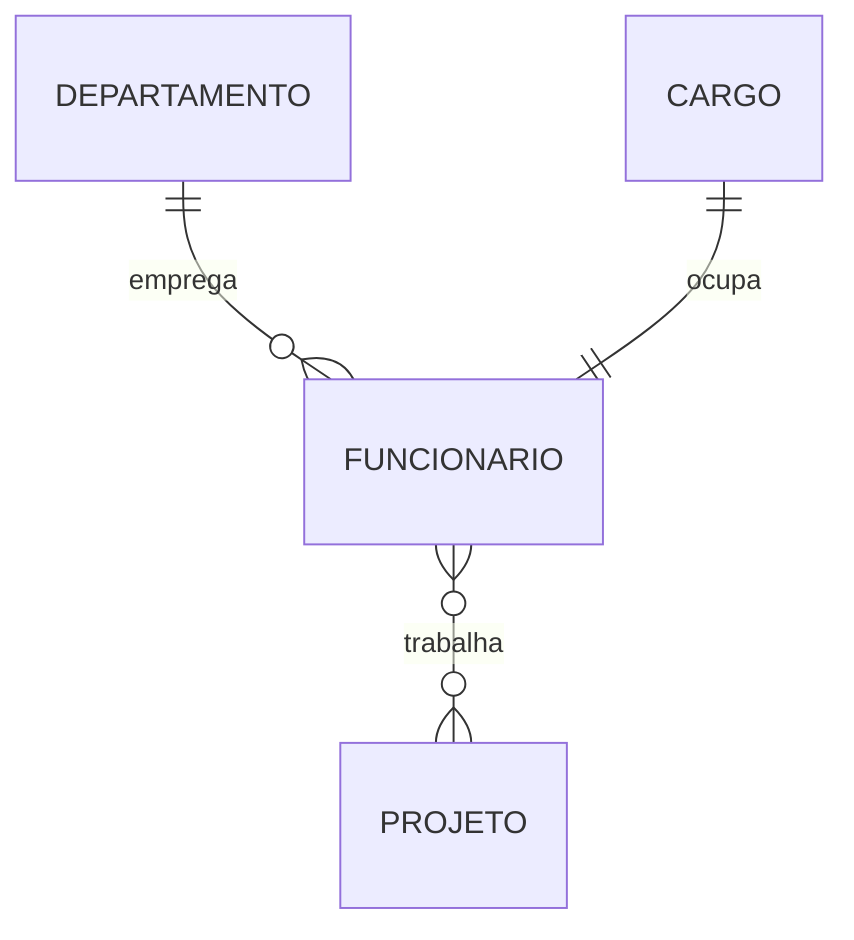
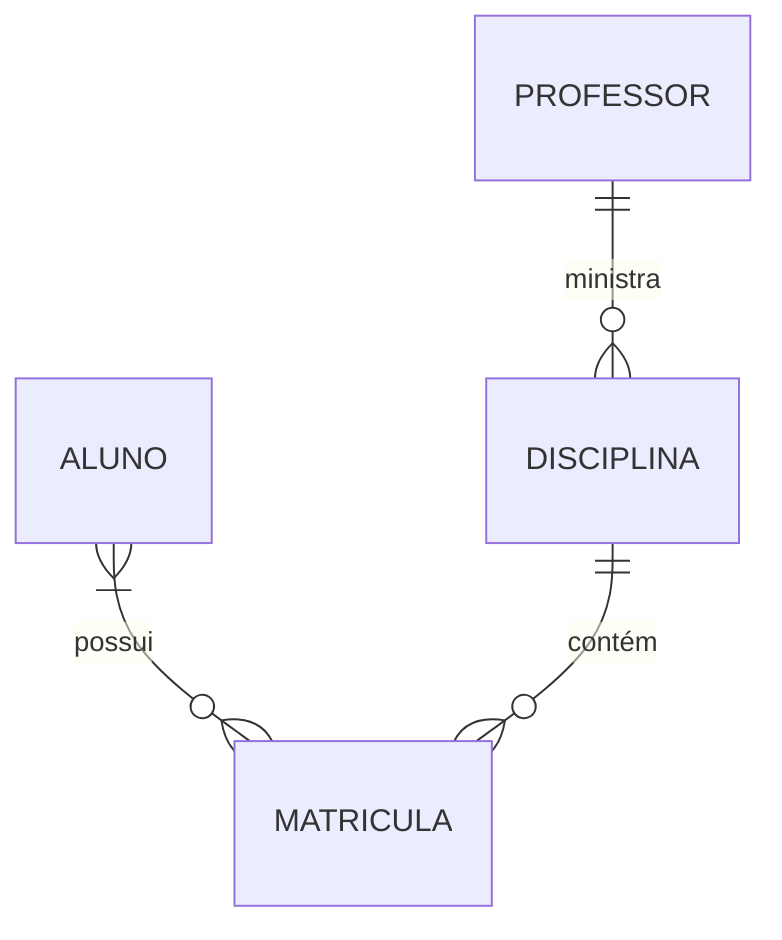
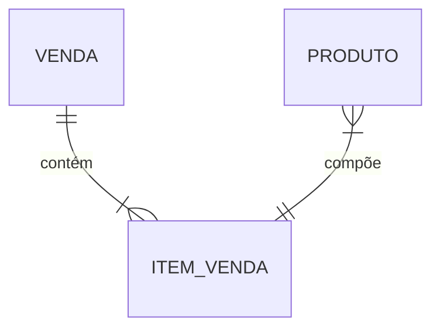
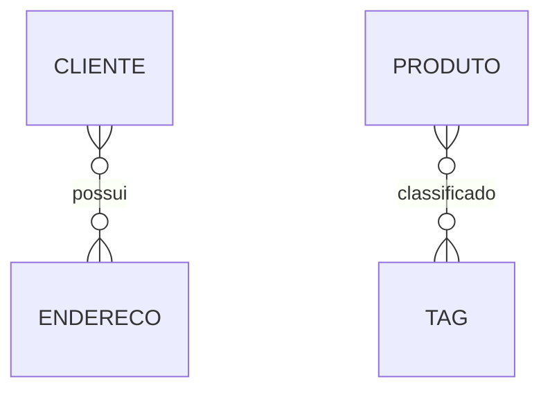

# Restrições de Participação

As restrições de participação definem como as entidades devem participar em relacionamentos, especificando regras de obrigatoriedade e cardinalidade.

## Tipos de Participação

### 1. Participação Total (Obrigatória)



#### Características
- Toda instância da entidade deve participar do relacionamento
- Representada por linha dupla (||)
- Cardinalidade mínima maior que zero

#### Exemplos
- Todo item de pedido deve estar associado a um produto
- Todo funcionário deve pertencer a um departamento
- Toda conta bancária deve ter um titular

### 2. Participação Parcial (Opcional)



#### Características
- Instâncias podem ou não participar do relacionamento
- Representada por linha simples
- Cardinalidade mínima igual a zero

#### Exemplos
- Um cliente pode não ter pedidos
- Um produto pode não ter categoria
- Um funcionário pode não ter projetos

## Notações de Cardinalidade

### 1. Cardinalidade Mínima



#### Tipos
- Zero (o): Participação opcional
- Um (|): Participação obrigatória

### 2. Cardinalidade Máxima



#### Tipos
- Um (|): Máximo uma instância
- Muitos ({): Múltiplas instâncias

## Implementação

### 1. Nível de Banco de Dados

```sql
-- Participação Total
CREATE TABLE Funcionario (
    matricula VARCHAR(10) PRIMARY KEY,
    nome VARCHAR(100) NOT NULL,
    departamento_id INTEGER NOT NULL,
    FOREIGN KEY (departamento_id) 
    REFERENCES Departamento(id)
);

-- Participação Parcial
CREATE TABLE Produto (
    codigo VARCHAR(10) PRIMARY KEY,
    nome VARCHAR(100) NOT NULL,
    categoria_id INTEGER,
    FOREIGN KEY (categoria_id) 
    REFERENCES Categoria(id)
);
```

### 2. Nível de Aplicação

```java
@Entity
public class Funcionario {
    @Id
    private String matricula;
    
    @NotNull
    private String nome;
    
    @ManyToOne(optional = false)
    private Departamento departamento;
}

@Entity
public class Produto {
    @Id
    private String codigo;
    
    @NotNull
    private String nome;
    
    @ManyToOne(optional = true)
    private Categoria categoria;
}
```

## Casos de Uso

### 1. Sistema de Recursos Humanos



### 2. Sistema Acadêmico



## Boas Práticas

### 1. Modelagem
- Identifique claramente as regras de negócio
- Documente as restrições
- Valide com stakeholders
- Considere casos especiais

### 2. Implementação
- Use constraints apropriadas
- Implemente validações em múltiplas camadas
- Considere impacto na performance
- Mantenha consistência

### 3. Manutenção
- Monitore violações
- Atualize conforme necessário
- Mantenha documentação
- Revise periodicamente

## Considerações Importantes

### 1. Impacto no Negócio
- Regras operacionais
- Processos de negócio
- Requisitos legais
- Flexibilidade vs. Controle

### 2. Performance
- Impacto em consultas
- Estratégias de indexação
- Otimização de joins
- Cache e performance

### 3. Manutenibilidade
- Evolução do sistema
- Mudanças de requisitos
- Documentação
- Testes

## Padrões Comuns

### 1. Relacionamentos Mandatórios



### 2. Relacionamentos Opcionais



## Conclusão

Restrições de participação são cruciais para:
- Integridade dos dados
- Regras de negócio
- Consistência do modelo
- Qualidade da informação

Uma modelagem adequada:
- Reflete requisitos reais
- Facilita implementação
- Melhora manutenibilidade
- Garante consistência