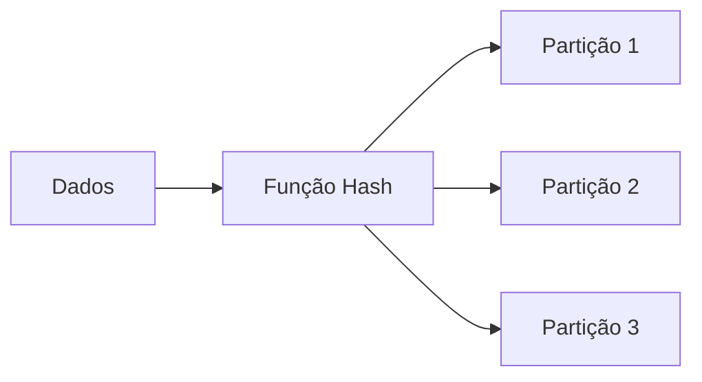

# Design de Particionamento

## Tipos de Particionamento

### 1. Particionamento Horizontal
```sql
-- Exemplo de particionamento por range
CREATE TABLE vendas (
    id INT,
    data DATE,
    valor DECIMAL(10,2)
) PARTITION BY RANGE (data) (
    PARTITION p2021 VALUES LESS THAN ('2022-01-01'),
    PARTITION p2022 VALUES LESS THAN ('2023-01-01'),
    PARTITION p2023 VALUES LESS THAN ('2024-01-01')
);
```

### 2. Particionamento por Hash


### 3. Particionamento Composto
- Range-Hash
- Range-List
- List-Hash

## Estratégias de Implementação

### 1. Critérios de Particionamento
- Data
- ID
- Região
- Status

### 2. Gerenciamento de Partições
```sql
-- Adicionar nova partição
ALTER TABLE vendas 
ADD PARTITION p2024 
VALUES LESS THAN ('2025-01-01');

-- Mesclar partições
ALTER TABLE vendas 
MERGE PARTITIONS p2021, p2022 
INTO PARTITION p_historico;
```

### 3. Manutenção
- Rotação de partições
- Arquivamento
- Purge de dados
- Rebalanceamento

## Otimização de Consultas

### 1. Partition Pruning
- Eliminação de partições
- Partition-wise joins
- Parallel processing

### 2. Monitoramento
```sql
-- Análise de uso de partições
SELECT partition_name, num_rows, blocks
FROM user_tab_partitions
WHERE table_name = 'VENDAS';
```

### 3. Considerações de Performance
- Tamanho das partições
- Distribuição de dados
- I/O balanceamento
- Índices locais vs globais