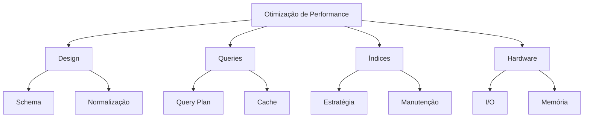
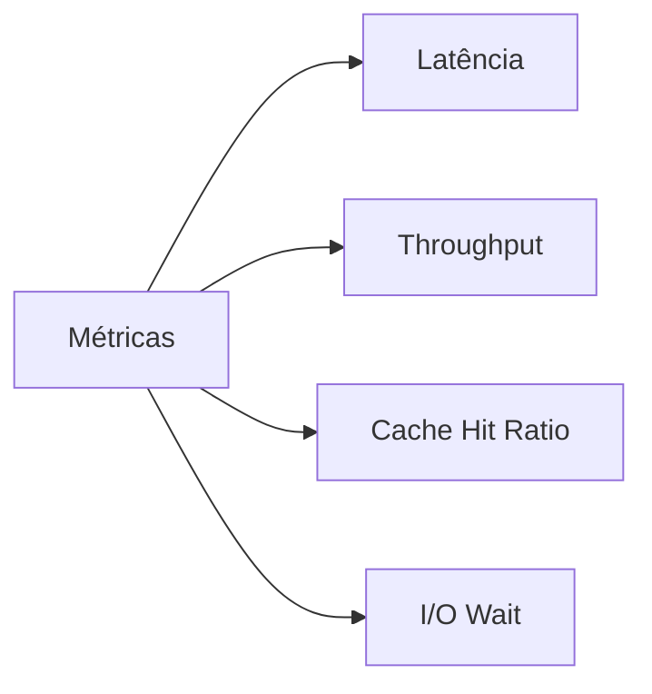

# Otimização de Performance em Bancos de Dados

## Visão Geral



## Estratégias de Otimização

### 1. Design de Schema
- Normalização apropriada
- Tipos de dados eficientes
- Particionamento
- Clustering

### 2. Otimização de Queries

#### Análise de Plano de Execução
```sql
EXPLAIN ANALYZE
SELECT *
FROM pedidos p
JOIN clientes c ON p.cliente_id = c.id
WHERE p.status = 'PENDENTE';
```

#### Técnicas Comuns
- Minimizar SELECT *
- Usar JOINs eficientes
- Evitar subqueries desnecessárias
- Utilizar índices apropriadamente

### 3. Indexação

#### Estratégias
- Índices compostos
- Índices parciais
- Índices cobertos
- Manutenção regular

```sql
-- Índice composto para queries frequentes
CREATE INDEX idx_pedidos_cliente_data ON pedidos(cliente_id, data_pedido);

-- Índice parcial para filtros comuns
CREATE INDEX idx_pedidos_pendentes ON pedidos(data_pedido)
WHERE status = 'PENDENTE';
```

## Monitoramento e Análise

### 1. Métricas Principais



### 2. Ferramentas de Análise
- Query analyzers
- Profilers
- Monitoring dashboards
- Log analysis

## Técnicas Avançadas

### 1. Particionamento
```sql
CREATE TABLE vendas (
    id SERIAL,
    data_venda DATE,
    valor DECIMAL
) PARTITION BY RANGE (data_venda);

CREATE TABLE vendas_2023 PARTITION OF vendas
    FOR VALUES FROM ('2023-01-01') TO ('2024-01-01');
```

### 2. Materialização
```sql
CREATE MATERIALIZED VIEW mv_resumo_vendas AS
SELECT 
    data_venda::DATE,
    SUM(valor) as total_vendas
FROM vendas
GROUP BY data_venda::DATE
WITH DATA;
```

### 3. Caching
- Query cache
- Buffer pool
- Application-level cache
- Distributed cache

## Otimizações Específicas

### 1. OLTP (Online Transaction Processing)
- Índices precisos
- Normalização adequada
- Transações otimizadas
- Connection pooling

### 2. OLAP (Online Analytical Processing)
- Desnormalização estratégica
- Agregações pré-calculadas
- Particionamento efetivo
- Parallel query

## Boas Práticas

### 1. Design
- Escolha apropriada de tipos
- Constraints adequadas
- Normalização balanceada
- Documentação clara

### 2. Desenvolvimento
```sql
-- Evitar
SELECT * FROM usuarios WHERE nome LIKE '%João%';

-- Preferir
SELECT id, nome, email 
FROM usuarios 
WHERE nome_normalizado = normalize('João');
```

### 3. Manutenção
- Atualização de estatísticas
- Rebuild de índices
- Vacuum regular
- Monitoramento contínuo

## Checklist de Otimização

### 1. Análise Inicial
- [ ] Identificar queries lentas
- [ ] Analisar planos de execução
- [ ] Verificar índices existentes
- [ ] Avaliar estatísticas

### 2. Implementação
- [ ] Criar/ajustar índices
- [ ] Otimizar queries
- [ ] Configurar partições
- [ ] Ajustar parâmetros

### 3. Validação
- [ ] Testar performance
- [ ] Monitorar recursos
- [ ] Verificar impactos
- [ ] Documentar mudanças

## Considerações de Escalabilidade

### 1. Vertical Scaling
- CPU
- Memória
- Storage
- I/O

### 2. Horizontal Scaling
- Sharding
- Read replicas
- Load balancing
- Distributed caching

## Anti-Patterns e Soluções

### 1. Problemas Comuns
```sql
-- Anti-pattern: N+1 queries
SELECT * FROM pedidos;
SELECT * FROM itens WHERE pedido_id = ?; -- Repetido N vezes

-- Solução: JOIN adequado
SELECT p.*, i.*
FROM pedidos p
JOIN itens i ON p.id = i.pedido_id;
```

### 2. Mitigações
- Query batching
- Eager loading
- Caching estratégico
- Query optimization

## Recursos Adicionais

### 1. Ferramentas
- Query analyzers
- Profiling tools
- Monitoring solutions
- Benchmarking utilities

### 2. Documentação
- Performance guides
- Best practices
- Case studies
- Troubleshooting guides