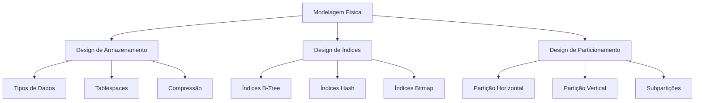

# Modelagem Física

A modelagem física é a última etapa do processo de modelagem de dados, onde o modelo lógico é transformado em uma implementação específica para um SGBD.

## Visão Geral

## Componentes Principais

### 1. Design de Armazenamento
- Escolha de tipos de dados
- Configuração de tablespaces
- Estratégias de compressão
- Gestão de espaço

### 2. Design de Índices
- Seleção de tipos de índices
- Otimização de consultas
- Manutenção de índices
- Monitoramento de uso

### 3. Design de Particionamento
- Estratégias de particionamento
- Critérios de distribuição
- Gerenciamento de partições
- Otimização de consultas

## Considerações de Performance

### 1. Otimização de I/O
- Distribuição de dados
- Buffer cache
- Prefetch
- Write-back

### 2. Otimização de CPU
- Processamento paralelo
- Particionamento
- Compressão
- Execução de queries

## Melhores Práticas

1. **Planejamento de Capacidade**
   - Crescimento de dados
   - Requisitos de performance
   - Recursos de hardware
   - Janelas de manutenção

2. **Monitoramento**
   - Uso de espaço
   - Performance de queries
   - Fragmentação
   - Contenção de recursos