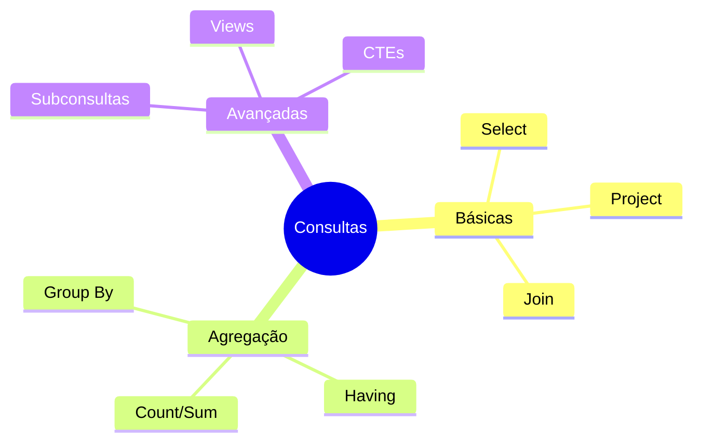

# Operações de Consulta

## Visão Geral



## Operações Básicas

### SELECT
```sql
-- Sintaxe básica
SELECT [DISTINCT] colunas
FROM tabela
WHERE condição;

-- Exemplo
SELECT nome, email
FROM Clientes
WHERE status = 'ATIVO';
```

### JOIN
```sql
-- Inner Join
SELECT c.nome, p.data
FROM Clientes c
JOIN Pedidos p ON c.id = p.cliente_id;

-- Left Join
SELECT c.nome, COUNT(p.id) as total_pedidos
FROM Clientes c
LEFT JOIN Pedidos p ON c.id = p.cliente_id
GROUP BY c.nome;
```

## Operações de Agregação

### GROUP BY
```sql
-- Contagem por grupo
SELECT departamento, COUNT(*) as total
FROM Funcionarios
GROUP BY departamento;

-- Média salarial
SELECT cargo, AVG(salario) as media_salarial
FROM Funcionarios
GROUP BY cargo
HAVING AVG(salario) > 5000;
```

### Funções de Agregação
```sql
SELECT 
    COUNT(*) as total_registros,
    SUM(valor) as valor_total,
    AVG(valor) as valor_medio,
    MIN(data) as data_inicial,
    MAX(data) as data_final
FROM Vendas;
```

## Operações Avançadas

### Subconsultas
```sql
-- Subconsulta no WHERE
SELECT nome
FROM Produtos
WHERE preco > (
    SELECT AVG(preco)
    FROM Produtos
);

-- Subconsulta no FROM
SELECT dept, total_func
FROM (
    SELECT departamento as dept,
           COUNT(*) as total_func
    FROM Funcionarios
    GROUP BY departamento
) as stats
WHERE total_func > 10;
```

### Common Table Expressions (CTEs)
```sql
WITH VendasMensais AS (
    SELECT 
        EXTRACT(MONTH FROM data) as mes,
        SUM(valor) as total
    FROM Vendas
    GROUP BY EXTRACT(MONTH FROM data)
)
SELECT mes, total
FROM VendasMensais
WHERE total > 10000;
```

## Otimização de Consultas

### Índices
```sql
-- Criar índice para consultas frequentes
CREATE INDEX idx_cliente_status 
ON Clientes(status);

-- Índice composto
CREATE INDEX idx_pedido_data_cliente 
ON Pedidos(data, cliente_id);
```

### Plano de Execução
```sql
EXPLAIN ANALYZE
SELECT c.nome, COUNT(p.id) as total_pedidos
FROM Clientes c
JOIN Pedidos p ON c.id = p.cliente_id
GROUP BY c.nome
HAVING COUNT(p.id) > 5;
```

## Padrões de Consulta

### 1. Paginação
```sql
SELECT *
FROM Produtos
ORDER BY nome
LIMIT 10 OFFSET 20;
```

### 2. Hierarquias
```sql
WITH RECURSIVE Subordinados AS (
    SELECT id, nome, gerente_id
    FROM Funcionarios
    WHERE id = 1
    UNION ALL
    SELECT f.id, f.nome, f.gerente_id
    FROM Funcionarios f
    JOIN Subordinados s ON f.gerente_id = s.id
)
SELECT * FROM Subordinados;
```

### 3. Pivotamento
```sql
SELECT 
    produto_id,
    SUM(CASE WHEN MONTH(data) = 1 THEN valor END) as jan,
    SUM(CASE WHEN MONTH(data) = 2 THEN valor END) as fev,
    SUM(CASE WHEN MONTH(data) = 3 THEN valor END) as mar
FROM Vendas
GROUP BY produto_id;
```

## Boas Práticas

### 1. Performance
- Use índices apropriados
- Evite SELECT *
- Limite resultados grandes
- Use JOINs adequadamente

### 2. Manutenibilidade
- Use CTEs para clareza
- Quebre consultas complexas
- Documente partes críticas
- Use aliases descritivos

### 3. Segurança
- Evite injeção SQL
- Use parâmetros
- Limite acesso quando necessário

## Exercícios Práticos

1. Básico
```sql
-- Liste produtos mais vendidos
SELECT p.nome, COUNT(*) as vendas
FROM Produtos p
JOIN Vendas v ON p.id = v.produto_id
GROUP BY p.nome
ORDER BY vendas DESC
LIMIT 10;
```

2. Intermediário
```sql
-- Clientes que compraram todos os produtos
SELECT c.nome
FROM Clientes c
WHERE NOT EXISTS (
    SELECT p.id
    FROM Produtos p
    WHERE NOT EXISTS (
        SELECT 1
        FROM Vendas v
        WHERE v.cliente_id = c.id
        AND v.produto_id = p.id
    )
);
```

3. Avançado
```sql
-- Análise de vendas com janelas móveis
WITH VendasDiarias AS (
    SELECT 
        data,
        SUM(valor) as total
    FROM Vendas
    GROUP BY data
)
SELECT 
    data,
    total,
    AVG(total) OVER (
        ORDER BY data
        ROWS BETWEEN 6 PRECEDING AND CURRENT ROW
    ) as media_7_dias
FROM VendasDiarias;
```