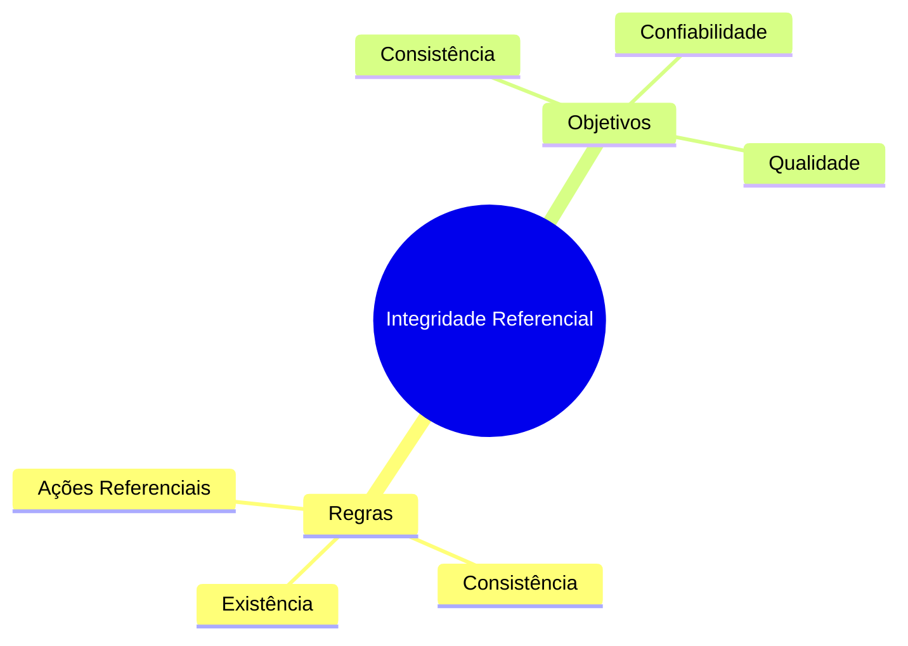
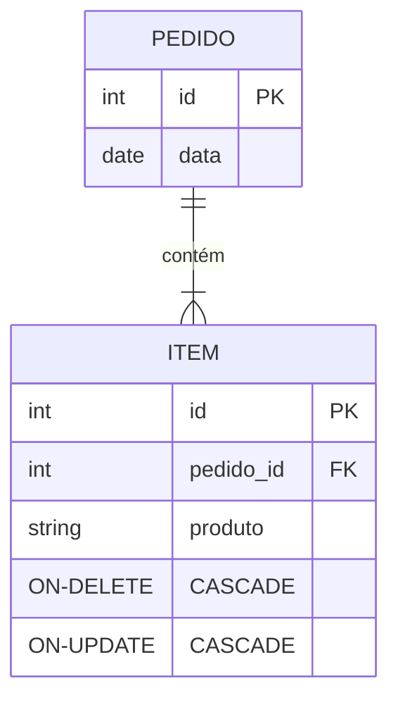
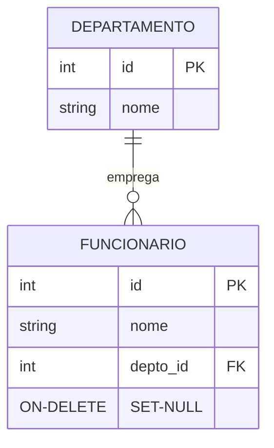
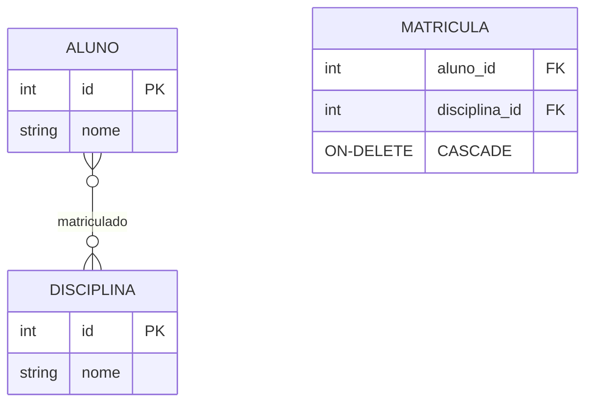

# Integridade Referencial

## Conceitos Fundamentais

### Definição
A integridade referencial garante que relacionamentos entre tabelas permaneçam consistentes.



## Regras de Integridade

### 1. Regra de Existência
- FK deve corresponder a PK válida
- Ou ser NULL (se permitido)

### 2. Regra de Modificação
- Atualizações devem manter consistência
- Deleções devem ser controladas

### 3. Ações Referenciais



#### ON DELETE
- CASCADE: Deleta registros relacionados
- SET NULL: Define FK como NULL
- RESTRICT: Impede deleção
- NO ACTION: Comportamento padrão

#### ON UPDATE
- CASCADE: Atualiza registros relacionados
- SET NULL: Define FK como NULL
- RESTRICT: Impede atualização
- NO ACTION: Comportamento padrão

## Implementação

### 1. SQL DDL
```sql
CREATE TABLE Pedido (
    id SERIAL PRIMARY KEY,
    cliente_id INTEGER,
    data DATE,
    FOREIGN KEY (cliente_id) 
        REFERENCES Cliente(id)
        ON DELETE RESTRICT
        ON UPDATE CASCADE
);
```

### 2. Constraints Deferidas
```sql
CREATE TABLE ItemPedido (
    pedido_id INTEGER,
    produto_id INTEGER,
    quantidade INTEGER,
    FOREIGN KEY (pedido_id) 
        REFERENCES Pedido(id)
        DEFERRABLE INITIALLY DEFERRED
);
```

## Cenários Comuns

### 1. Relacionamentos Pai-Filho



### 2. Relacionamentos Muitos-para-Muitos



## Boas Práticas

### 1. Design de Esquema
- Planeje ações referenciais
- Documente decisões
- Considere impacto em cascata

### 2. Performance
- Use índices apropriados
- Monitore operações em cascata
- Otimize consultas relacionadas

### 3. Manutenção
- Audite violações
- Mantenha consistência
- Atualize documentação

## Tratamento de Erros

### 1. Violações de Integridade
```sql
-- Tratamento em transação
BEGIN;
    DELETE FROM Departamento WHERE id = 1;
EXCEPTION WHEN foreign_key_violation THEN
    -- Tratamento do erro
ROLLBACK;
```

### 2. Validações Preventivas
```sql
-- Verificar antes de deletar
SELECT COUNT(*) FROM Funcionario 
WHERE depto_id = 1;
```

## Monitoramento

### 1. Logs de Violação
- Registre tentativas falhas
- Analise padrões
- Identifique problemas

### 2. Métricas
- Taxa de violações
- Performance de operações
- Impacto em cascata

## Considerações Avançadas

### 1. Transações Distribuídas
- Consistência entre sistemas
- Recuperação de falhas
- Sincronização

### 2. Replicação
- Propagação de mudanças
- Consistência eventual
- Resolução de conflitos