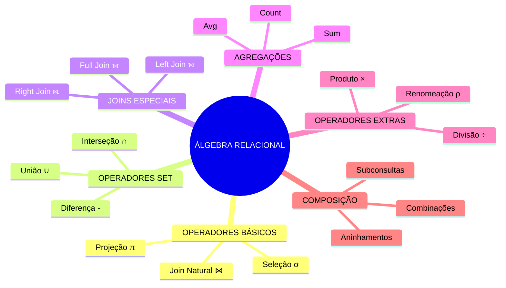

# Álgebra Relacional

```
╔═══════════════════════════════════════════════════════════════════════╗
║                    RELATIONAL.ALGEBRA                                 ║
║             "A linguagem matemática dos bancos de dados"             ║
╚═══════════════════════════════════════════════════════════════════════╝
```

## INTRODUÇÃO

A álgebra relacional é como um conjunto de regras matemáticas que nos permite manipular dados em bancos de dados relacionais. Pense nela como um conjunto de LEGO®: cada peça (operador) tem uma função específica, e podemos combiná-las para construir consultas complexas.

### Por que é importante?
- É a base teórica do SQL
- Permite entender como os dados são manipulados
- Ajuda a otimizar consultas
- É fundamental para o design de bancos de dados


## MAPA MENTAL 




## CHEAT SHEET - TABELA DOS PREGUIÇOSOS

| OPERADOR     | SÍMBOLO | NOME SQL       | O QUE FAZ                 | EXEMPLO SQL                   |
|--------------|---------|----------------|---------------------------|-------------------------------|
| Seleção      | σ       | WHERE          | Filtra linhas             | SELECT * FROM tabela         |
|              |         |                |                           | WHERE condição;              |
| Projeção     | π       | SELECT         | Seleciona colunas         | SELECT coluna1, coluna2      |
|              |         |                |                           | FROM tabela;                 |
| Join Natural | ⋈       | NATURAL JOIN   | Junta tabelas             | SELECT * FROM tabela1        |
|              |         |                |                           | NATURAL JOIN tabela2;        |
| União        | ∪       | UNION          | Combina resultados        | SELECT * FROM tabela1        |
|              |         |                |                           | UNION                        |
|              |         |                |                           | SELECT * FROM tabela2;       |
| Diferença    | -       | EXCEPT         | Remove resultados         | SELECT * FROM tabela1        |
|              |         |                |                           | EXCEPT                       |
|              |         |                |                           | SELECT * FROM tabela2;       |


## OPERADORES BÁSICOS COM SQL

| Operador     | Símbolo | Nome SQL     | O que faz           | Exemplo SQL                        |
|--------------|---------|--------------|--------------------|------------------------------------|
| Seleção      | σ       | WHERE        | Filtra linhas      | `SELECT * FROM tabela WHERE condição;` |
| Projeção     | π       | SELECT       | Seleciona colunas  | `SELECT coluna1, coluna2 FROM tabela;` |
| Join Natural | ⋈       | NATURAL JOIN | Junta tabelas      | `SELECT * FROM tabela1 NATURAL JOIN tabela2;` |
| União        | ∪       | UNION        | Combina resultados | `SELECT * FROM tabela1 UNION SELECT * FROM tabela2;` |
| Diferença    | -       | EXCEPT       | Remove resultados  | `SELECT * FROM tabela1 EXCEPT SELECT * FROM tabela2;` |


## CONCEITOS.BÁSICOS

### O que é uma Relação?
Uma relação é basicamente uma tabela com:
- Linhas (registros/tuplas)
- Colunas (atributos)

Exemplo:
```
┌────────────────────────────────────────────┐
│ CLIENTES                                  │
├─────────┬──────────────┬─────────────────┤
│   ID    │    Nome      │    Idade        │
├─────────┼──────────────┼─────────────────┤
│   1     │    João      │     25          │
│   2     │    Maria     │     30          │
│   3     │    Pedro     │     28          │
└────────────────────────────────────────────┘
```

## OPERADORES.FUNDAMENTAIS

### 1. Seleção (σ - Sigma)
```
┌────────────────────────────────────────────┐
│ SELEÇÃO (σ)                               │
├────────────────────────────────────────────┤
│ O que faz: Filtra linhas                  │
│ Como se lê: "Sigma"                       │
│ Exemplo: σidade>25(Clientes)               │
│ Significado: "Selecione clientes com      │
│              idade maior que 25"          │
└────────────────────────────────────────────┘
```

Em SQL seria:
```sql
SELECT * 
FROM Clientes 
WHERE idade > 25;
```

### 2. Projeção (π - Pi)
```
┌────────────────────────────────────────────┐
│ PROJEÇÃO (π)                              │
├────────────────────────────────────────────┤
│ O que faz: Seleciona colunas              │
│ Como se lê: "Pi"                          │
│ Exemplo: πnome,idade(Clientes)             │
│ Significado: "Mostre apenas nome e idade  │
│              dos clientes"                │
└────────────────────────────────────────────┘
```

Em SQL seria:
```sql
SELECT nome, idade 
FROM Clientes;
```

### 3. Join Natural (⋈)
```
┌────────────────────────────────────────────┐
│ JOIN NATURAL (⋈)                          │
├────────────────────────────────────────────┤
│ O que faz: Combina duas tabelas           │
│ Como se lê: "Join"                        │
│ Exemplo: Clientes ⋈ Pedidos              │
│ Significado: "Junte clientes com seus     │
│              respectivos pedidos"         │
└────────────────────────────────────────────┘
```

Em SQL seria:
```sql
SELECT * 
FROM Clientes 
NATURAL JOIN Pedidos;
```

## OPERAÇÕES.BÁSICAS

### Seleção (σ)
```sql
-- Exemplo: σidade>18(Clientes)
SELECT * FROM Clientes WHERE idade > 18;
```

### Projeção (π)
```sql
-- Exemplo: πnome,email(Usuarios)
SELECT nome, email FROM Usuarios;
```

### Join Natural (⋈)
```sql
-- Exemplo: Pedidos ⋈ Clientes
SELECT * FROM Pedidos 
NATURAL JOIN Clientes;
```

## OPERAÇÕES.AVANÇADAS

### Join Theta (⋈θ)
```
┌────────────────────────────────────────────┐
│ THETA.JOIN                                │
├────────────────────────────────────────────┤
│ R ⋈θ S, onde θ é a condição de junção    │
│ Como se lê: "R join S onde theta"         │
└────────────────────────────────────────────┘
```

### Division (÷)
```
┌────────────────────────────────────────────┐
│ DIVISION.OPERATOR                         │
├────────────────────────────────────────────┤
│ R ÷ S                                     │
│ Como se lê: "R dividido por S"            │
└────────────────────────────────────────────┘
```

### Agregação (γ)
```
┌────────────────────────────────────────────┐
│ AGGREGATION.OPERATOR                      │
├────────────────────────────────────────────┤
│ γgrupo,função(R)                           │
│ Como se lê: "Gamma grupo,função de R"     │
└────────────────────────────────────────────┘
```

## EXEMPLOS.PRÁTICOS.DETALHADOS

### Exemplo 1: Encontrar Clientes VIP
Queremos encontrar o nome e email dos clientes que gastaram mais de 1000.

```
┌────────────────────────────────────────────┐
│ PASSO A PASSO                             │
├────────────────────────────────────────────┤
│ 1. Juntar Clientes com Vendas             │
│ 2. Filtrar vendas > 1000                  │
│ 3. Mostrar apenas nome e email            │
└────────────────────────────────────────────┘
```

Em álgebra relacional:
```
πnome,email(σtotal>1000(Clientes ⋈ Vendas))
```

Como ler:
1. Comece de dentro dos parênteses
2. Junte (`⋈`) Clientes com Vendas
3. Filtre (`σ`) onde total > 1000
4. Projete (`π`) apenas nome e email

Em SQL:
```sql
SELECT c.nome, c.email
FROM Clientes c
JOIN Vendas v ON c.id = v.cliente_id
WHERE v.total > 1000;
```

### Exemplo 2: Agrupamento
Queremos contar quantos pedidos cada cliente fez.

```
┌────────────────────────────────────────────┐
│ AGREGAÇÃO                                 │
├────────────────────────────────────────────┤
│ γcliente_id,COUNT(*)(Pedidos)              │
├────────────────────────────────────────────┤
│ Como ler:                                 │
│ "Agrupe por cliente_id e conte            │
│  o total de pedidos para cada um"         │
└────────────────────────────────────────────┘
```

Em SQL:
```sql
SELECT cliente_id, COUNT(*) as total_pedidos
FROM Pedidos
GROUP BY cliente_id;
```

## DICAS.PRÁTICAS

### Como Construir Consultas
1. Identifique o que você quer ver (Projeção - π)
2. Identifique de onde vêm os dados (Joins - ⋈)
3. Defina as condições (Seleção - σ)
4. Se precisar agrupar, use agregação (γ)

### Exemplo de Construção
Problema: "Liste o nome dos clientes que fizeram mais de 5 pedidos em 2023"

Passo a passo:
```
┌────────────────────────────────────────────┐
│ 1. Juntar Clientes e Pedidos              │
│ 2. Filtrar pedidos de 2023                │
│ 3. Agrupar por cliente                    │
│ 4. Contar pedidos                         │
│ 5. Filtrar > 5 pedidos                    │
│ 6. Mostrar apenas nomes                   │
└────────────────────────────────────────────┘
```

Em álgebra relacional:
```
πnome(σcontagem>5(γcliente_id,COUNT(*)->contagem(
    σano=2023(Clientes ⋈ Pedidos)
)))
```

Em SQL:
```sql
SELECT c.nome
FROM Clientes c
JOIN Pedidos p ON c.id = p.cliente_id
WHERE YEAR(p.data) = 2023
GROUP BY c.id, c.nome
HAVING COUNT(*) > 5;
```

## EXERCÍCIOS.INICIANTES

1. Básico: Selecione todos os clientes com idade > 18
```
Álgebra: σidade>18(Clientes)
SQL: SELECT * FROM Clientes WHERE idade > 18;
```

2. Intermediário: Nome e email dos clientes do Rio de Janeiro
```
Álgebra: πnome,email(σcidade='Rio de Janeiro'(Clientes))
SQL: SELECT nome, email FROM Clientes WHERE cidade = 'Rio de Janeiro';
```

## RECURSOS.PARA.APRENDER

### Ferramentas Online
- RelaX: Pratique álgebra relacional online
- SQLFiddle: Teste suas conversões para SQL
- DB-MAIN: Visualize suas operações

### Dicas de Estudo
1. Comece com operadores básicos
2. Pratique a conversão para SQL
3. Construa consultas gradualmente
4. Use diagramas para visualizar joins

```
╔════════════════════════════════════════════════════════════════════╗
║ "Entender álgebra relacional é como aprender a gramática de uma   ║
║  nova língua - no início parece difícil, mas depois tudo faz      ║
║  sentido!"                                                        ║
╚════════════════════════════════════════════════════════════════════╝
```

