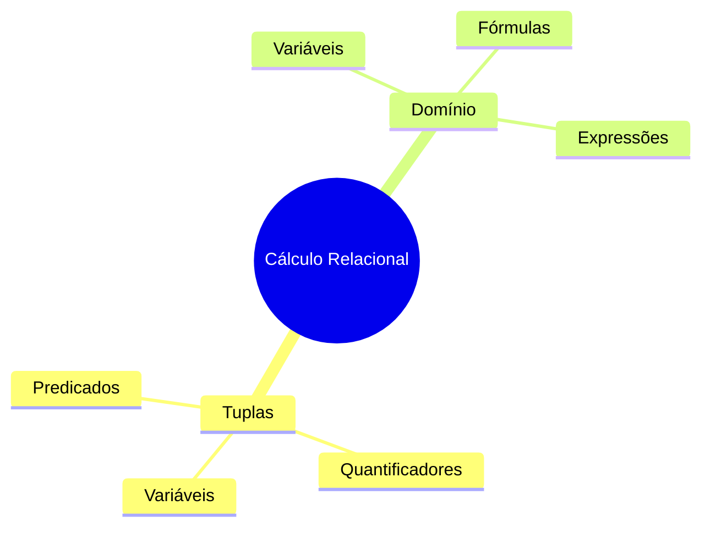
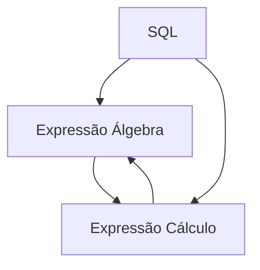

# Cálculo Relacional

## Fundamentos



## Cálculo de Tuplas

### Sintaxe Básica
```
┌────────────────────────────────────────────┐
│ CÁLCULO DE TUPLAS                         │
├────────────────────────────────────────────┤
│ {t | P(t)}                                │
│ Onde:                                     │
│ t: variável de tupla                      │
│ P(t): predicado sobre t                   │
└────────────────────────────────────────────┘
```

### Quantificadores

1. Universal (∀)
```sql
-- Todos os clientes que fizeram pedidos
{c | c ∈ Clientes ∧ ∀p(p ∈ Pedidos → 
    p.cliente_id = c.id)}

-- SQL equivalente:
SELECT * FROM Clientes c
WHERE NOT EXISTS (
    SELECT 1 FROM Pedidos p
    WHERE p.cliente_id != c.id
);
```

2. Existencial (∃)
```sql
-- Clientes com pelo menos um pedido
{c | c ∈ Clientes ∧ ∃p(p ∈ Pedidos ∧ 
    p.cliente_id = c.id)}

-- SQL equivalente:
SELECT * FROM Clientes c
WHERE EXISTS (
    SELECT 1 FROM Pedidos p
    WHERE p.cliente_id = c.id
);
```

## Cálculo de Domínio

### Sintaxe Básica
```
┌────────────────────────────────────────────┐
│ CÁLCULO DE DOMÍNIO                        │
├────────────────────────────────────────────┤
│ {<x1,...,xn> | P(x1,...,xn)}             │
│ Onde:                                     │
│ xi: variáveis de domínio                  │
│ P: predicado sobre variáveis              │
└────────────────────────────────────────────┘
```

### Exemplos

1. Projeção Simples
```sql
-- Nome e idade dos clientes
{<n,i> | ∃c(c ∈ Clientes ∧ 
    c.nome = n ∧ c.idade = i)}

-- SQL equivalente:
SELECT nome, idade FROM Clientes;
```

2. Seleção com Condição
```sql
-- Clientes maiores de idade
{<n,i> | ∃c(c ∈ Clientes ∧ 
    c.nome = n ∧ c.idade = i ∧ i > 18)}

-- SQL equivalente:
SELECT nome, idade 
FROM Clientes 
WHERE idade > 18;
```

## Comparação com Álgebra Relacional

### Equivalência


### Exemplos de Equivalência

1. Seleção
```
Álgebra: σidade>18(Clientes)
Cálculo: {c | c ∈ Clientes ∧ c.idade > 18}
SQL: SELECT * FROM Clientes WHERE idade > 18
```

2. Projeção
```
Álgebra: πnome,email(Clientes)
Cálculo: {<n,e> | ∃c(c ∈ Clientes ∧ 
         c.nome = n ∧ c.email = e)}
SQL: SELECT nome, email FROM Clientes
```

## Exercícios Práticos

1. Básico
```sql
-- Encontre todos os produtos com preço > 100
{p | p ∈ Produtos ∧ p.preco > 100}

-- SQL equivalente:
SELECT * FROM Produtos 
WHERE preco > 100;
```

2. Intermediário
```sql
-- Clientes que fizeram pedidos em 2023
{c | c ∈ Clientes ∧ ∃p(p ∈ Pedidos ∧ 
    p.cliente_id = c.id ∧ 
    YEAR(p.data) = 2023)}

-- SQL equivalente:
SELECT DISTINCT c.* 
FROM Clientes c
JOIN Pedidos p ON c.id = p.cliente_id
WHERE YEAR(p.data) = 2023;
```

## Otimização

### Regras de Simplificação
1. Eliminação de Quantificadores
2. Redução de Variáveis
3. Simplificação de Predicados

### Exemplo de Otimização
```sql
-- Antes
{c | c ∈ Clientes ∧ ∃p(p ∈ Pedidos ∧ 
    p.cliente_id = c.id ∧ ∃i(i ∈ Itens ∧ 
    i.pedido_id = p.id))}

-- Depois
{c | c ∈ Clientes ∧ ∃p(p ∈ Pedidos ∧ 
    p.cliente_id = c.id ∧ p.id IN Itens.pedido_id)}
```