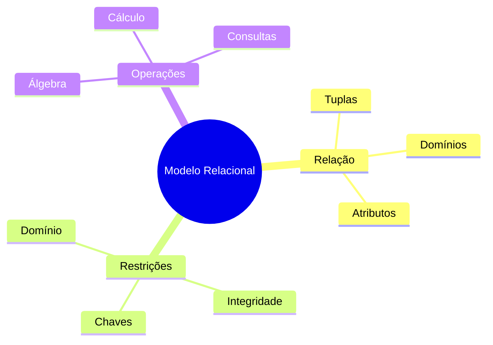

# Conceitos do Modelo Relacional

O modelo relacional é fundamentado em conceitos matemáticos sólidos que garantem sua consistência e confiabilidade.

## Definições Fundamentais



## Terminologia

| Termo Relacional | Termo Informal | Descrição |
|-----------------|----------------|-----------|
| Relação | Tabela | Conjunto de tuplas |
| Tupla | Linha/Registro | Conjunto de valores relacionados |
| Atributo | Coluna/Campo | Característica da relação |
| Domínio | Tipo de Dados | Conjunto de valores possíveis |
| Esquema | Estrutura | Definição da relação |
| Instância | Dados | Conteúdo atual da relação |

## Propriedades Essenciais

1. **Valores Atômicos**
2. **Sem Ordem nas Tuplas**
3. **Sem Duplicatas**
4. **Sem Ordem nos Atributos**
5. **Valores Únicos nas Colunas**

## Exemplos Práticos

### Esquema de Relação
```sql
FUNCIONARIO (ID, Nome, Cargo, Salario, Depto_ID)
```

### Instância de Relação
```sql
ID  | Nome    | Cargo      | Salario | Depto_ID
----+---------+------------+---------+---------
1   | Ana     | Analista   | 5000    | 10
2   | Carlos  | Gerente    | 8000    | 20
3   | Maria   | Desenvolvedora | 6000 | 10
```