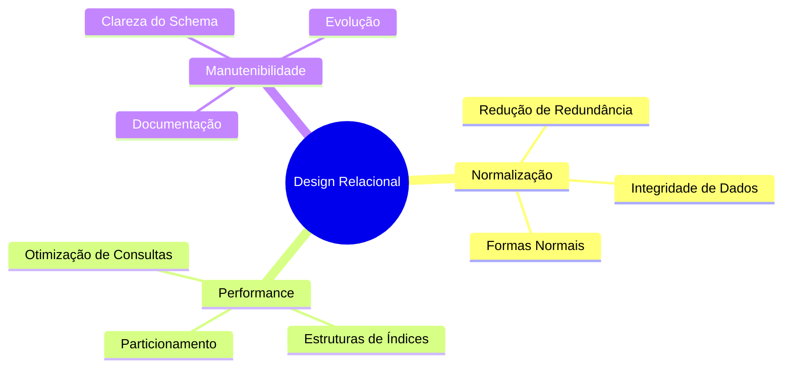

# Design Relacional

O design relacional é um processo sistemático para criar esquemas de banco de dados que sejam eficientes, consistentes e mantenham a integridade dos dados.

## Princípios Fundamentais

## Processo de Design

### 1. Análise de Requisitos
- Identificação de entidades e relacionamentos
- Definição de restrições
- Levantamento de requisitos de consulta
- Requisitos de performance

### 2. Modelagem Conceitual
- Criação do modelo ER
- Definição de cardinalidades
- Identificação de chaves
- Documentação de regras de negócio

### 3. Modelagem Lógica
- Transformação para modelo relacional
- Normalização de tabelas
- Definição de constraints
- Otimização inicial

### 4. Modelagem Física
- Escolha de tipos de dados
- Estratégia de indexação
- Particionamento
- Configurações de armazenamento

## Considerações Importantes

### 1. Integridade dos Dados
- Restrições de domínio
- Integridade referencial
- Regras de negócio
- Validações

### 2. Performance
- Análise de consultas frequentes
- Estratégias de otimização
- Balanceamento de recursos
- Monitoramento

### 3. Escalabilidade
- Crescimento de dados
- Evolução do schema
- Particionamento
- Distribuição

## Melhores Práticas

### 1. Nomenclatura
- Padrões consistentes
- Nomes descritivos
- Convenções estabelecidas
- Documentação clara

### 2. Normalização
- Nível adequado de normalização
- Casos para desnormalização
- Balanceamento com performance
- Manutenção da integridade

### 3. Documentação
- Dicionário de dados
- Diagramas atualizados
- Decisões de design
- Regras de negócio

## Ferramentas e Técnicas

### 1. Modelagem
- Ferramentas CASE
- Geradores de documentação
- Validadores de schema
- Otimizadores

### 2. Análise
- Analisadores de performance
- Ferramentas de profiling
- Monitores de consulta
- Validadores de integridade

### 3. Manutenção
- Controle de versão
- Ferramentas de migração
- Gestão de mudanças
- Backup e recuperação