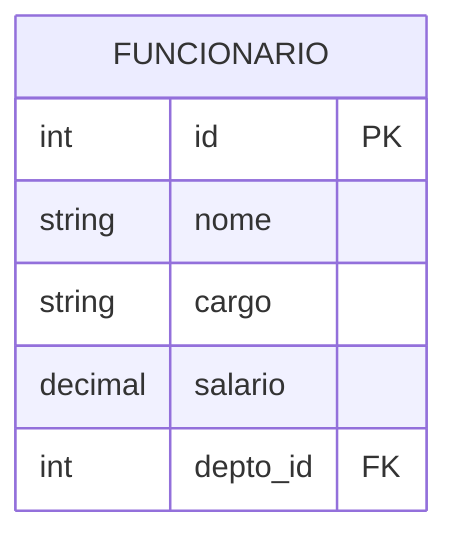
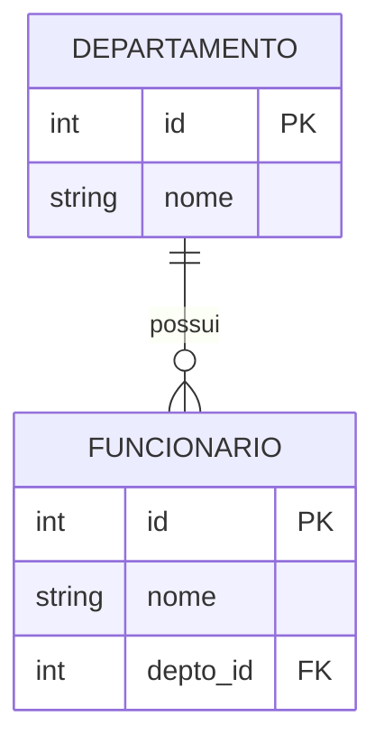
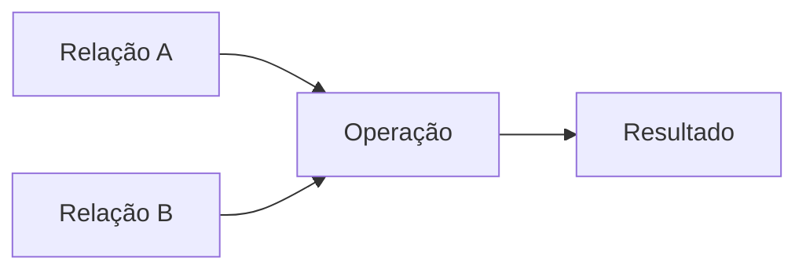
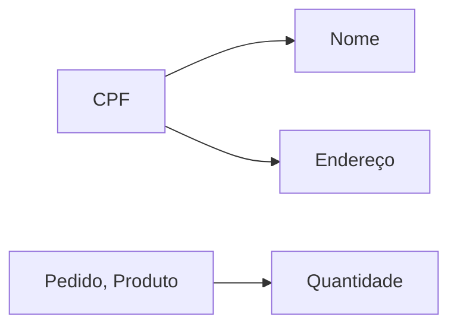

# Modelo Relacional

O modelo relacional é um modelo de dados que organiza as informações em relações (tabelas), baseado em conceitos matemáticos da teoria dos conjuntos e lógica de predicados.

## Conceitos Fundamentais

### 1. Relação (Tabela)



Uma relação consiste em:
- **Esquema**: estrutura da tabela
- **Tuplas**: linhas da tabela
- **Atributos**: colunas da tabela
- **Domínios**: tipos de dados válidos

### 2. Chaves

#### Tipos de Chaves
- **Chave Primária**: Identifica unicamente cada tupla
- **Chave Candidata**: Potencial chave primária
- **Chave Estrangeira**: Referencia chave primária de outra relação
- **Chave Composta**: Formada por múltiplos atributos

```sql
CREATE TABLE Pedido (
    numero INT,
    item_id INT,
    quantidade INT,
    PRIMARY KEY (numero, item_id),
    FOREIGN KEY (item_id) REFERENCES Item(id)
);
```

## Propriedades Fundamentais

### 1. Integridade

#### Integridade de Entidade
- Chave primária não pode ser nula
- Valores únicos para identificação

#### Integridade Referencial
- Chaves estrangeiras válidas
- Consistência entre relações



### 2. Atomicidade
- Valores atômicos (indivisíveis)
- Sem atributos multivalorados
- Sem grupos repetitivos

## Operações Relacionais

### 1. Álgebra Relacional



#### Operações Básicas
- **Seleção** (σ): Filtra tuplas
- **Projeção** (π): Seleciona colunas
- **União** (∪): Combina tuplas
- **Diferença** (-): Remove tuplas
- **Produto Cartesiano** (×): Combina todas as tuplas

#### Operações Derivadas
- **Interseção** (∩)
- **Junção** (⋈)
- **Divisão** (÷)

### 2. Exemplos Práticos

```sql
-- Seleção
SELECT * FROM Funcionario 
WHERE salario > 5000;

-- Projeção
SELECT nome, cargo FROM Funcionario;

-- Junção
SELECT f.nome, d.nome as departamento
FROM Funcionario f
JOIN Departamento d ON f.depto_id = d.id;
```

## Normalização no Modelo Relacional

### 1. Dependências Funcionais



### 2. Formas Normais
1. **1FN**: Valores atômicos
2. **2FN**: Dependência total da chave
3. **3FN**: Sem dependências transitivas
4. **BCNF**: Todas as dependências por chave

## Vantagens e Limitações

### Vantagens
- Simplicidade conceitual
- Independência de dados
- Flexibilidade
- Integridade garantida
- Base matemática sólida

### Limitações
- Tipos de dados complexos
- Relacionamentos hierárquicos
- Performance em alguns casos
- Modelagem OO direta

## Implementação Prática

### 1. Estruturas de Dados

```sql
CREATE TABLE Cliente (
    id SERIAL PRIMARY KEY,
    nome VARCHAR(100) NOT NULL,
    email VARCHAR(100) UNIQUE,
    data_cadastro DATE DEFAULT CURRENT_DATE,
    status CHAR(1) CHECK (status IN ('A','I'))
);
```

### 2. Restrições

```sql
ALTER TABLE Pedido
ADD CONSTRAINT fk_cliente
FOREIGN KEY (cliente_id)
REFERENCES Cliente(id)
ON DELETE RESTRICT
ON UPDATE CASCADE;
```

## Melhores Práticas

### 1. Design
- Normalização adequada
- Chaves bem definidas
- Integridade referencial
- Tipos de dados apropriados

### 2. Nomenclatura
- Padrões consistentes
- Nomes descritivos
- Prefixos/sufixos quando necessário
- Documentação clara

### 3. Performance
- Índices apropriados
- Constraints adequadas
- Tipos de dados otimizados
- Relacionamentos eficientes

## Ferramentas de Modelagem

### 1. CASE Tools
- MySQL Workbench
- Oracle SQL Developer
- pgModeler
- ERwin

### 2. Visualização
- DrawSQL
- dbdiagram.io
- QuickDBD
- Lucidchart