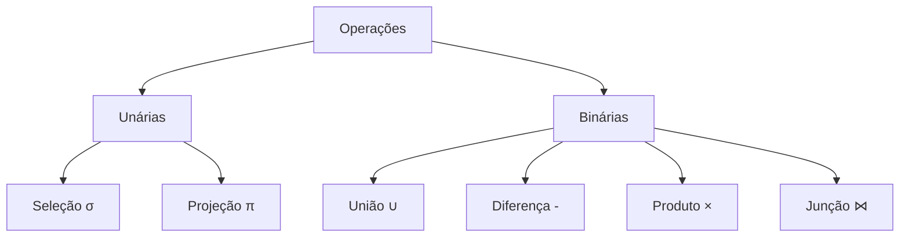
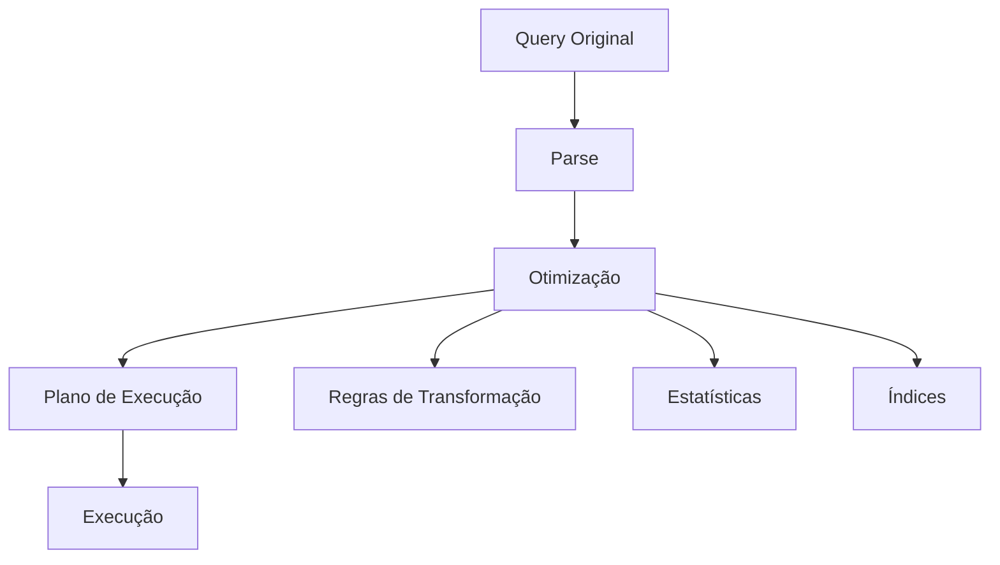

# Operações Relacionais

As operações relacionais formam a base para manipulação e consulta de dados em um banco de dados relacional.

## Álgebra Relacional

### Operações Básicas



### Exemplos de Operações

#### Seleção (σ)
```sql
-- Álgebra: σsalario>5000(Funcionario)
SELECT * 
FROM Funcionario 
WHERE salario > 5000;
```

#### Projeção (π)
```sql
-- Álgebra: πnome,cargo(Funcionario)
SELECT nome, cargo 
FROM Funcionario;
```

#### Junção Natural (⋈)
```sql
-- Álgebra: Funcionario ⋈ Departamento
SELECT * 
FROM Funcionario 
NATURAL JOIN Departamento;
```

## Otimização de Operações

### Regras de Transformação

1. **Comutatividade**
   - A ⋈ B = B ⋈ A
   - A ∪ B = B ∪ A

2. **Associatividade**
   - (A ⋈ B) ⋈ C = A ⋈ (B ⋈ C)
   - (A ∪ B) ∪ C = A ∪ (B ∪ C)

3. **Distributividade**
   - σc(A ⋈ B) = σc(A) ⋈ B
   - πa(A ⋈ B) = πa(πa,b(A) ⋈ B)

## Exemplos Práticos

### Consulta Complexa

```sql
-- Encontrar funcionários e seus departamentos
-- com salário acima da média
SELECT f.nome, d.nome as departamento
FROM Funcionario f
JOIN Departamento d ON f.depto_id = d.id
WHERE f.salario > (
    SELECT AVG(salario) 
    FROM Funcionario
);
```

### Análise de Performance



## Boas Práticas

1. **Otimização**
   - Usar índices apropriados
   - Evitar produto cartesiano
   - Preferir junções a subconsultas

2. **Legibilidade**
   - Nomes claros
   - Indentação consistente
   - Comentários quando necessário

3. **Manutenção**
   - Modularização
   - Reutilização
   - Documentação