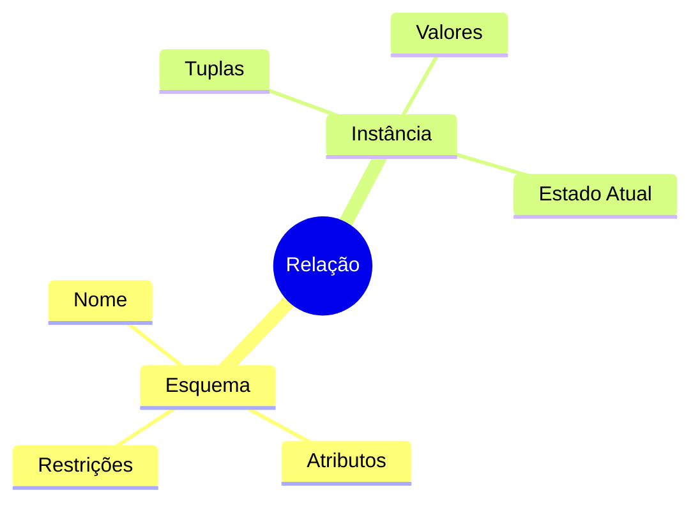
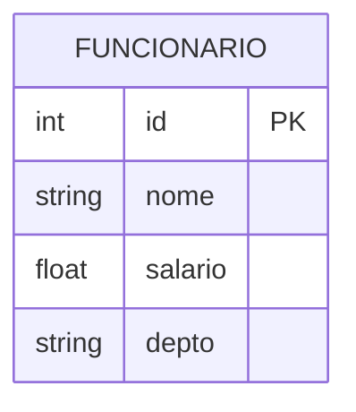
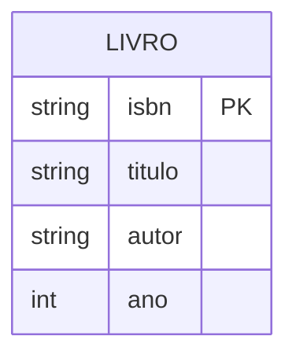
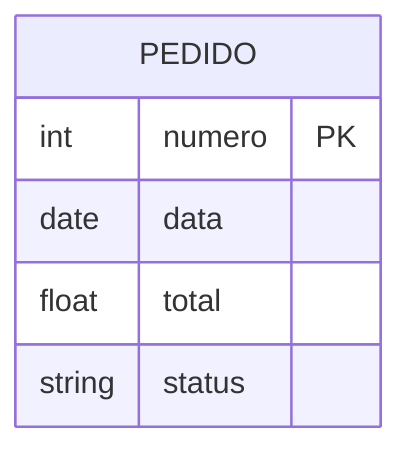

# Relações e Tuplas

## Conceitos Fundamentais

### Relação
Uma relação é uma estrutura matemática que representa uma tabela no modelo relacional.



### Propriedades das Relações

1. **Sem Ordem nas Tuplas**
   - A ordem das linhas é irrelevante
   - {(1,A), (2,B)} = {(2,B), (1,A)}

2. **Sem Duplicatas**
   - Cada tupla é única
   - Identificada pela chave primária

3. **Valores Atômicos**
   - Cada célula contém valor indivisível
   - Não permite arrays ou estruturas

## Tuplas

### Definição Formal
Uma tupla é um conjunto ordenado de valores: t = (v₁, v₂, ..., vₙ)
- v₁ pertence ao domínio do primeiro atributo
- v₂ pertence ao domínio do segundo atributo
- vₙ pertence ao domínio do n-ésimo atributo

### Exemplo Prático



Instância da Relação:
```sql
ID  | NOME    | SALARIO | DEPTO
----|---------|---------|-------
1   | Ana     | 5000.00 | TI
2   | Carlos  | 6000.00 | RH
3   | Maria   | 5500.00 | TI
```

### Operações com Tuplas

1. **Inserção**
   - Adiciona nova tupla
   - Deve respeitar restrições

2. **Remoção**
   - Elimina tupla existente
   - Considera integridade referencial

3. **Atualização**
   - Modifica valores
   - Mantém consistência

## Notação Matemática

### Definição de Relação
R ⊆ D₁ × D₂ × ... × Dₙ
- R é a relação
- Dᵢ são os domínios dos atributos

### Operações de Conjunto
- União: R ∪ S
- Interseção: R ∩ S
- Diferença: R - S

## Exemplos Detalhados

### Sistema de Biblioteca



Instâncias:
```sql
ISBN       | TITULO           | AUTOR    | ANO
-----------|------------------|----------|----
123456789  | Banco de Dados  | Silva    | 2020
987654321  | SQL Avançado    | Pereira  | 2021
```

### Sistema de Vendas



## Considerações Práticas

### 1. Integridade dos Dados
- Validação de entrada
- Consistência das tuplas
- Restrições de domínio

### 2. Performance
- Indexação adequada
- Otimização de consultas
- Gerenciamento de espaço

### 3. Manutenibilidade
- Documentação clara
- Normalização apropriada
- Padrões de nomenclatura