# Relacionamentos

Um relacionamento representa uma associação entre duas ou mais entidades, descrevendo como elas interagem entre si no contexto do domínio.

## Características dos Relacionamentos

### 1. Grau do Relacionamento

#### Relacionamento Binário
- Envolve duas entidades
- Tipo mais comum
- Exemplo: Cliente realiza Pedido

#### Relacionamento Ternário
- Envolve três entidades
- Usado em casos específicos
- Exemplo: Professor leciona Disciplina para Turma

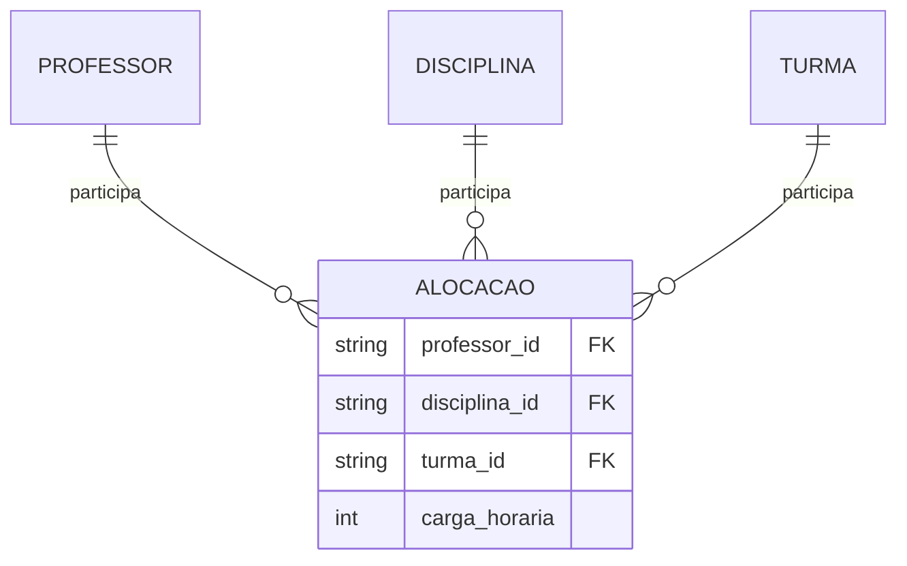

#### Relacionamento Recursivo
- Uma entidade se relaciona consigo mesma
- Exemplo: Funcionário supervisiona Funcionário

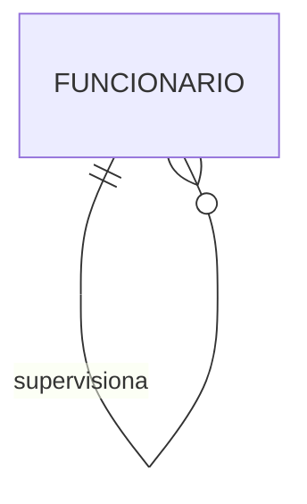

### 2. Cardinalidade

#### Um-para-Um (1:1)
- Cada instância se relaciona com no máximo uma outra
- Exemplo: Pessoa tem um CPF

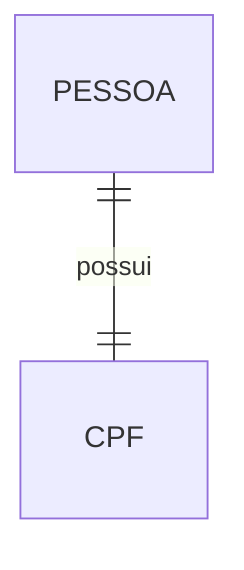

#### Um-para-Muitos (1:N)
- Uma instância se relaciona com várias outras
- Exemplo: Departamento tem vários Funcionários

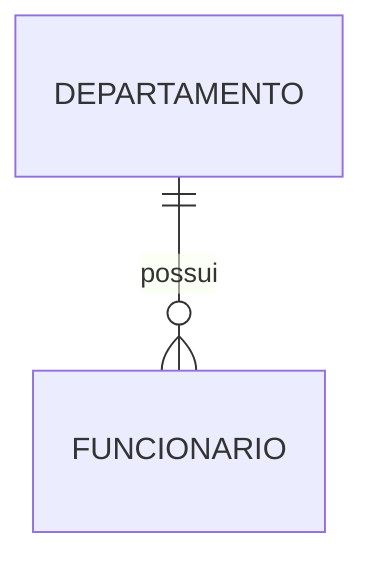

#### Muitos-para-Muitos (N:M)
- Várias instâncias se relacionam com várias outras
- Exemplo: Aluno cursa várias Disciplinas

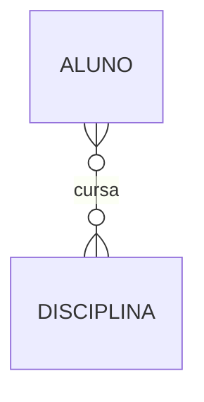

### 3. Participação

#### Participação Total
- Todas as instâncias da entidade participam do relacionamento
- Representada por linha dupla

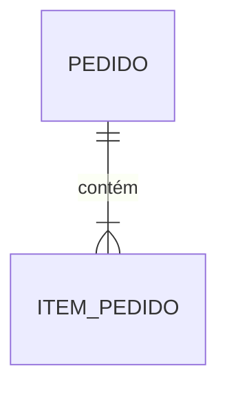

#### Participação Parcial
- Algumas instâncias podem não participar
- Representada por linha simples

## Atributos em Relacionamentos

Relacionamentos podem ter seus próprios atributos.

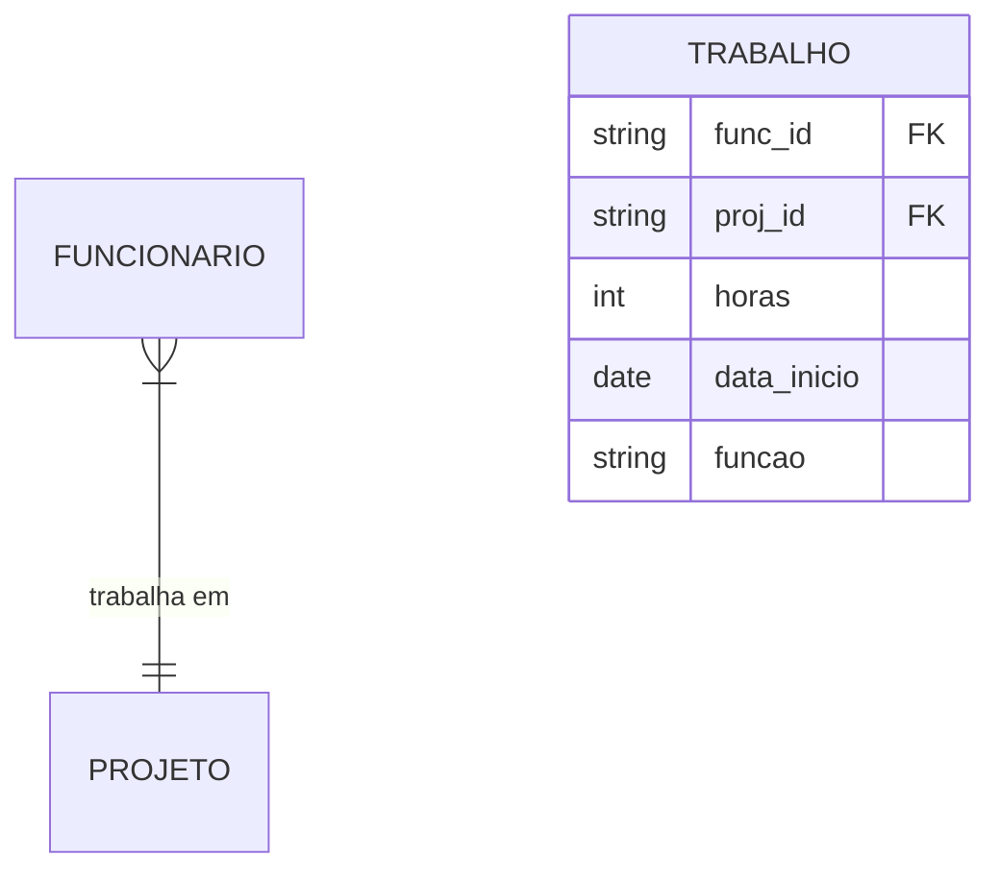

## Papéis em Relacionamentos

Cada entidade desempenha um papel específico no relacionamento.

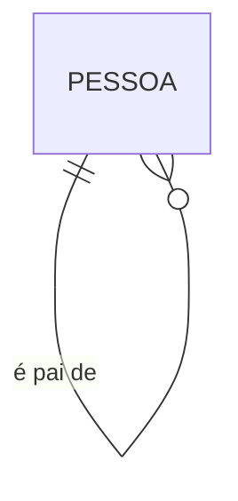

## Exemplos Práticos

### Sistema Acadêmico

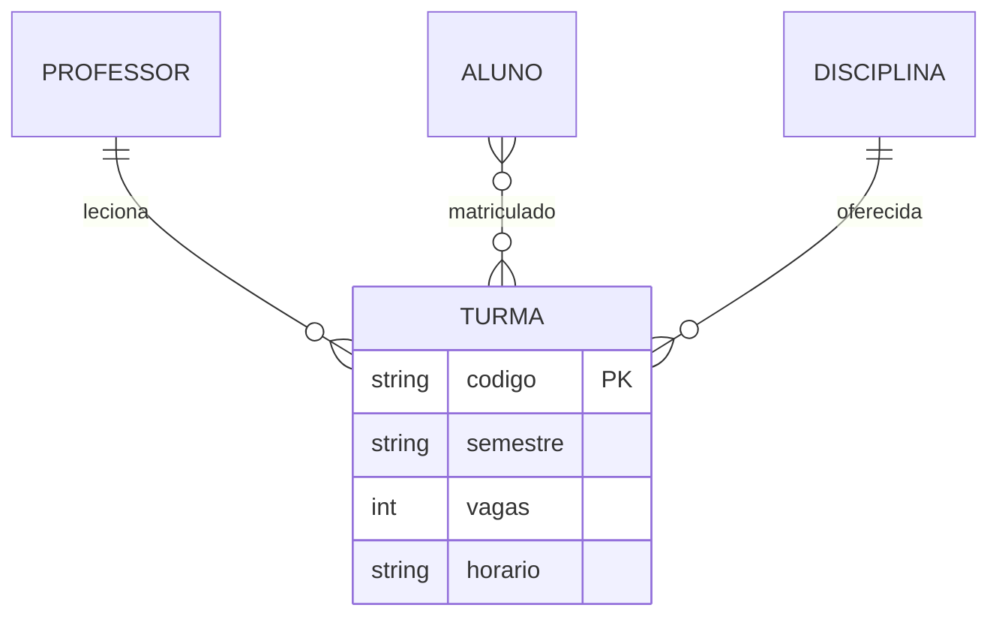

### Sistema de Vendas

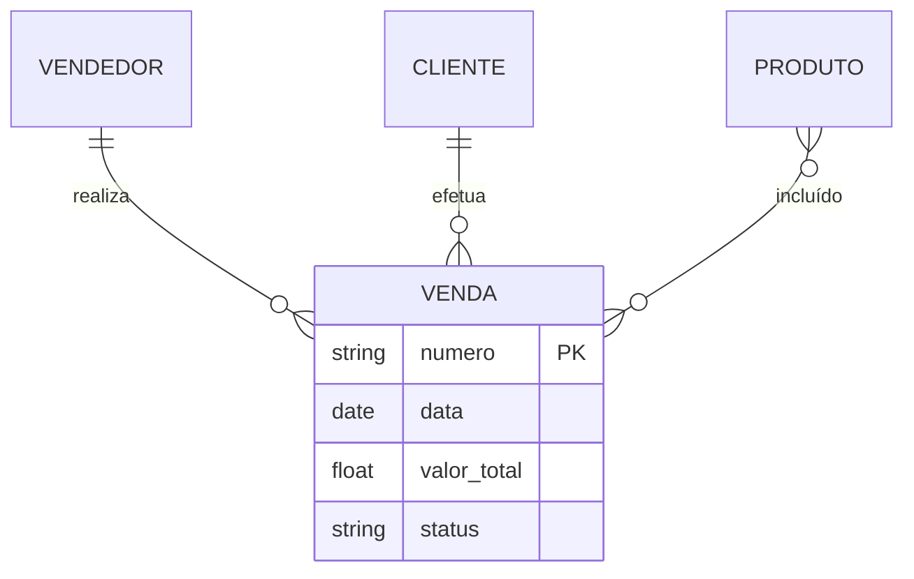

## Boas Práticas

### 1. Nomenclatura
- Use verbos para nomes de relacionamentos
- Seja claro e específico
- Mantenha consistência

### 2. Design
- Evite relacionamentos redundantes
- Minimize relacionamentos complexos
- Documente restrições importantes

### 3. Implementação
- Considere o impacto na performance
- Planeje índices adequados
- Mantenha a integridade referencial

## Considerações de Modelagem

### 1. Normalização
- Balance normalização com performance
- Considere requisitos de consulta
- Avalie impacto nas operações

### 2. Restrições
- Defina regras de negócio
- Implemente validações
- Mantenha consistência

### 3. Evolução
- Planeje para mudanças
- Documente decisões
- Mantenha flexibilidade

## Padrões Comuns

### 1. Associação Simples

### 2. Agregação
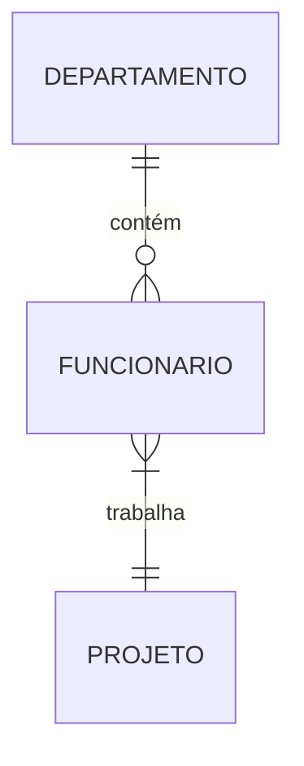

### 3. Composição
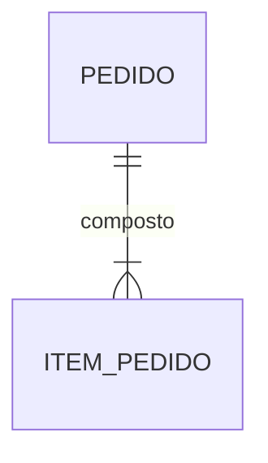

## Conclusão

Relacionamentos são essenciais para:
- Estruturação dos dados
- Integridade do modelo
- Representação do negócio
- Implementação eficiente

A modelagem adequada de relacionamentos:
- Facilita a manutenção
- Melhora a performance
- Garante consistência
- Suporta evolução