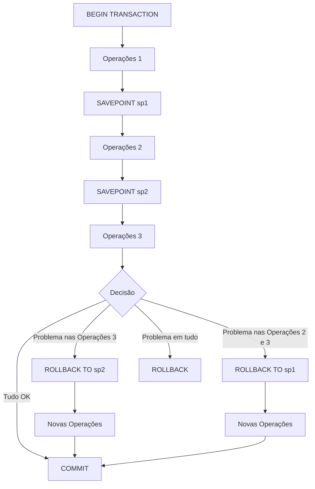

# Gerenciamento de Savepoints

## Introdução aos Savepoints

Savepoints são marcadores dentro de uma transação que permitem o rollback parcial, desfazendo apenas parte das operações realizadas, sem precisar abortar toda a transação.



## Comandos Básicos

### Criação de Savepoint

```sql
SAVEPOINT nome_do_savepoint;
```

### Rollback para um Savepoint

```sql
ROLLBACK TO [SAVEPOINT] nome_do_savepoint;
-- ou em alguns SGBDs
ROLLBACK TRANSACTION TO [SAVEPOINT] nome_do_savepoint;
```

### Liberação de Savepoint

Em alguns SGBDs, é possível liberar um savepoint que não é mais necessário:

```sql
RELEASE SAVEPOINT nome_do_savepoint;
```

## Comportamento dos Savepoints

### Ciclo de Vida

- **Criação**: Um savepoint é criado com o comando `SAVEPOINT`
- **Uso**: Um savepoint pode ser usado como destino de um `ROLLBACK TO`
- **Liberação**: Um savepoint pode ser liberado explicitamente com `RELEASE SAVEPOINT`
- **Descarte**: Todos os savepoints são descartados quando a transação é finalizada com `COMMIT` ou `ROLLBACK`

### Aninhamento

Savepoints podem ser aninhados, permitindo níveis de granularidade no controle de transações:

```sql
BEGIN;
    INSERT INTO tabela1 VALUES (1);
    
    SAVEPOINT sp1;
    UPDATE tabela2 SET coluna1 = 'valor1';
    
    SAVEPOINT sp2;
    DELETE FROM tabela3 WHERE id = 5;
    
    -- Desfaz apenas o DELETE
    ROLLBACK TO sp2;
    
    -- Continua a transação
    INSERT INTO tabela4 VALUES (2);
    
    -- Desfaz o UPDATE e o INSERT em tabela4
    ROLLBACK TO sp1;
    
    -- Continua a transação
    UPDATE tabela5 SET coluna1 = 'valor2';
COMMIT;
```

### Comportamento em Diferentes SGBDs

#### PostgreSQL

- Suporta savepoints aninhados
- Permite `RELEASE SAVEPOINT`
- Savepoints persistem após `ROLLBACK TO`

```sql
BEGIN;
    INSERT INTO tabela VALUES (1);
    SAVEPOINT sp1;
    INSERT INTO tabela VALUES (2);
    SAVEPOINT sp2;
    INSERT INTO tabela VALUES (3);
    ROLLBACK TO sp1;
    -- Neste ponto, sp2 ainda existe, mas é inútil
    INSERT INTO tabela VALUES (4);
COMMIT;
-- Resultado: tabela contém valores 1 e 4
```

#### MySQL

- Suporta savepoints aninhados
- Permite `RELEASE SAVEPOINT`
- Comportamento similar ao PostgreSQL

#### Oracle

- Suporta savepoints aninhados
- Permite `ROLLBACK TO` sem a palavra `SAVEPOINT`
- Não mantém savepoints após um rollback para um savepoint anterior

```sql
BEGIN;
    INSERT INTO tabela VALUES (1);
    SAVEPOINT sp1;
    INSERT INTO tabela VALUES (2);
    SAVEPOINT sp2;
    INSERT INTO tabela VALUES (3);
    ROLLBACK TO sp1;
    -- Em Oracle, sp2 não existe mais neste ponto
COMMIT;
```

#### SQL Server

- Suporta savepoints
- Usa `SAVE TRANSACTION` em vez de `SAVEPOINT`
- Não suporta `RELEASE SAVEPOINT`

```sql
BEGIN TRANSACTION;
    INSERT INTO tabela VALUES (1);
    SAVE TRANSACTION sp1;
    INSERT INTO tabela VALUES (2);
    ROLLBACK TRANSACTION sp1;
    INSERT INTO tabela VALUES (3);
COMMIT;
-- Resultado: tabela contém valores 1 e 3
```

## Casos de Uso

### 1. Processamento em Etapas

Útil quando uma transação tem várias etapas lógicas e você deseja poder reverter para o início de qualquer etapa.

```sql
BEGIN;
    -- Etapa 1: Criar pedido
    INSERT INTO pedidos (cliente_id, data) 
    VALUES (101, CURRENT_DATE)
    RETURNING id INTO v_pedido_id;
    
    SAVEPOINT apos_criar_pedido;
    
    -- Etapa 2: Adicionar itens
    INSERT INTO itens_pedido (pedido_id, produto_id, quantidade, preco)
    VALUES 
        (v_pedido_id, 201, 2, 29.90),
        (v_pedido_id, 202, 1, 49.90);
    
    SAVEPOINT apos_adicionar_itens;
    
    -- Etapa 3: Atualizar estoque
    UPDATE produtos SET estoque = estoque - 2 WHERE id = 201;
    UPDATE produtos SET estoque = estoque - 1 WHERE id = 202;
    
    -- Verificar se há estoque suficiente
    IF EXISTS (SELECT 1 FROM produtos WHERE id IN (201, 202) AND estoque < 0) THEN
        -- Desfazer apenas a atualização de estoque
        ROLLBACK TO apos_adicionar_itens;
        -- Marcar pedido como "aguardando estoque"
        UPDATE pedidos SET status = 'AGUARDANDO_ESTOQUE' WHERE id = v_pedido_id;
    END IF;
    
    -- Finalizar transação
    COMMIT;
```

### 2. Tratamento de Erros

Permite implementar lógica de recuperação de erros sem abortar toda a transação.

```sql
BEGIN;
    -- Operações principais
    INSERT INTO clientes (nome, email) VALUES ('João Silva', 'joao@email.com');
    
    SAVEPOINT apos_cliente;
    
    -- Operações que podem falhar
    BEGIN
        -- Tenta inserir endereço
        INSERT INTO enderecos (cliente_id, cep, logradouro) 
        VALUES (LASTVAL(), '12345-678', 'Rua das Flores, 123');
    EXCEPTION WHEN OTHERS THEN
        -- Se falhar, volta para depois de inserir o cliente
        ROLLBACK TO apos_cliente;
        -- Registra o problema
        INSERT INTO log_erros (operacao, mensagem) 
        VALUES ('inserir_endereco', SQLERRM);
    END;
    
    -- Continua com outras operações
    INSERT INTO contatos (cliente_id, telefone) 
    VALUES (LASTVAL(), '(11) 98765-4321');
    
    COMMIT;
```

### 3. Validação de Dados em Etapas

Permite validar dados em etapas, revertendo apenas as etapas com problemas.

```sql
BEGIN;
    -- Etapa 1: Importar dados de clientes
    INSERT INTO clientes_temp
    SELECT * FROM arquivo_importacao_clientes;
    
    SAVEPOINT apos_importar_clientes;
    
    -- Etapa 2: Validar dados de clientes
    DELETE FROM clientes_temp 
    WHERE email IS NULL OR email NOT LIKE '%@%.%';
    
    -- Verificar se muitos registros foram removidos
    IF (SELECT COUNT(*) FROM clientes_temp) < 
       (SELECT COUNT(*) * 0.9 FROM arquivo_importacao_clientes) THEN
        -- Muitos registros inválidos, voltar e tentar corrigir
        ROLLBACK TO apos_importar_clientes;
        
        -- Tentar corrigir emails
        UPDATE clientes_temp
        SET email = nome || '@dominio.com'
        WHERE email IS NULL OR email NOT LIKE '%@%.%';
    END IF;
    
    SAVEPOINT apos_validar_clientes;
    
    -- Etapa 3: Mover para tabela definitiva
    INSERT INTO clientes
    SELECT * FROM clientes_temp;
    
    COMMIT;
```

## Práticas Recomendadas

### 1. Nomeação Clara e Consistente

Use nomes descritivos que indiquem o estado da transação após cada savepoint:

```sql
-- Bom: nomes descritivos
SAVEPOINT apos_criar_cliente;
SAVEPOINT apos_processar_pagamento;
SAVEPOINT apos_atualizar_estoque;

-- Evite: nomes genéricos ou numéricos
SAVEPOINT sp1;
SAVEPOINT ponto2;
SAVEPOINT x123;
```
