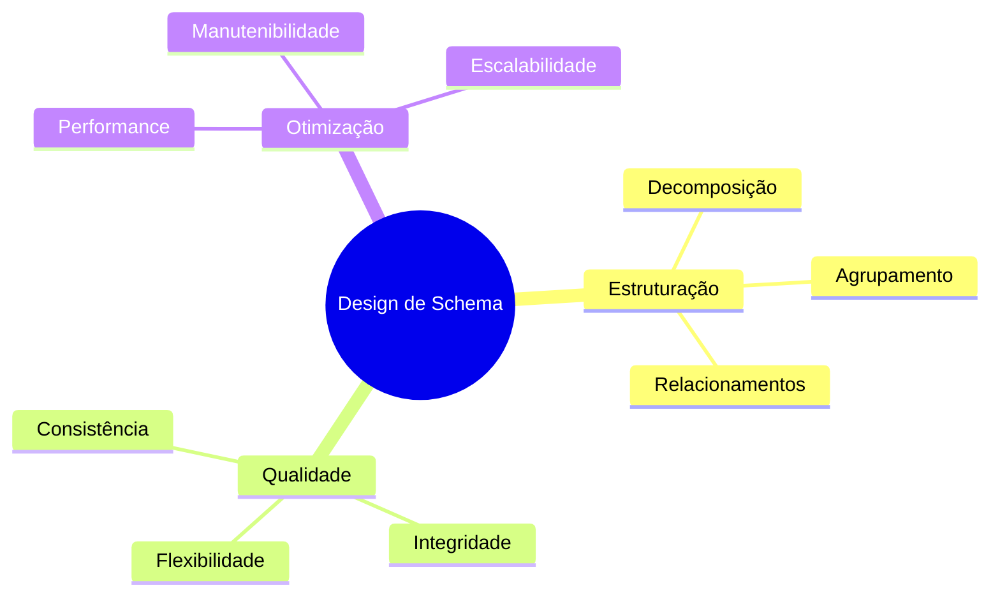

# Design de Schema

O design de schema é uma etapa crucial no desenvolvimento de bancos de dados relacionais, focando na estruturação eficiente das tabelas e seus relacionamentos.

## Princípios de Design

## Etapas do Design

### 1. Análise de Requisitos
- Identificação de entidades
- Mapeamento de relacionamentos
- Definição de restrições
- Requisitos de dados

### 2. Estruturação Inicial
- Definição de tabelas
- Estabelecimento de chaves
- Mapeamento de relacionamentos
- Definição de constraints

### 3. Refinamento
- Normalização apropriada
- Otimização de estruturas
- Validação de integridade
- Ajustes de performance

## Padrões de Design

### 1. Padrões de Chave
- Chaves naturais vs. surrogate
- Estratégias de geração
- Unicidade e integridade
- Indexação eficiente

### 2. Padrões de Relacionamento
- One-to-One
- One-to-Many
- Many-to-Many
- Auto-relacionamentos

### 3. Padrões de Dados
- Tipos apropriados
- Constraints de domínio
- Valores default
- Validações

## Considerações Práticas

### 1. Performance
- Estruturas de índice
- Particionamento
- Clustering
- Otimização de queries

### 2. Manutenibilidade
- Nomenclatura clara
- Documentação adequada
- Versionamento
- Evolução do schema

### 3. Escalabilidade
- Crescimento de dados
- Distribuição
- Replicação
- Sharding

## Antipadrões

### 1. Estruturais
- Redundância excessiva
- Relacionamentos circulares
- Chaves compostas complexas
- Falta de normalização

### 2. Implementação
- Tipos de dados inadequados
- Constraints ausentes
- Índices mal planejados
- Falta de documentação

## Ferramentas e Técnicas

### 1. Modelagem
- Diagramas ER
- Ferramentas CASE
- Geradores de DDL
- Validadores de schema

### 2. Validação
- Testes de integridade
- Análise de performance
- Verificação de constraints
- Revisão de design

### 3. Manutenção
- Controle de versão
- Migrations
- Monitoramento
- Otimização contínua