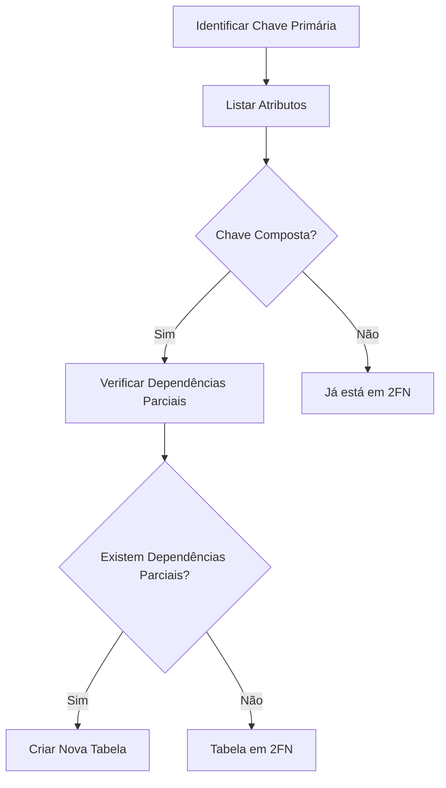

# Segunda Forma Normal (2FN)

## Definição

A Segunda Forma Normal (2FN) é um nível de normalização que exige:
1. A tabela deve estar na 1FN
2. Todos os atributos não-chave devem depender totalmente da chave primária

## Conceitos Fundamentais

### 1. Dependência Funcional Total
- Todos os atributos não-chave dependem da chave primária completa
- Não existem dependências parciais
- Aplicável principalmente em chaves compostas

### 2. Dependência Funcional Parcial
- Quando um atributo depende apenas de parte da chave primária
- Deve ser eliminada para atingir a 2FN
- Comum em tabelas com chaves compostas

## Exemplos Práticos

### Exemplo 1: Pedidos

#### Violação da 2FN
```sql
-- Tabela não normalizada
CREATE TABLE Pedido (
    cliente_id INT,
    produto_id INT,
    data_pedido DATE,
    quantidade INT,
    valor_produto DECIMAL(10,2),
    nome_produto VARCHAR(100),
    PRIMARY KEY (cliente_id, produto_id)
);
```

#### Aplicação da 2FN
```sql
-- Tabelas normalizadas
CREATE TABLE Pedido (
    cliente_id INT,
    produto_id INT,
    data_pedido DATE,
    quantidade INT,
    PRIMARY KEY (cliente_id, produto_id)
);

CREATE TABLE Produto (
    id INT PRIMARY KEY,
    nome VARCHAR(100),
    valor DECIMAL(10,2)
);
```

### Exemplo 2: Cursos e Professores

#### Violação da 2FN
```sql
-- Tabela não normalizada
CREATE TABLE Curso_Professor (
    curso_id INT,
    professor_id INT,
    nome_curso VARCHAR(100),
    departamento_curso VARCHAR(50),
    nome_professor VARCHAR(100),
    PRIMARY KEY (curso_id, professor_id)
);
```

#### Aplicação da 2FN
```sql
-- Tabelas normalizadas
CREATE TABLE Curso (
    id INT PRIMARY KEY,
    nome VARCHAR(100),
    departamento VARCHAR(50)
);

CREATE TABLE Curso_Professor (
    curso_id INT,
    professor_id INT,
    PRIMARY KEY (curso_id, professor_id),
    FOREIGN KEY (curso_id) REFERENCES Curso(id),
    FOREIGN KEY (professor_id) REFERENCES Professor(id)
);

CREATE TABLE Professor (
    id INT PRIMARY KEY,
    nome VARCHAR(100)
);
```

## Processo de Identificação

### 1. Análise de Dependências


### 2. Passos para Normalização
1. Identificar a chave primária
2. Verificar dependências funcionais
3. Separar atributos com dependência parcial
4. Criar novas tabelas quando necessário

## Benefícios

### 1. Estrutura de Dados
- Eliminação de redundância
- Melhor organização
- Maior consistência

### 2. Integridade
- Dados mais confiáveis
- Atualizações mais seguras
- Menor risco de anomalias

## Considerações Práticas

### 1. Implementação
```sql
-- Exemplo de migração de dados
INSERT INTO Produto (id, nome, valor)
SELECT DISTINCT produto_id, nome_produto, valor_produto
FROM pedido_antigo;

INSERT INTO Pedido (cliente_id, produto_id, data_pedido, quantidade)
SELECT cliente_id, produto_id, data_pedido, quantidade
FROM pedido_antigo;
```

### 2. Performance
- Avaliação de impacto
- Balanceamento de normalização
- Considerações de consulta

## Checklist de Validação

### 1. Verificação
- [ ] Tabela está em 1FN?
- [ ] Chave primária identificada?
- [ ] Dependências funcionais mapeadas?
- [ ] Dependências parciais eliminadas?

### 2. Testes
- [ ] Integridade dos dados
- [ ] Consistência das relações
- [ ] Performance das consultas
- [ ] Facilidade de manutenção

## Anti-Padrões

### 1. Violações Comuns
```sql
-- Anti-padrão: Dependência parcial
CREATE TABLE Inscricao_Curso (
    aluno_id INT,
    curso_id INT,
    data_inscricao DATE,
    nome_curso VARCHAR(100),  -- Depende apenas de curso_id
    PRIMARY KEY (aluno_id, curso_id)
);

-- Correção
CREATE TABLE Curso (
    id INT PRIMARY KEY,
    nome VARCHAR(100)
);

CREATE TABLE Inscricao (
    aluno_id INT,
    curso_id INT,
    data_inscricao DATE,
    PRIMARY KEY (aluno_id, curso_id),
    FOREIGN KEY (curso_id) REFERENCES Curso(id)
);
```

### 2. Soluções
- Identificar dependências parciais
- Criar tabelas separadas
- Estabelecer relacionamentos apropriados
- Manter documentação atualizada

## Conclusão

A Segunda Forma Normal é essencial para:
- Eliminar redundâncias
- Melhorar a organização dos dados
- Facilitar a manutenção
- Garantir consistência

Deve ser implementada considerando:
- Requisitos do sistema
- Complexidade das consultas
- Necessidades de performance
- Facilidade de manutenção