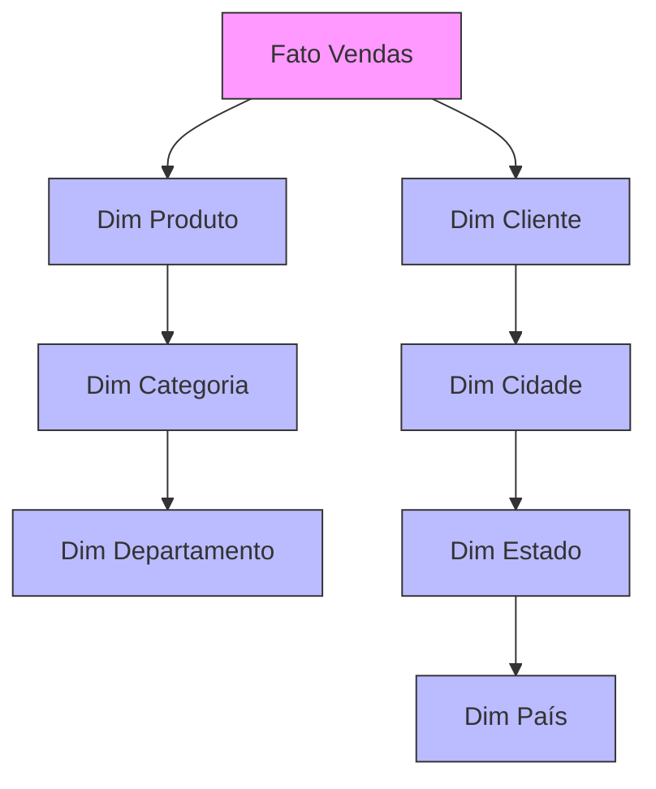

# Schema Floco de Neve

## Estrutura Básica



## Características

### 1. Normalização de Dimensões
```sql
-- Hierarquia de localização normalizada
CREATE TABLE dim_cidade (
    sk_cidade INT PRIMARY KEY,
    nome_cidade VARCHAR(50),
    sk_estado INT,
    FOREIGN KEY (sk_estado) REFERENCES dim_estado(sk_estado)
);

CREATE TABLE dim_estado (
    sk_estado INT PRIMARY KEY,
    nome_estado VARCHAR(50),
    sk_pais INT,
    FOREIGN KEY (sk_pais) REFERENCES dim_pais(sk_pais)
);
```

### 2. Hierarquias Explícitas
- Níveis separados
- Integridade referencial
- Economia de espaço
- Manutenção facilitada

## Comparação com Schema Estrela

### 1. Vantagens
- Menor redundância
- Consistência de dados
- Atualizações eficientes
- Normalização completa

### 2. Desvantagens
- Performance reduzida
- Mais joins necessários
- Complexidade maior
- Queries mais complexas