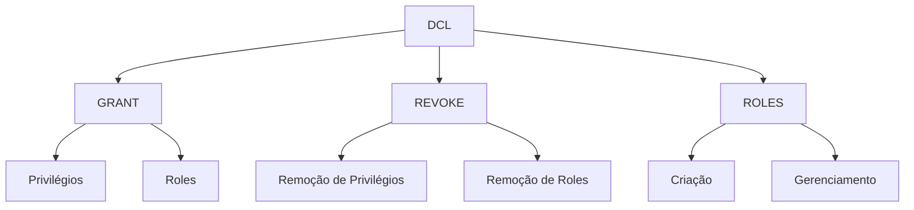

# DCL - Linguagem de Controle de Dados

```ascii
╔══════════════════════════════════════════════════════════════╗
║  SECURITY_MASTER >> Controle de Acesso a Dados             ║
║  INSTRUTOR: SECURITY_SPECIALIST                           ║
╚══════════════════════════════════════════════════════════════╝
```

## Visão Geral

SECURITY_SPECIALIST apresenta: "A Linguagem de Controle de Dados (DCL) é fundamental para gerenciar segurança e acesso em bancos de dados."



## Comandos Principais

### 1. GRANT
PERMISSION_MASTER explica: "Concede privilégios a usuários e roles"

```sql
-- Privilégios básicos
GRANT SELECT, INSERT ON tabela TO usuario;

-- Todos os privilégios
GRANT ALL PRIVILEGES ON DATABASE banco TO admin;

-- Privilégios específicos
GRANT UPDATE(salario) ON funcionarios TO rh_manager;
```

### 2. REVOKE
ACCESS_CONTROLLER demonstra: "Remove privilégios concedidos"

```sql
-- Revogar privilégios específicos
REVOKE INSERT, UPDATE ON produtos FROM usuario;

-- Revogar todos os privilégios
REVOKE ALL PRIVILEGES ON ALL TABLES IN SCHEMA public FROM usuario;
```

### 3. Gerenciamento de ROLES
ROLE_MASTER apresenta: "Organiza privilégios em grupos lógicos"

```sql
-- Criar role
CREATE ROLE analistas;

-- Atribuir privilégios à role
GRANT SELECT ON ALL TABLES IN SCHEMA analytics TO analistas;

-- Atribuir role a usuário
GRANT analistas TO usuario;
```

## Padrões de Segurança

SECURITY_ARCHITECT compartilha padrões essenciais:

### 1. Princípio do Menor Privilégio

```sql
-- Criar role com privilégios mínimos
CREATE ROLE app_read;
GRANT SELECT ON tabela1, tabela2 TO app_read;
GRANT USAGE ON SCHEMA public TO app_read;

-- Revogar privilégios desnecessários
REVOKE ALL ON ALL TABLES IN SCHEMA public FROM PUBLIC;
```

### 2. Hierarquia de Roles

```sql
-- Estrutura hierárquica
CREATE ROLE junior_dev;
CREATE ROLE senior_dev;
CREATE ROLE tech_lead;

GRANT junior_dev TO senior_dev;
GRANT senior_dev TO tech_lead;
```

### 3. Segurança em Nível de Coluna

```sql
-- Restringir acesso a colunas sensíveis
GRANT SELECT (nome, email) ON usuarios TO suporte;
REVOKE SELECT (senha_hash) ON usuarios FROM suporte;
```

## Boas Práticas

SECURITY_GUARDIAN compartilha diretrizes:

### 1. Auditoria
```sql
-- Criar tabela de auditoria
CREATE TABLE audit_log (
    id SERIAL PRIMARY KEY,
    usuario TEXT,
    acao TEXT,
    tabela TEXT,
    data TIMESTAMP DEFAULT CURRENT_TIMESTAMP
);

-- Trigger para auditoria
CREATE TRIGGER audit_changes
AFTER INSERT OR UPDATE OR DELETE ON dados_sensiveis
FOR EACH ROW EXECUTE FUNCTION log_changes();
```

### 2. Revisão Regular

```sql
-- Consultar privilégios existentes
SELECT grantee, privilege_type, table_name
FROM information_schema.role_table_grants
WHERE table_schema = 'public';

-- Verificar membros de roles
SELECT rolname, member
FROM pg_roles r
JOIN pg_auth_members m ON r.oid = m.roleid;
```

### 3. Rotação de Credenciais

```sql
-- Alterar senha de usuário
ALTER USER aplicacao_user WITH PASSWORD 'novo_password_seguro';

-- Revogar e reconectar sessões
SELECT pg_terminate_backend(pid) 
FROM pg_stat_activity 
WHERE usename = 'aplicacao_user';
```

## Cenários Comuns

IMPLEMENTATION_EXPERT apresenta soluções práticas:

### 1. Ambiente de Desenvolvimento

```sql
-- Setup inicial
CREATE ROLE dev_team;
GRANT CONNECT ON DATABASE dev_db TO dev_team;
GRANT USAGE ON SCHEMA public TO dev_team;
GRANT SELECT, INSERT, UPDATE, DELETE ON ALL TABLES IN SCHEMA public TO dev_team;
```

### 2. Ambiente de Produção

```sql
-- Setup de produção
CREATE ROLE app_service;
GRANT CONNECT ON DATABASE prod_db TO app_service;
GRANT USAGE ON SCHEMA public TO app_service;
GRANT SELECT, INSERT ON tabela_cliente TO app_service;
GRANT UPDATE (status, ultima_atualizacao) ON tabela_pedido TO app_service;
```

## Troubleshooting

PROBLEM_SOLVER apresenta soluções para problemas comuns:

### 1. Conflitos de Privilégios

```sql
-- Verificar privilégios efetivos
SELECT * FROM information_schema.role_table_grants
WHERE grantee = 'usuario_problematico';

-- Resetar privilégios
REVOKE ALL PRIVILEGES ON ALL TABLES IN SCHEMA public FROM usuario_problematico;
GRANT SELECT ON tabela_especifica TO usuario_problematico;
```

### 2. Problemas de Acesso

```sql
-- Diagnosticar problemas de conexão
SELECT * FROM pg_stat_activity
WHERE usename = 'usuario_problema';

-- Verificar configurações de autenticação
SELECT rolname, rolcanlogin, rolvaliduntil
FROM pg_roles
WHERE rolname = 'usuario_problema';
```

```ascii
╔════════════════════════════════════════════╗
║  CHECKLIST SEGURANÇA:                     ║
║  □ Privilégios mínimos?                   ║
║  □ Roles apropriadas?                     ║
║  □ Auditoria ativa?                       ║
║  □ Senhas fortes?                         ║
║  □ Revisão regular?                       ║
╚════════════════════════════════════════════╝
```

## Conclusão

SECURITY_SPECIALIST conclui: "O DCL é crucial para manter a segurança e integridade do banco de dados. Implemente controles de acesso cuidadosamente e revise-os regularmente."

> **Dica de Segurança**: Mantenha um inventário atualizado de todos os privilégios concedidos e revise-o periodicamente para garantir conformidade com as políticas de segurança.