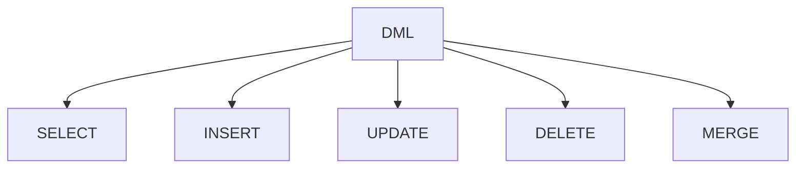

# DML - Linguagem de Manipulação de Dados

```ascii
╔══════════════════════════════════════════════════════════════╗
║  DATA_MANIPULATOR >> Operações com Dados                   ║
║  INSTRUTOR: DML_MASTER                                     ║
╚══════════════════════════════════════════════════════════════╝
```

## Visão Geral

DML_MASTER apresenta: "A Linguagem de Manipulação de Dados (DML) é o conjunto de comandos SQL usado para gerenciar dados em um banco de dados."



## Comandos Principais

### 1. SELECT
DATA_READER explica: "Recupera dados do banco"

```sql
-- Consulta básica
SELECT nome, preco 
FROM produtos 
WHERE categoria = 'Eletrônicos';

-- Com joins
SELECT c.nome, p.descricao
FROM clientes c
JOIN pedidos p ON c.id = p.cliente_id;
```

### 2. INSERT
DATA_WRITER demonstra: "Adiciona novos registros"

```sql
-- Inserção simples
INSERT INTO produtos (nome, preco)
VALUES ('Smartphone', 999.99);

-- Inserção múltipla
INSERT INTO produtos (nome, preco)
VALUES 
    ('Tablet', 499.99),
    ('Notebook', 1499.99);
```

### 3. UPDATE
DATA_MODIFIER apresenta: "Modifica registros existentes"

```sql
-- Atualização simples
UPDATE produtos 
SET preco = preco * 1.1
WHERE categoria = 'Eletrônicos';

-- Atualização com join
UPDATE pedidos p
SET status = 'Aprovado'
FROM clientes c
WHERE p.cliente_id = c.id
AND c.vip = true;
```

### 4. DELETE
DATA_REMOVER alerta: "Remove registros do banco"

```sql
-- Remoção simples
DELETE FROM logs 
WHERE data < CURRENT_DATE - INTERVAL '30 days';

-- Remoção com subquery
DELETE FROM produtos
WHERE id IN (
    SELECT produto_id 
    FROM estoque 
    WHERE quantidade = 0
);
```

### 5. MERGE
DATA_SYNC_MASTER explica: "Sincroniza dados entre tabelas"

```sql
-- Merge básico
MERGE INTO produtos_destino d
USING produtos_origem o
ON (d.id = o.id)
WHEN MATCHED THEN
    UPDATE SET preco = o.preco
WHEN NOT MATCHED THEN
    INSERT (id, nome, preco)
    VALUES (o.id, o.nome, o.preco);
```

## Boas Práticas

BEST_PRACTICE_GURU compartilha:

### 1. Performance
- Use índices apropriados
- Evite SELECT *
- Otimize JOINs
- Limite resultados quando possível

### 2. Segurança
- Use transações
- Valide dados de entrada
- Faça backup antes de operações grandes
- Use WHERE em UPDATE/DELETE

### 3. Manutenção
- Documente queries complexas
- Use aliases descritivos
- Mantenha consistência no estilo
- Implemente logging quando necessário

```ascii
╔════════════════════════════════════════════╗
║  CHECKLIST DML:                           ║
║  □ Índices verificados?                   ║
║  □ Transação necessária?                  ║
║  □ WHERE clause adequada?                 ║
║  □ Performance otimizada?                 ║
║  □ Backup realizado?                      ║
╚════════════════════════════════════════════╝
```

## Padrões Comuns

PATTERN_MASTER apresenta padrões úteis:

### 1. Upsert
```sql
INSERT INTO produtos (id, nome, preco)
VALUES (1, 'Smartphone', 999.99)
ON CONFLICT (id) 
DO UPDATE SET preco = EXCLUDED.preco;
```

### 2. Soft Delete
```sql
-- Em vez de DELETE
UPDATE usuarios
SET ativo = false,
    data_inativacao = CURRENT_TIMESTAMP
WHERE id = 123;
```

### 3. Batch Processing
```sql
-- Processamento em lotes
WITH batch AS (
    SELECT id 
    FROM pedidos 
    WHERE status = 'Pendente' 
    LIMIT 1000
    FOR UPDATE SKIP LOCKED
)
UPDATE pedidos p
SET status = 'Processando'
FROM batch b
WHERE p.id = b.id;
```

## Troubleshooting

ERROR_HANDLER apresenta soluções para problemas comuns:

### 1. Deadlocks
```sql
-- Verificando bloqueios
SELECT blocked_locks.pid AS blocked_pid,
       blocking_locks.pid AS blocking_pid
FROM pg_catalog.pg_locks blocked_locks
JOIN pg_catalog.pg_locks blocking_locks 
    ON blocking_locks.locktype = blocked_locks.locktype;
```

### 2. Performance Issues
```sql
-- Analisando query
EXPLAIN ANALYZE
SELECT * FROM produtos p
JOIN categorias c ON p.categoria_id = c.id
WHERE p.preco > 100;
```

## Conclusão

DML_MASTER conclui: "O domínio dos comandos DML é essencial para qualquer desenvolvedor de banco de dados. Use-os com sabedoria e sempre considere performance e segurança."

> **Dica Final**: Mantenha um ambiente de testes para praticar operações DML complexas antes de executá-las em produção.
