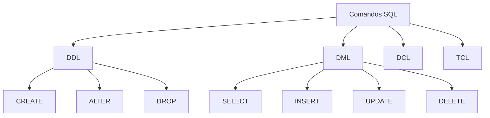

# Fundamentos SQL

```ascii
╔══════════════════════════════════════════════════════════════╗
║  NEURAL.MATRIX >> SQL.FUNDAMENTOS                           ║
║  STATUS: ATIVO                                             ║
║  SEGURANÇA: CRIPTOGRAFADO                                  ║
║  ACESSO: CONHECIMENTO_PROFUNDO                             ║
╚══════════════════════════════════════════════════════════════╝
```

## ACID_QUEEN.PERSPECTIVA: Visão Geral

```ascii
┌────────────────────────────┐
│ CONCEITOS.CORE            │
├────────────────────────────┤
│ ► DDL                    │
│ ► DML                    │
│ ► DCL                    │
│ ► TCL                    │
└────────────────────────────┘
```

## ARQUITETURA.SQL



## NOSQL_PUNK.ALERTA: Conceitos Fundamentais

### 1. DDL (Linguagem de Definição de Dados)
- Manipulação de esquema
- Criação/modificação de objetos
- Controle da estrutura do banco

### 2. DML (Linguagem de Manipulação de Dados)
- Operações com dados
- Funções CRUD
- Execução de consultas

### 3. DCL (Linguagem de Controle de Dados)
- Controle de acesso
- Gerenciamento de permissões
- Implementação de segurança

### 4. TCL (Linguagem de Controle de Transação)
- Gerenciamento de transações
- Consistência de dados
- Propriedades ACID

## SEC_PHANTOM.DIRETRIZES: Boas Práticas

```ascii
┌─────────────────────────────────┐
│ PROTOCOLOS.SEGURANÇA           │
├─────────────────────────────────┤
│ ► Use prepared statements      │
│ ► Valide todas as entradas    │
│ ► Configure acessos           │
│ ► Monitore performance        │
└─────────────────────────────────┘
```

## TIME_LORD.EXERCÍCIOS: Treinamento Prático

### Operações Básicas
```sql
-- Create table
CREATE TABLE hackers (
    id INT PRIMARY KEY,
    codename VARCHAR(50),
    skill_level INT,
    last_hack TIMESTAMP
);

-- Insert data
INSERT INTO hackers (id, codename, skill_level)
VALUES (1, 'GHOST_PROTOCOL', 9);

-- Query data
SELECT * FROM hackers 
WHERE skill_level > 7;

-- Update records
UPDATE hackers 
SET last_hack = CURRENT_TIMESTAMP 
WHERE id = 1;
```

## BACKUP_PRIEST.SABEDORIA: Armadilhas Comuns

### Fique Atento A
- Vulnerabilidades de injeção SQL
- Gargalos de performance
- Deadlocks de transação
- Vazamentos de conexão

### Soluções
- Use queries parametrizadas
- Implemente indexação adequada
- Monitore timeout de transações
- Implemente pool de conexões

```ascii
╔════════════════════════════════════╗
║  FIM.DA.TRANSMISSÃO              ║
║  STATUS: COMPLETO                ║
║  PRÓXIMO.MÓDULO: SQL.DDL         ║
╚════════════════════════════════════╝
```