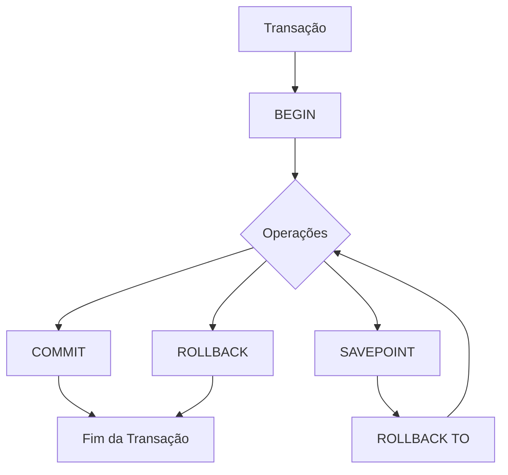
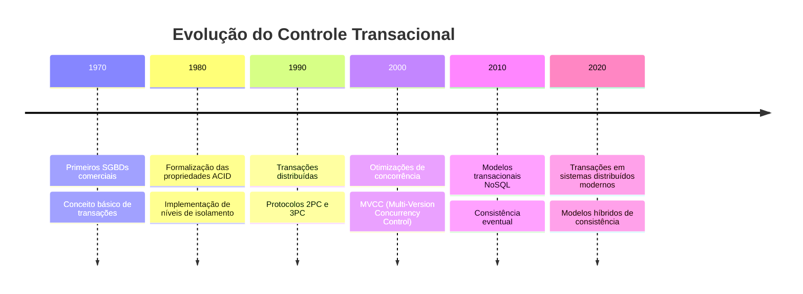

# Linguagem de Controle de Transação (TCL)

```ascii
╔══════════════════════════════════════════════════════════════╗
║  NEURAL.MATRIX >> TCL.FUNDAMENTOS                           ║
║  STATUS: ATIVO                                             ║
║  SEGURANÇA: CRIPTOGRAFADO                                  ║
║  ACESSO: CONHECIMENTO_PROFUNDO                             ║
╚══════════════════════════════════════════════════════════════╝
```

## ACID_QUEEN.PERSPECTIVA: Visão Geral

```ascii
┌────────────────────────────┐
│ COMANDOS.CORE             │
├────────────────────────────┤
│ ► BEGIN                   │
│ ► COMMIT                  │
│ ► ROLLBACK                │
│ ► SAVEPOINT               │
└────────────────────────────┘
```

## ARQUITETURA.TCL



## NOSQL_PUNK.ALERTA: Conceitos Fundamentais

### 1. Transações
- Unidade lógica de trabalho
- Conjunto de operações indivisíveis
- Garantia de consistência

### 2. Propriedades ACID
- **A**tomicidade: tudo ou nada
- **C**onsistência: integridade preservada
- **I**solamento: transações independentes
- **D**urabilidade: mudanças permanentes

### 3. Estados da Transação
- Ativa: durante a execução
- Parcialmente confirmada: após última operação
- Confirmada: após COMMIT
- Falha: erro durante execução
- Abortada: após ROLLBACK

## SEC_PHANTOM.DIRETRIZES: Boas Práticas

### Transações Eficientes
- Mantenha transações curtas
- Minimize bloqueios
- Evite operações externas dentro de transações

### Tratamento de Erros
- Implemente tratamento de exceções
- Utilize SAVEPOINT para recuperação parcial
- Monitore deadlocks

### Isolamento
- Escolha o nível adequado
- Entenda as anomalias de concorrência
- Considere o impacto no desempenho

## TIME_LORD.CRONOLOGIA: Evolução Histórica



## BACKUP_PRIESTESS.RITUAL: Comandos Essenciais

### BEGIN
Inicia uma transação:
```sql
BEGIN;
-- ou
BEGIN TRANSACTION;
-- ou
START TRANSACTION;
```

### COMMIT
Confirma as alterações:
```sql
COMMIT;
-- ou
COMMIT TRANSACTION;
```

### ROLLBACK
Desfaz as alterações:
```sql
ROLLBACK;
-- ou
ROLLBACK TRANSACTION;
```

### SAVEPOINT
Cria um ponto de salvamento:
```sql
SAVEPOINT nome_savepoint;
```

### ROLLBACK TO SAVEPOINT
Retorna a um ponto de salvamento:
```sql
ROLLBACK TO SAVEPOINT nome_savepoint;
-- ou
ROLLBACK TO nome_savepoint;
```

## Navegação do Conteúdo

- [Fundamentos de Transações](transaction-basics.md)
- [Commit e Rollback](commit-rollback.md)
- [Gerenciamento de Savepoints](savepoint-management.md)

## Conclusão

O controle transacional é fundamental para garantir a integridade dos dados em sistemas de banco de dados. Através dos comandos TCL, os desenvolvedores podem gerenciar o comportamento das transações, garantindo que as operações sejam executadas de forma atômica, consistente, isolada e durável.

A compreensão profunda dos mecanismos transacionais permite o desenvolvimento de aplicações robustas que mantêm a integridade dos dados mesmo em cenários de falha ou concorrência.