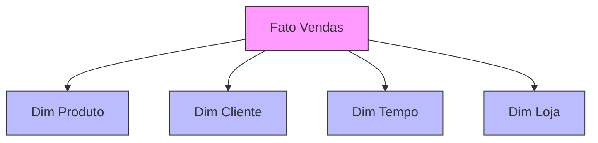

# Schema Estrela

## Estrutura Básica



## Características

### 1. Tabela Fato Central
```sql
CREATE TABLE fato_vendas (
    sk_produto INT,
    sk_cliente INT,
    sk_tempo INT,
    sk_loja INT,
    quantidade INT,
    valor_venda DECIMAL(10,2),
    custo DECIMAL(10,2),
    FOREIGN KEY (sk_produto) REFERENCES dim_produto(sk_produto),
    FOREIGN KEY (sk_cliente) REFERENCES dim_cliente(sk_cliente),
    FOREIGN KEY (sk_tempo) REFERENCES dim_tempo(sk_tempo),
    FOREIGN KEY (sk_loja) REFERENCES dim_loja(sk_loja)
);
```

### 2. Dimensões Desnormalizadas
- Atributos consolidados
- Hierarquias em uma tabela
- Redundância controlada
- Otimização para queries

## Vantagens

1. **Performance**
   - Menos joins
   - Queries simples
   - Indexação eficiente
   - Cache otimizado

2. **Usabilidade**
   - Fácil entendimento
   - Manutenção simples
   - Desenvolvimento rápido