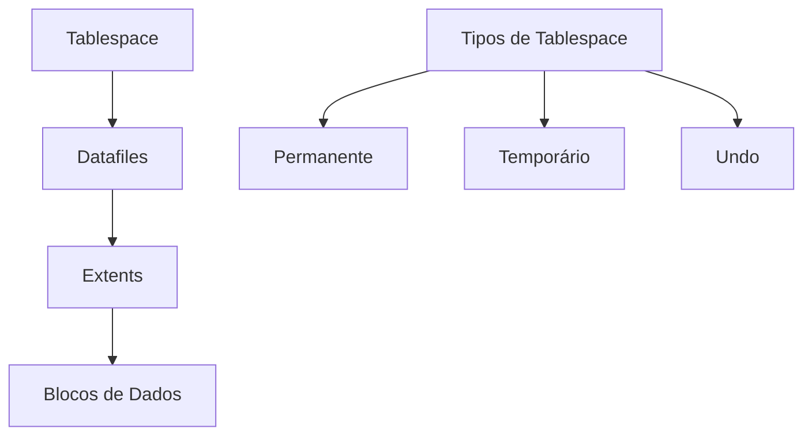

# Design de Armazenamento

## Estruturas de Armazenamento

### 1. Tablespaces


### 2. Tipos de Dados
- Numéricos
  - INTEGER, DECIMAL, FLOAT
  - Considerações de precisão
- Caracteres
  - CHAR, VARCHAR, TEXT
  - Codificação e collation
- Data/Hora
  - DATE, TIMESTAMP
  - Fusos horários
- Binários
  - BLOB, BINARY
  - Armazenamento externo

### 3. Compressão de Dados
```sql
-- Exemplo de tabela com compressão
CREATE TABLE vendas_comprimidas (
    id INT,
    data DATE,
    valor DECIMAL(10,2)
) COMPRESS FOR OLTP;
```

## Estratégias de Organização

### 1. Alocação de Espaço
- Initial extent
- Next extent
- PCTFREE
- PCTUSED

### 2. Gestão de Blocos


### 3. Configurações de I/O
- Tamanho de bloco
- Buffer cache
- Direct I/O
- Async I/O