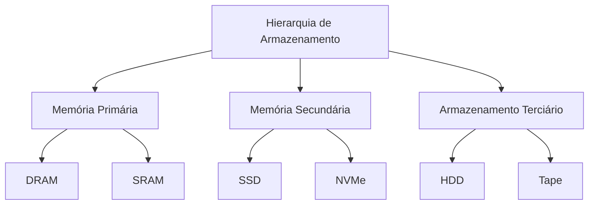
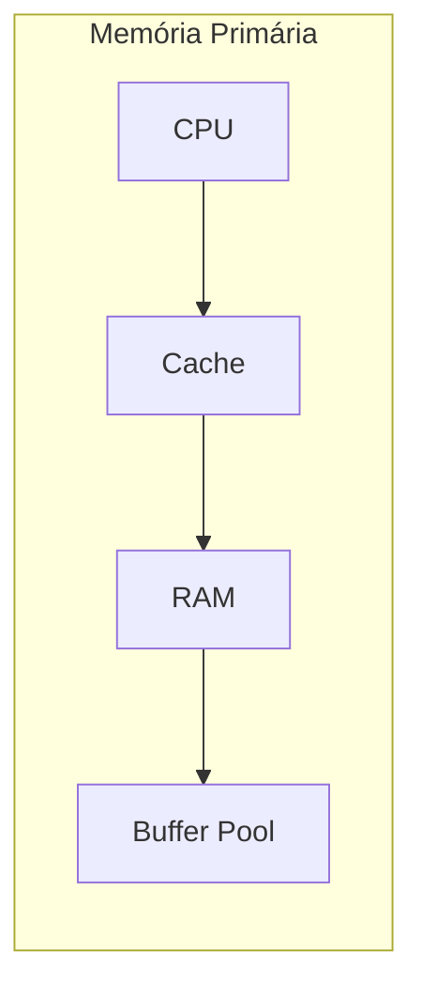
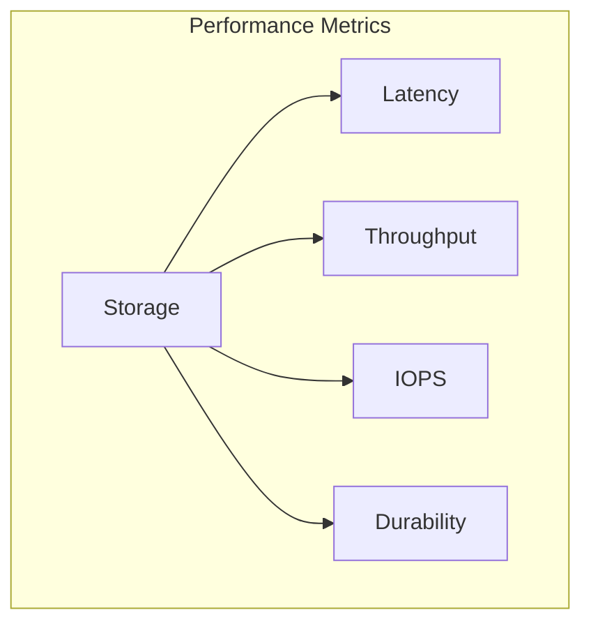
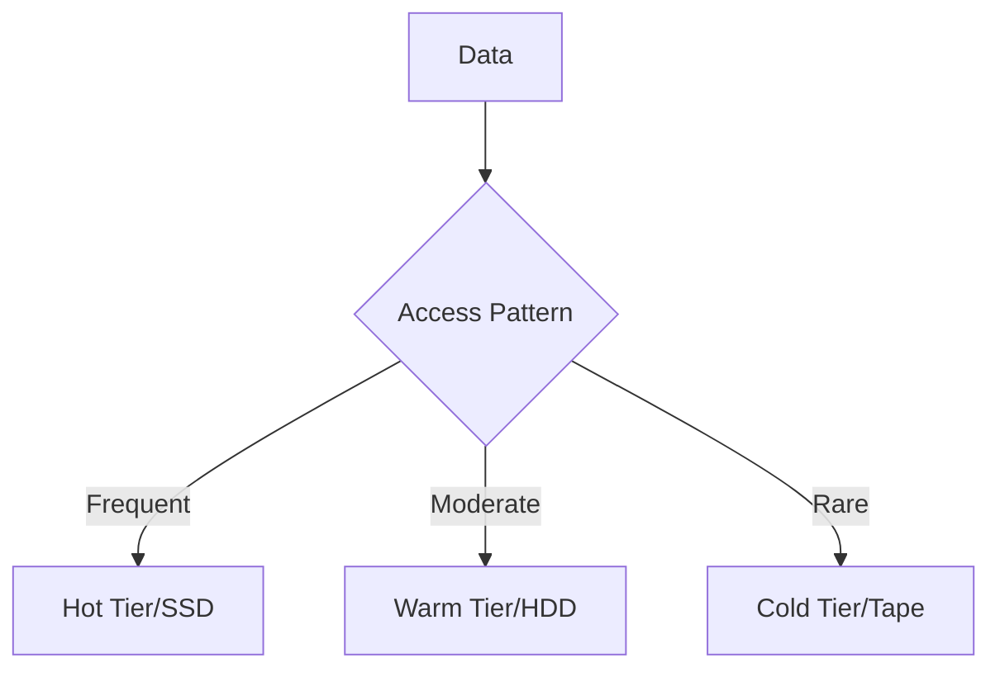
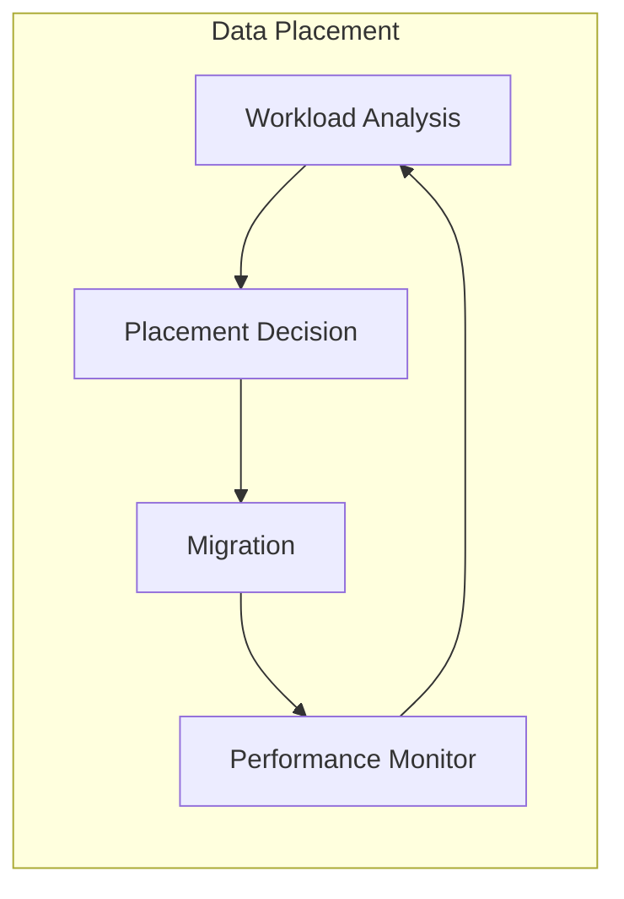
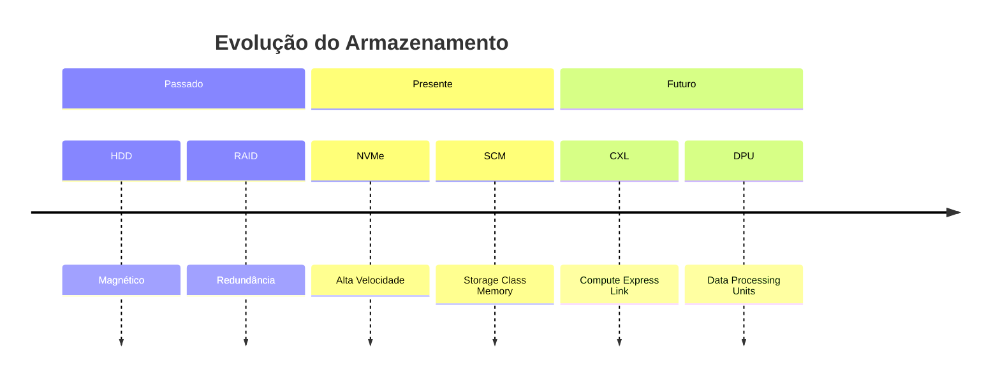
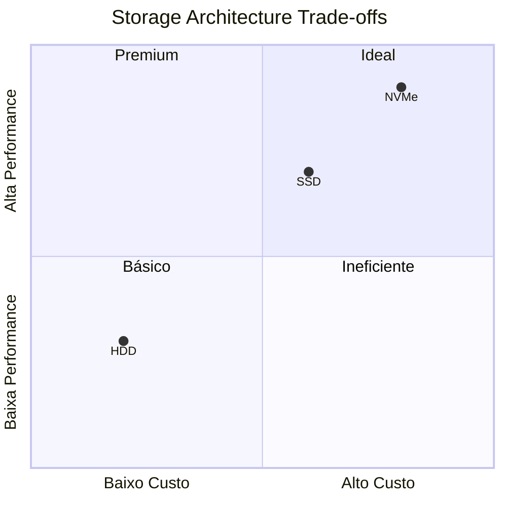
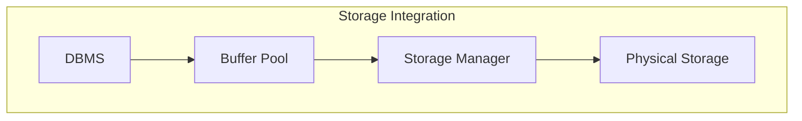

# Hierarquia de Armazenamento

A hierarquia de armazenamento é uma estrutura fundamental que organiza diferentes tecnologias de armazenamento baseadas em velocidade, custo e capacidade, impactando diretamente o desempenho dos sistemas de banco de dados.



## Níveis de Armazenamento

### 1. Memória Primária
- **Características**
  - Acesso rápido
  - Volatilidade
  - Custo elevado
  - Capacidade limitada



### 2. Memória Secundária
- **Tecnologias**
  - SSDs
  - NVMe
  - Storage Class Memory
  - Flash Arrays

```java
class StorageDevice {
    enum Type {
        SSD, NVME, SCM, HDD
    }
    
    private final Type type;
    private final long capacity;
    private final int latency;
    private final int throughput;
}
```

## Características de Performance

### 1. Métricas Principais
- **Indicadores**
  - Latência
  - Throughput
  - IOPS
  - Durabilidade



### 2. Trade-offs
```java
class StorageManager {
    private Map<StorageTier, List<StorageDevice>> tiers;
    
    public void optimizePlacement(Data data) {
        StorageTier tier = selectOptimalTier(
            data.getAccessPattern(),
            data.getPriority(),
            data.getSize()
        );
        allocateToTier(data, tier);
    }
}
```

## Estratégias de Gerenciamento

### 1. Tiered Storage
- **Implementação**
  - Hot data
  - Warm data
  - Cold data
  - Archive data



### 2. Caching Strategies
- **Políticas**
  - Write-through
  - Write-back
  - Write-around
  - Read-ahead

## Otimizações

### 1. Data Placement
- **Técnicas**
  - Locality optimization
  - Access pattern analysis
  - Workload-based placement
  - Auto-tiering



### 2. I/O Optimization
```java
class IOOptimizer {
    private IOScheduler scheduler;
    private BufferManager buffer;
    
    public void optimize() {
        // Agrupa I/Os similares
        List<IORequest> requests = scheduler.getRequests();
        List<IORequest> optimized = mergeRequests(requests);
        
        // Aplica write coalescing
        buffer.coalesceWrites(optimized);
    }
}
```

## Tecnologias Emergentes

### 1. Novas Arquiteturas
- **Inovações**
  - Persistent Memory
  - Storage Class Memory
  - Computational Storage
  - Disaggregated Storage



### 2. Tendências
- **Direções**
  - Inteligência artificial
  - Automação
  - Software-defined storage
  - Cloud-native storage

## Considerações de Design

### 1. Arquitetura
- **Aspectos**
  - Escalabilidade
  - Disponibilidade
  - Consistência
  - Custo-benefício



### 2. Best Practices
- Monitoramento contínuo
- Capacity planning
- Performance tuning
- Disaster recovery

## Integração com DBMS

### 1. Buffer Management
- **Estratégias**
  - Page replacement
  - Prefetching
  - Write coalescing
  - I/O scheduling



### 2. Otimizações
```java
class StorageOptimizer {
    private BufferPool bufferPool;
    private StorageManager storage;
    
    public void optimize() {
        // Ajusta buffer baseado em padrões de acesso
        AccessPattern pattern = analyzeAccess();
        adjustBufferSize(pattern);
        
        // Otimiza placement
        optimizePlacement(pattern);
    }
}
```

## Conclusão
A hierarquia de armazenamento é um componente crítico que continua evoluindo com novas tecnologias e demandas, exigindo constante adaptação e otimização para maximizar o desempenho dos sistemas de banco de dados.