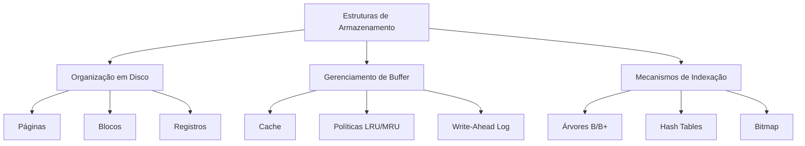
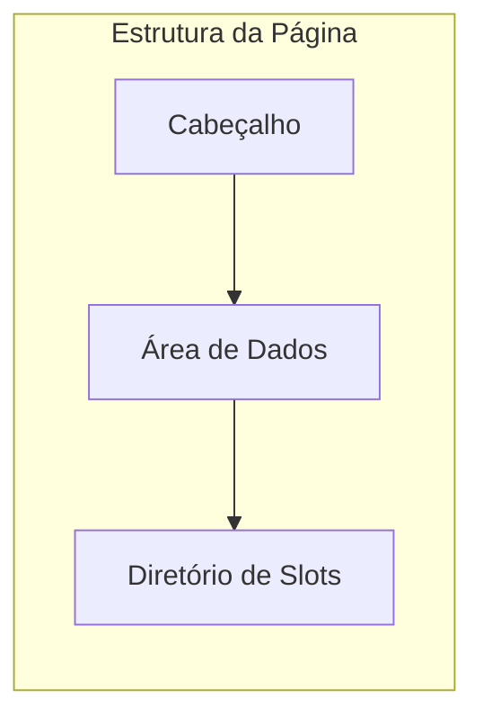
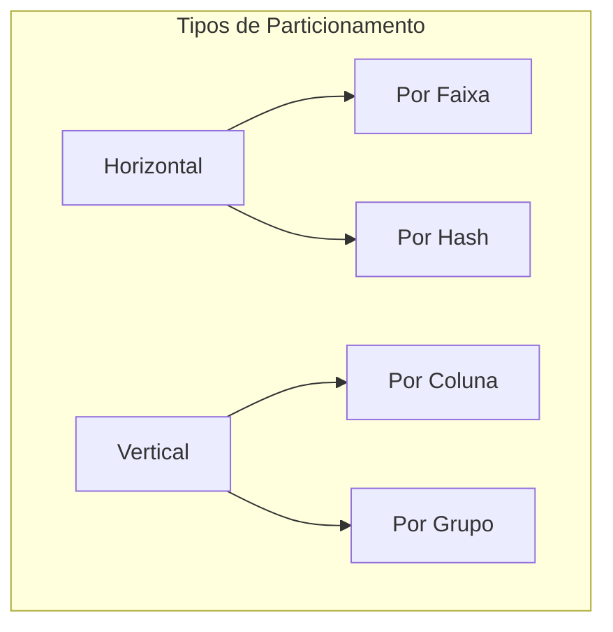
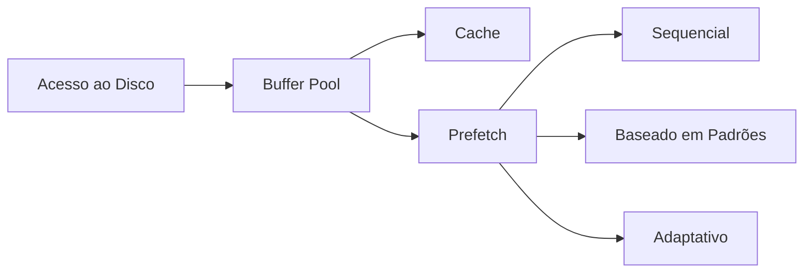
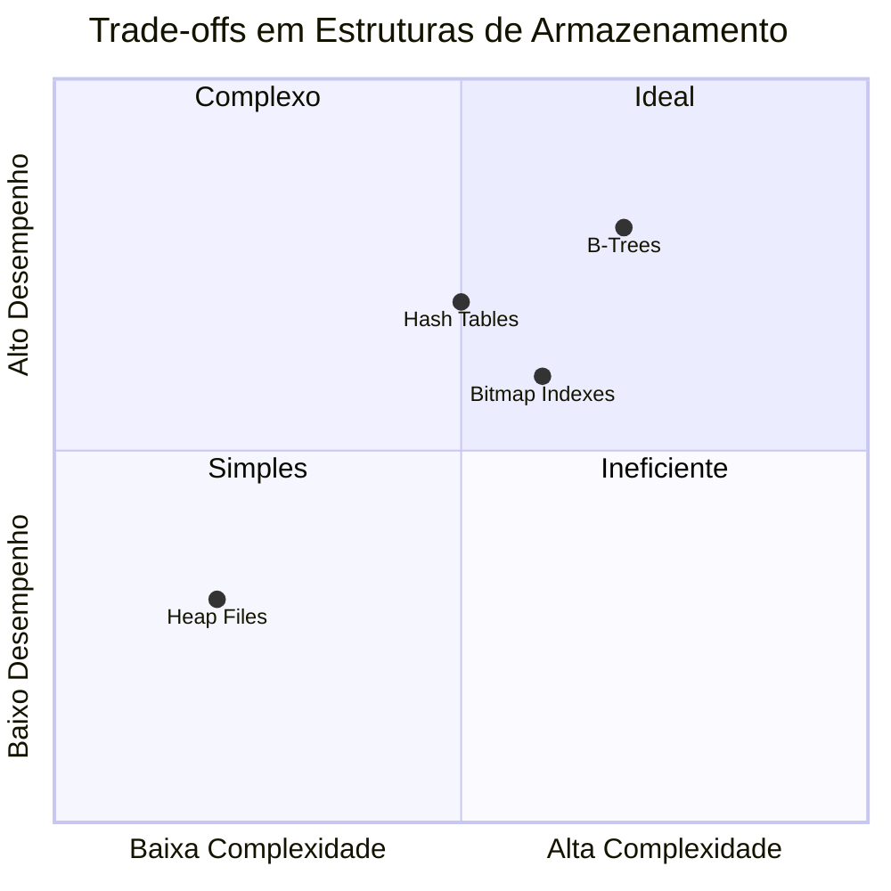

# Estruturas de Armazenamento

As estruturas de armazenamento são fundamentais para o desempenho e eficiência dos sistemas de banco de dados. Este capítulo explora as diferentes estruturas e técnicas utilizadas para organizar e acessar dados em dispositivos de armazenamento.

## Organização Física dos Dados

### 1. Estrutura de Páginas
- Tamanho fixo (tipicamente 4KB-16KB)
- Cabeçalho da página
- Área de dados
- Diretório de slots
- Gestão de espaço livre

### 2. Formatos de Registro
- Registros de tamanho fixo
- Registros de tamanho variável
- Técnicas de compressão
- Gestão de campos nulos

### 3. Organização de Arquivos
- Heap files
- Arquivos sequenciais
- Arquivos hash
- Arquivos clusterizados

## Técnicas de Armazenamento

### 1. Compressão de Dados
- Compressão de página
- Compressão de registro
- Dicionário de dados
- Técnicas específicas por tipo

### 2. Particionamento
- Horizontal
- Vertical
- Por faixa
- Por hash
- Composto

### 3. Estratégias de Alocação
- Alocação contígua
- Alocação encadeada
- Alocação indexada
- Extensible hashing

## Otimização de Acesso

### 1. Organização Física
- Clustering
- Sequenciamento
- Interleaving
- Striping

### 2. Prefetching
- Prefetch sequencial
- Prefetch baseado em padrões
- Prefetch adaptativo
- Gestão de buffer inteligente

### 3. Write Optimization
- Write-ahead logging
- Group commit
- Background writing
- Write buffering

## Considerações de Desempenho

### 1. Métricas de Avaliação
- Taxa de acertos no buffer
- Tempo médio de acesso
- Throughput de I/O
- Utilização do espaço

### 2. Trade-offs
- Espaço vs. Velocidade
- Complexidade vs. Flexibilidade
- Consistência vs. Performance
- Redundância vs. Eficiência

## Tendências e Inovações

### 1. Novas Tecnologias
- NVMe e Storage Class Memory
- Armazenamento columnnar
- Estruturas híbridas
- In-memory databases

### 2. Otimizações Modernas
- Compressão adaptativa
- Indexação automática
- Auto-tuning
- Machine learning aplicado

