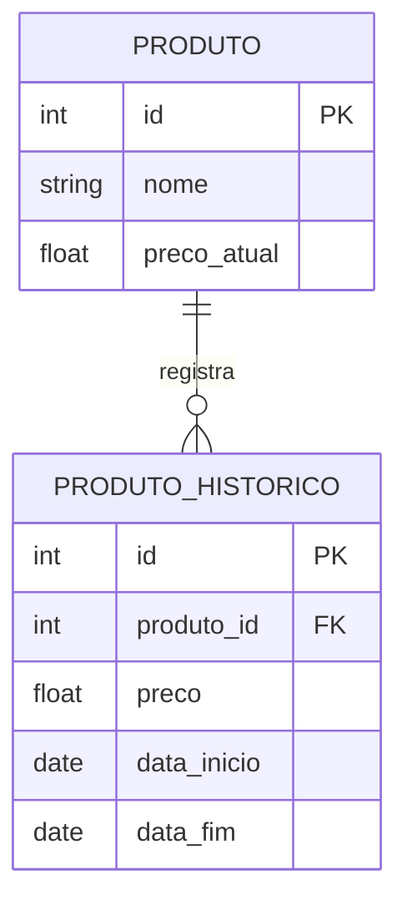
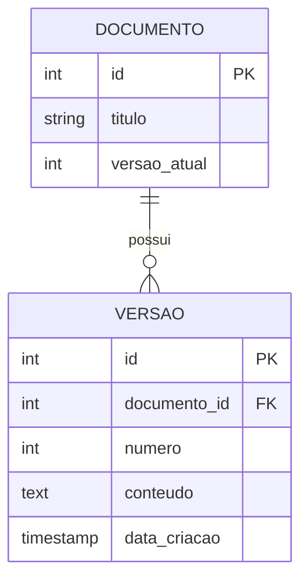
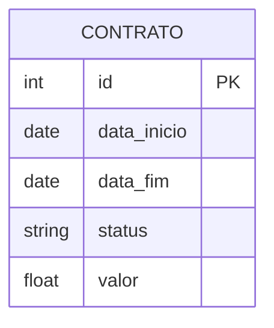

# Padrões Temporais

## Histórico de Mudanças



### Implementação
```sql
CREATE TABLE produto (
    id INT PRIMARY KEY,
    nome VARCHAR(100),
    preco_atual DECIMAL(10,2)
);

CREATE TABLE produto_historico (
    id INT PRIMARY KEY,
    produto_id INT,
    preco DECIMAL(10,2),
    data_inicio DATE,
    data_fim DATE,
    FOREIGN KEY (produto_id) REFERENCES produto(id)
);
```

## Versionamento



### Implementação
```sql
CREATE TABLE documento (
    id INT PRIMARY KEY,
    titulo VARCHAR(200),
    versao_atual INT
);

CREATE TABLE versao (
    id INT PRIMARY KEY,
    documento_id INT,
    numero INT,
    conteudo TEXT,
    data_criacao TIMESTAMP,
    FOREIGN KEY (documento_id) REFERENCES documento(id)
);
```

## Dados Temporais



### Implementação
```sql
CREATE TABLE contrato (
    id INT PRIMARY KEY,
    data_inicio DATE,
    data_fim DATE,
    status VARCHAR(20),
    valor DECIMAL(10,2)
);

-- Índices para consultas temporais
CREATE INDEX idx_contrato_periodo 
ON contrato(data_inicio, data_fim);
```