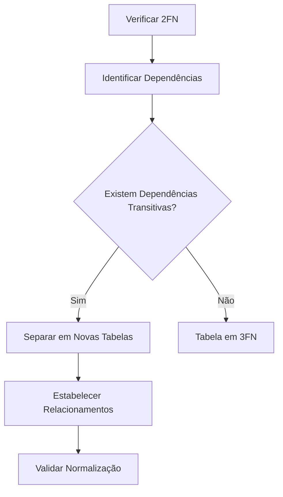

# Terceira Forma Normal (3FN)

## Definição

A Terceira Forma Normal (3FN) é um nível de normalização que exige:
1. A tabela deve estar na 2FN
2. Não deve haver dependências transitivas entre atributos não-chave

## Conceitos Fundamentais

### 1. Dependência Transitiva
- Ocorre quando um atributo não-chave depende de outro atributo não-chave
- A → B e B → C, então A → C (transitividade)
- Deve ser eliminada para atingir a 3FN

### 2. Identificação de Dependências
- Mapeamento de todas as dependências funcionais
- Análise de relacionamentos indiretos
- Identificação de atributos determinantes

## Exemplos Práticos

### Exemplo 1: Funcionários e Departamentos

#### Violação da 3FN
```sql
-- Tabela não normalizada
CREATE TABLE Funcionario (
    id INT PRIMARY KEY,
    nome VARCHAR(100),
    departamento_id INT,
    nome_departamento VARCHAR(100),
    localizacao_departamento VARCHAR(100)
);
```

#### Aplicação da 3FN
```sql
-- Tabelas normalizadas
CREATE TABLE Funcionario (
    id INT PRIMARY KEY,
    nome VARCHAR(100),
    departamento_id INT,
    FOREIGN KEY (departamento_id) REFERENCES Departamento(id)
);

CREATE TABLE Departamento (
    id INT PRIMARY KEY,
    nome VARCHAR(100),
    localizacao VARCHAR(100)
);
```

### Exemplo 2: Pedidos e Clientes

#### Violação da 3FN
```sql
-- Tabela não normalizada
CREATE TABLE Pedido (
    id INT PRIMARY KEY,
    cliente_id INT,
    nome_cliente VARCHAR(100),
    cidade_cliente VARCHAR(100),
    estado_cliente VARCHAR(2)
);
```

#### Aplicação da 3FN
```sql
-- Tabelas normalizadas
CREATE TABLE Pedido (
    id INT PRIMARY KEY,
    cliente_id INT,
    FOREIGN KEY (cliente_id) REFERENCES Cliente(id)
);

CREATE TABLE Cliente (
    id INT PRIMARY KEY,
    nome VARCHAR(100),
    cidade_id INT,
    FOREIGN KEY (cidade_id) REFERENCES Cidade(id)
);

CREATE TABLE Cidade (
    id INT PRIMARY KEY,
    nome VARCHAR(100),
    estado VARCHAR(2)
);
```

## Processo de Normalização

### 1. Identificação de Dependências


### 2. Passos para Normalização
1. Confirmar 2FN
2. Identificar dependências transitivas
3. Criar novas tabelas
4. Estabelecer relacionamentos
5. Validar integridade

## Benefícios

### 1. Qualidade dos Dados
- Eliminação de redundância
- Maior consistência
- Integridade referencial

### 2. Manutenção
- Atualizações simplificadas
- Menor risco de anomalias
- Melhor organização

## Considerações Práticas

### 1. Implementação
```sql
-- Exemplo de migração de dados
INSERT INTO Departamento (id, nome, localizacao)
SELECT DISTINCT departamento_id, nome_departamento, localizacao_departamento
FROM funcionario_antigo;

UPDATE Funcionario f
SET departamento_id = (
    SELECT d.id 
    FROM Departamento d 
    WHERE d.nome = f.nome_departamento
);
```

### 2. Performance
- Análise de impacto
- Otimização de consultas
- Índices adequados

## Checklist de Validação

### 1. Verificação
- [ ] Tabela está em 2FN?
- [ ] Dependências transitivas identificadas?
- [ ] Novas tabelas criadas corretamente?
- [ ] Relacionamentos estabelecidos?

### 2. Testes
- [ ] Integridade dos dados
- [ ] Consultas otimizadas
- [ ] Atualizações funcionais
- [ ] Performance adequada

## Anti-Padrões

### 1. Violações Comuns
```sql
-- Anti-padrão: Dependência transitiva
CREATE TABLE Venda (
    id INT PRIMARY KEY,
    vendedor_id INT,
    nome_vendedor VARCHAR(100),
    supervisor_id INT,
    nome_supervisor VARCHAR(100)
);

-- Correção
CREATE TABLE Funcionario (
    id INT PRIMARY KEY,
    nome VARCHAR(100),
    supervisor_id INT,
    FOREIGN KEY (supervisor_id) REFERENCES Funcionario(id)
);

CREATE TABLE Venda (
    id INT PRIMARY KEY,
    vendedor_id INT,
    FOREIGN KEY (vendedor_id) REFERENCES Funcionario(id)
);
```

### 2. Soluções
- Identificar e eliminar dependências transitivas
- Criar estruturas normalizadas
- Manter documentação clara
- Estabelecer padrões de desenvolvimento

## Conclusão

A Terceira Forma Normal é fundamental para:
- Garantir qualidade dos dados
- Facilitar manutenção
- Reduzir redundância
- Melhorar consistência

Deve ser implementada considerando:
- Requisitos do negócio
- Performance do sistema
- Complexidade das consultas
- Necessidades de manutenção