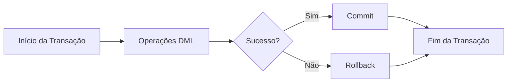
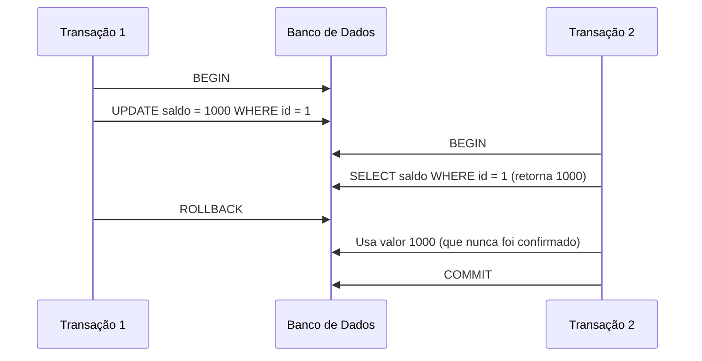
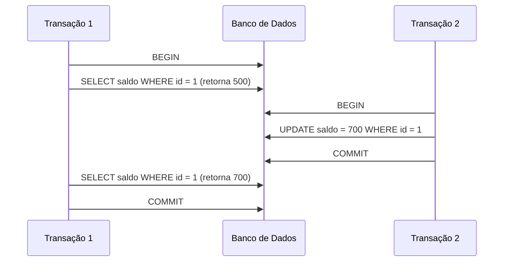
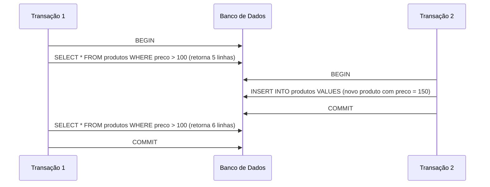
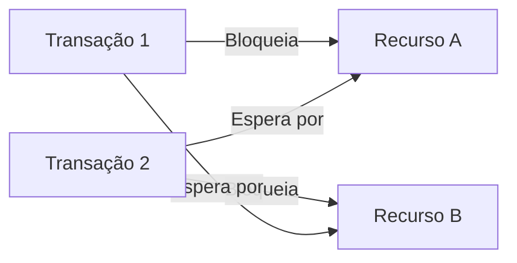

# Fundamentos de Transações

## Definição

Uma transação é uma unidade lógica de trabalho que contém uma ou mais operações de banco de dados. Todas as operações em uma transação são tratadas como uma única unidade atômica de trabalho que deve ser completamente executada ou completamente revertida.



## Propriedades ACID

As transações são caracterizadas pelas propriedades ACID:

### Atomicidade (Atomicity)
- Garante que todas as operações dentro da transação sejam tratadas como uma única unidade
- Ou todas as operações são executadas com sucesso, ou nenhuma é
- Não existem estados intermediários

```sql
BEGIN;
  UPDATE contas SET saldo = saldo - 1000 WHERE id = 1;
  UPDATE contas SET saldo = saldo + 1000 WHERE id = 2;
COMMIT;
```

Se qualquer uma das operações falhar, nenhuma alteração será aplicada.

### Consistência (Consistency)
- Garante que o banco de dados mude de um estado válido para outro estado válido
- Todas as regras de integridade são respeitadas
- Constraints, triggers e regras de negócio são preservadas

```sql
BEGIN;
  -- Esta operação viola uma constraint de saldo mínimo
  UPDATE contas SET saldo = -5000 WHERE id = 1;
COMMIT; -- Falha se houver uma constraint CHECK (saldo >= 0)
```

### Isolamento (Isolation)
- Garante que as transações sejam isoladas umas das outras
- Uma transação não deve ser afetada por outras transações concorrentes
- Diferentes níveis de isolamento oferecem diferentes garantias

```sql
-- Transação 1
BEGIN;
  UPDATE produtos SET estoque = estoque - 1 WHERE id = 101;
  -- Outras operações...
COMMIT;

-- Transação 2 (concorrente)
BEGIN;
  SELECT estoque FROM produtos WHERE id = 101; -- O que será visto depende do nível de isolamento
COMMIT;
```

### Durabilidade (Durability)
- Garante que uma vez que uma transação seja confirmada, suas alterações são permanentes
- As alterações persistem mesmo em caso de falha do sistema
- Implementada através de logs de transação e mecanismos de recuperação

## Níveis de Isolamento

Os SGBDs oferecem diferentes níveis de isolamento que equilibram consistência e desempenho:

### Read Uncommitted
- Nível mais baixo de isolamento
- Permite leitura de dados não confirmados (dirty reads)
- Maior desempenho, menor consistência

```sql
SET TRANSACTION ISOLATION LEVEL READ UNCOMMITTED;
BEGIN;
  -- Pode ler dados não confirmados de outras transações
  SELECT * FROM pedidos;
COMMIT;
```

### Read Committed
- Evita leituras sujas (dirty reads)
- Permite leituras não repetíveis (non-repeatable reads)
- Nível padrão em muitos SGBDs

```sql
SET TRANSACTION ISOLATION LEVEL READ COMMITTED;
BEGIN;
  -- Só lê dados confirmados, mas pode obter resultados diferentes em leituras repetidas
  SELECT * FROM pedidos;
  -- Algum processamento...
  SELECT * FROM pedidos; -- Pode retornar resultados diferentes
COMMIT;
```

### Repeatable Read
- Evita leituras sujas e não repetíveis
- Permite leituras fantasmas (phantom reads)
- Maior consistência, menor desempenho

```sql
SET TRANSACTION ISOLATION LEVEL REPEATABLE READ;
BEGIN;
  -- Mesmos dados serão lidos em consultas repetidas
  SELECT * FROM clientes WHERE saldo > 1000;
  -- Algum processamento...
  SELECT * FROM clientes WHERE saldo > 1000; -- Mesmos resultados que a primeira consulta
COMMIT;
```

### Serializable
- Nível mais alto de isolamento
- Evita todos os problemas de concorrência
- Menor desempenho, maior consistência

```sql
SET TRANSACTION ISOLATION LEVEL SERIALIZABLE;
BEGIN;
  -- Transações são completamente isoladas
  SELECT * FROM estoque WHERE produto_id = 101;
  -- Nenhuma outra transação pode modificar estes dados até o COMMIT
COMMIT;
```

## Anomalias de Concorrência

### Dirty Read (Leitura Suja)
Ocorre quando uma transação lê dados que foram modificados por outra transação não confirmada.



### Non-repeatable Read (Leitura Não Repetível)
Ocorre quando uma transação relê dados e encontra que foram modificados por outra transação confirmada.



### Phantom Read (Leitura Fantasma)
Ocorre quando uma transação relê um conjunto de linhas que satisfazem uma condição e encontra que o conjunto mudou devido a outra transação.



## Bloqueios (Locks)

Os SGBDs utilizam bloqueios para implementar o isolamento:

### Tipos de Bloqueios
- **Compartilhado (Shared)**: Permite leitura, mas não escrita
- **Exclusivo (Exclusive)**: Permite leitura e escrita, bloqueia outros acessos
- **Atualização (Update)**: Inicialmente compartilhado, pode ser promovido para exclusivo
- **Intenção (Intent)**: Indica intenção de adquirir bloqueios em níveis inferiores

### Granularidade de Bloqueios
- **Banco de dados**: Bloqueia todo o banco
- **Tabela**: Bloqueia uma tabela inteira
- **Página**: Bloqueia uma página de dados
- **Linha**: Bloqueia apenas uma linha
- **Coluna**: Bloqueia apenas uma coluna

### Deadlocks
Situação onde duas ou mais transações estão esperando uma pela outra para liberar recursos.



## Controle de Concorrência Multiversão (MVCC)

Muitos SGBDs modernos utilizam MVCC (Multi-Version Concurrency Control):

- Mantém múltiplas versões dos dados
- Leitores não bloqueiam escritores
- Escritores não bloqueiam leitores
- Cada transação vê um snapshot consistente do banco de dados
- Implementado em PostgreSQL, Oracle, MySQL InnoDB, etc.

```
Linha 1, versão 1 (txid 100): {id: 1, nome: "João", saldo: 500}
Linha 1, versão 2 (txid 105): {id: 1, nome: "João", saldo: 700}
```

## Exemplos Práticos

### Transferência Bancária

```sql
BEGIN;
  -- Verificar saldo
  SELECT saldo FROM contas WHERE id = 101;
  
  -- Debitar da conta origem
  UPDATE contas SET saldo = saldo - 1000 WHERE id = 101;
  
  -- Creditar na conta destino
  UPDATE contas SET saldo = saldo + 1000 WHERE id = 102;
  
  -- Registrar a transferência
  INSERT INTO transferencias (origem, destino, valor, data)
  VALUES (101, 102, 1000, CURRENT_TIMESTAMP);
  
  -- Confirmar todas as operações
  COMMIT;
```

### Processamento de Pedido

```sql
BEGIN;
  -- Inserir pedido
  INSERT INTO pedidos (cliente_id, data, valor_total)
  VALUES (201, CURRENT_DATE, 0)
  RETURNING id INTO v_pedido_id;
  
  -- Inserir itens do pedido
  INSERT INTO itens_pedido (pedido_id, produto_id, quantidade, preco_unitario)
  VALUES 
    (v_pedido_id, 301, 2, 29.90),
    (v_pedido_id, 302, 1, 49.90);
  
  -- Atualizar estoque
  UPDATE produtos SET estoque = estoque - 2 WHERE id = 301;
  UPDATE produtos SET estoque = estoque - 1 WHERE id = 302;
  
  -- Calcular valor total
  UPDATE pedidos 
  SET valor_total = (
    SELECT SUM(quantidade * preco_unitario) 
    FROM itens_pedido 
    WHERE pedido_id = v_pedido_id
  )
  WHERE id = v_pedido_id;
  
  -- Confirmar todas as operações
  COMMIT;
```

## Conclusão

As transações são fundamentais para garantir a integridade dos dados em sistemas de banco de dados. Compreender seus princípios e mecanismos é essencial para desenvolver aplicações robustas e confiáveis.

Os conceitos ACID, níveis de isolamento e controle de concorrência são pilares do processamento transacional que permitem que múltiplos usuários trabalhem simultaneamente com os dados, mantendo a consistência e a integridade do banco de dados.