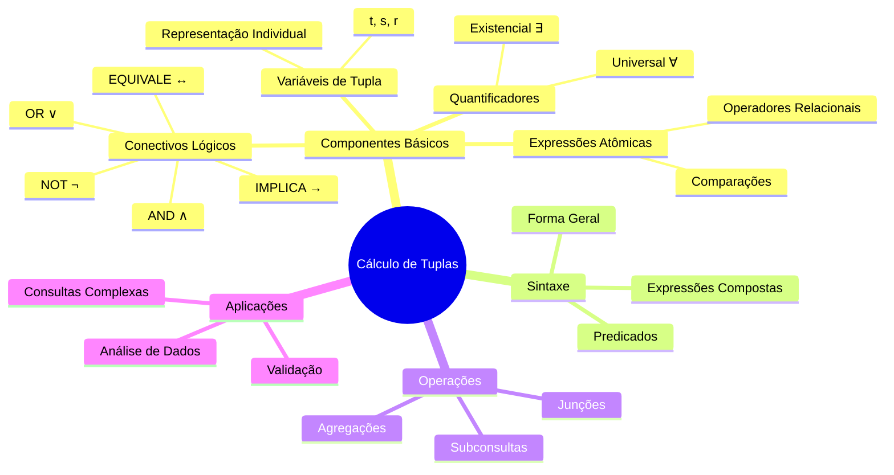

# Cálculo de Tuplas: 

## Mapa Mental 



```
╔═══════════════════════════════════════════════════╗
║ "Onde a lógica encontra dados, e sua sanidade    ║
║  mental encontra seu fim."                       ║
╚═══════════════════════════════════════════════════╝
```

## Fundamentos Teóricos

O cálculo de tuplas é uma linguagem declarativa baseada em lógica de predicados que permite expressar consultas em bancos de dados relacionais. Diferentemente da álgebra relacional, que nos diz COMO obter os dados, o cálculo de tuplas especifica O QUE queremos obter.

### Componentes Fundamentais

1. **Variáveis de Tupla**
   - Representam tuplas individuais em uma relação
   - Notação: t, s, r (convencionalmente)
   - Exemplo: t ∈ Employees (t é uma tupla na relação Employees)

2. **Expressões Atômicas**
   - Comparações básicas entre atributos ou valores
   - Operadores: =, ≠, <, >, ≤, ≥
   - Exemplo: t.salary > 50000

3. **Conectivos Lógicos**
   - ∧ (AND): Conjunção
   - ∨ (OR): Disjunção
   - ¬ (NOT): Negação
   - → (IMPLICA): Implicação
   - ↔ (EQUIVALE): Equivalência

4. **Quantificadores**
   - ∃ (Existencial): Existe pelo menos um
   - ∀ (Universal): Para todo
   - Exemplo: ∃e (e.department = t.department)

## Sintaxe Formal

### Forma Geral de uma Consulta
```
{ t | P(t) }
```
Onde:
- t é uma variável de tupla
- P(t) é um predicado envolvendo t

### Exemplos Práticos

1. **Consulta Básica**
```
{ t | t ∈ Employees ∧ t.salary > 100000 }
```
_Tradução: "Encontre todos os funcionários com salário superior a 100000"_

2. **Consulta com Quantificador Existencial**
```
{ t | t ∈ Departments ∧ 
    ∃e (e ∈ Employees ∧ 
        e.dept_id = t.id ∧ 
        e.salary > 150000) }
```
_Tradução: "Departamentos que têm pelo menos um funcionário com salário > 150000"_

3. **Consulta com Quantificador Universal**
```
{ t | t ∈ Projects ∧ 
    ∀e (e ∈ Employees ∧ 
        e.project_id = t.id → 
        e.skill_level = 'senior') }
```
_Tradução: "Projetos onde todos os funcionários são seniores"_

## Operações Avançadas

### 1. Junções Implícitas
```
{ t | ∃d ∈ Departments 
    (t.dept_id = d.id ∧ 
     d.location = 'NYC') }
```

### 2. Subconsultas Correlacionadas
```
{ t | t ∈ Employees ∧ 
    t.salary > (∃avg ∈ (
        { a | a = AVG(s.salary) ∧ 
              s ∈ Employees ∧ 
              s.dept_id = t.dept_id }
    )) }
```

### 3. Agregações
```
{ t | t ∈ Departments ∧ 
    COUNT({ e | e ∈ Employees ∧ 
            e.dept_id = t.id }) > 10 }
```

## Considerações Práticas

### Vantagens
1. Expressividade declarativa
2. Base teórica sólida
3. Independência de implementação

### Limitações
1. Complexidade de expressões aninhadas
2. Curva de aprendizado íngreme
3. Possível ineficiência na execução

## Exercícios Práticos

1. **Encontre Anomalias**
```
{ t | t ∈ Transactions ∧ 
    t.amount > 2 * (
        SELECT AVG(amount) 
        FROM Transactions 
        WHERE date = t.date
    ) }
```

2. **Detecção de Padrões**
```
{ t | t ∈ LogEntries ∧ 
    ∃p ∈ Patterns 
    (p.signature = t.pattern ∧ 
     p.risk_level = 'HIGH') }
```

```
╔═══════════════════════════════════════════════════╗
║ "A diferença entre teoria e prática é que,       ║
║  na teoria, não há diferença entre teoria        ║
║  e prática."                                     ║
╚═══════════════════════════════════════════════════╝
```

## Referências Adicionais

1. E.F. Codd's Relational Model
2. Database Theory Fundamentals
3. Query Language Specifications

**Nota**: Este documento assume familiaridade com lógica de predicados e teoria dos conjuntos. Se esses conceitos não são familiares, recomenda-se revisá-los antes de prosseguir.
