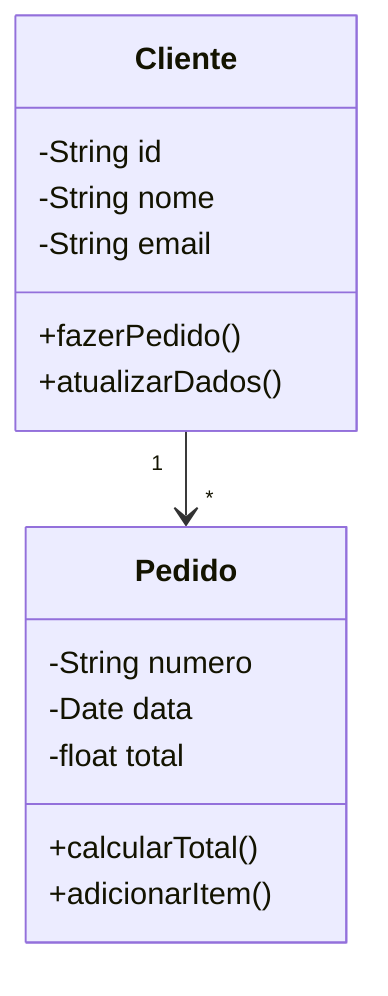
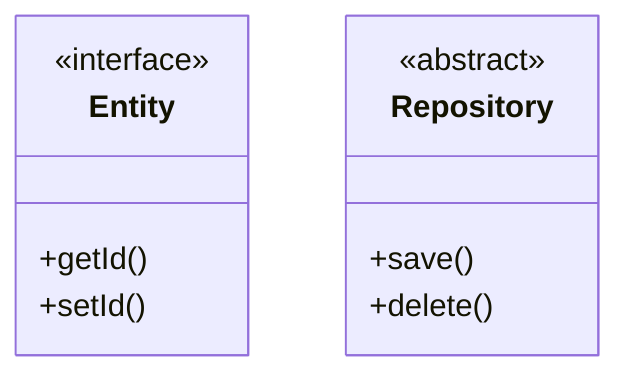

# Diagramas de Classe UML

Os diagramas de classe UML são fundamentais para modelagem orientada a objetos e podem ser usados como alternativa ou complemento aos modelos ER.

## Elementos Básicos

## Tipos de Relacionamentos

### 1. Associações
- Unidirecional
- Bidirecional
- Multiplicidade
- Papéis

### 2. Herança
- Generalização
- Especialização
- Abstração
- Polimorfismo

### 3. Dependências
- Uso
- Criação
- Implementação
- Realização

## Modelagem Avançada

### 1. Estereótipos

### 2. Restrições
- Invariantes
- Pré-condições
- Pós-condições
- Regras de negócio

### 3. Padrões
- Singleton
- Factory
- Observer
- Strategy

## Comparação com ER

### Semelhanças
- Modelagem estrutural
- Relacionamentos
- Atributos
- Restrições

### Diferenças
- Foco em comportamento
- Herança nativa
- Interfaces
- Métodos

## Melhores Práticas

### 1. Design
- Coesão alta
- Acoplamento baixo
- Encapsulamento
- Abstração adequada

### 2. Documentação
- Nomes claros
- Visibilidade correta
- Relacionamentos precisos
- Cardinalidade explícita

### 3. Manutenção
- Versionamento
- Refatoração
- Revisão
- Atualização

## Ferramentas de Suporte

### 1. Modelagem
- Enterprise Architect
- StarUML
- Visual Paradigm
- Lucidchart

### 2. Geração de Código
- Forward engineering
- Reverse engineering
- Round-trip engineering
- Templates