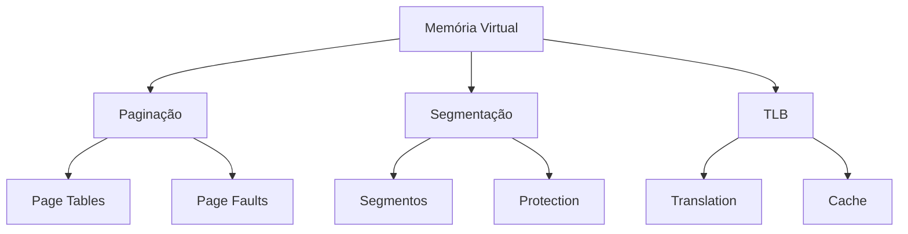
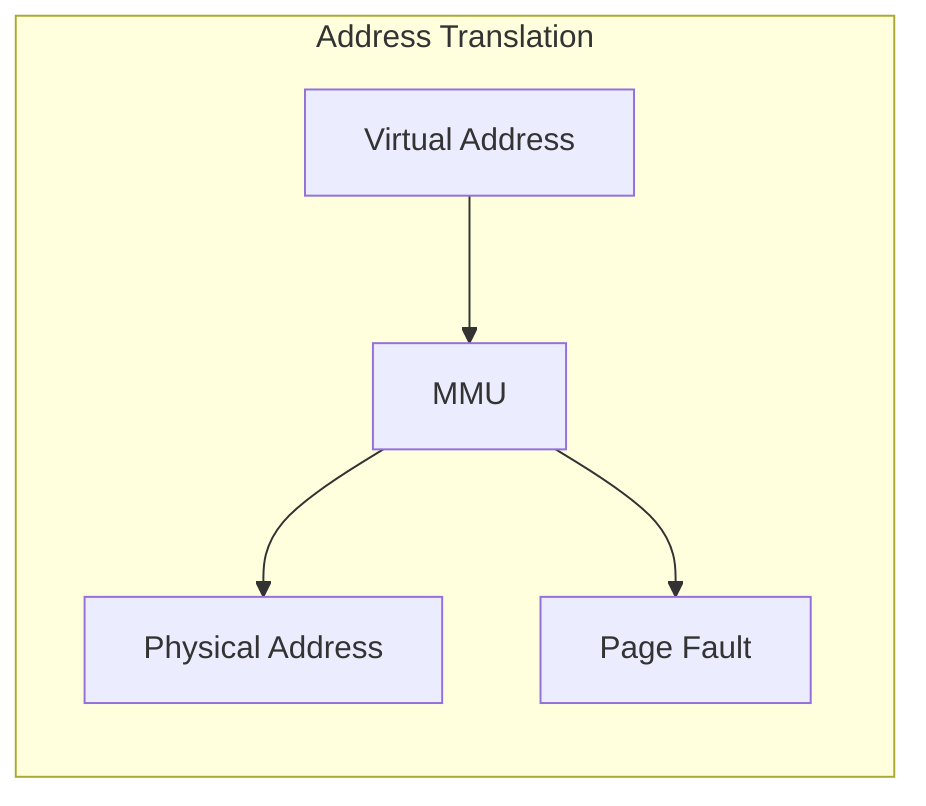
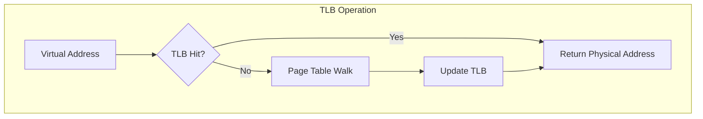
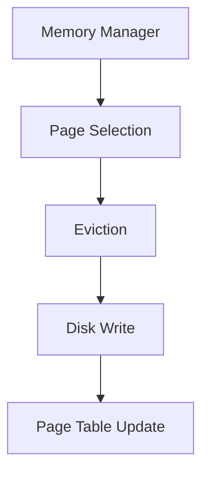
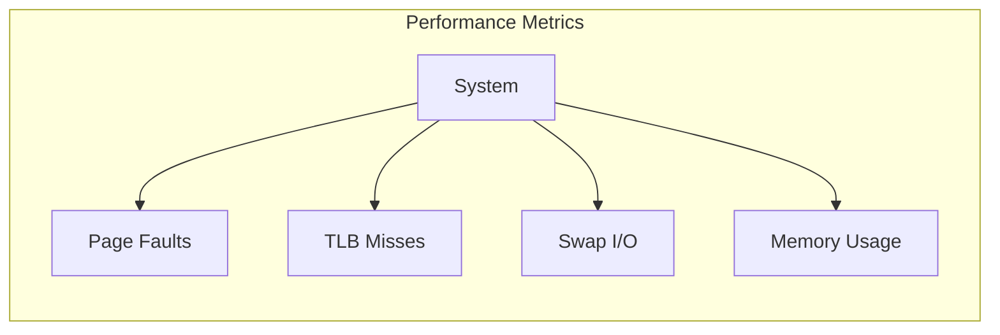
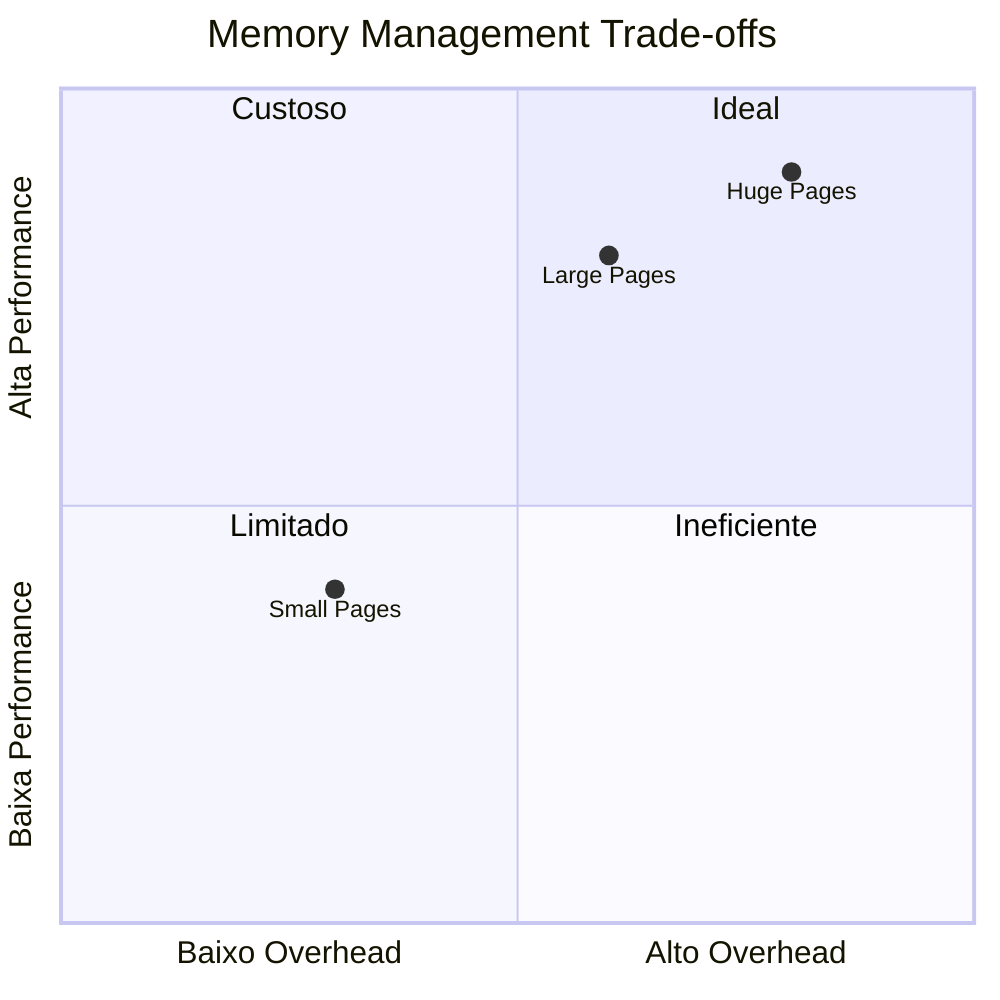
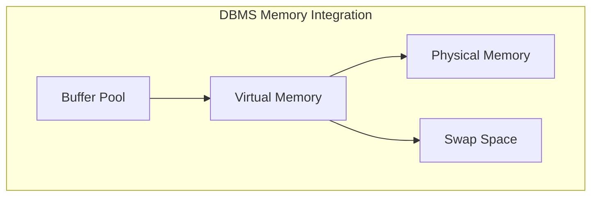
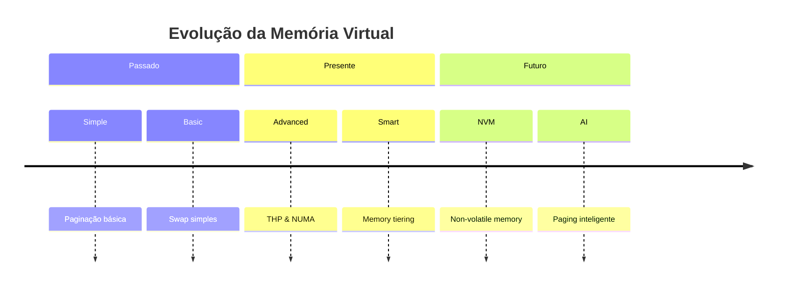

# Memória Virtual

A memória virtual é um componente essencial dos sistemas modernos de banco de dados, fornecendo uma abstração entre a memória física e o espaço de endereçamento utilizado pelos processos.



## Conceitos Fundamentais

### 1. Espaço de Endereçamento
- **Endereçamento Virtual**
  - Espaço linear
  - Independência de hardware
  - Isolamento de processos
  - Proteção de memória



### 2. Paginação
- **Estrutura**
  - Tamanho de página
  - Page frames
  - Page tables
  - Page directory

```java
class PageTable {
    private static final int PAGE_SIZE = 4096;
    private PageEntry[] entries;
    
    class PageEntry {
        long physicalAddress;
        boolean present;
        boolean dirty;
        boolean referenced;
        int protection;
    }
}
```

## Mecanismos de Tradução

### 1. TLB (Translation Lookaside Buffer)
- **Características**
  - Cache de traduções
  - Hit rate
  - Miss penalty
  - Flush operations



### 2. Page Fault Handling
```java
class PageFaultHandler {
    void handlePageFault(long virtualAddress) {
        // 1. Localizar página no disco
        Page page = findPageOnDisk(virtualAddress);
        
        // 2. Encontrar frame livre
        PhysicalFrame frame = findFreeFrame();
        
        // 3. Carregar página
        loadPage(page, frame);
        
        // 4. Atualizar page table
        updatePageTable(virtualAddress, frame);
    }
}
```

## Otimizações

### 1. Técnicas de Gerenciamento
- **Swapping**
  - Políticas de substituição
  - Priorização de páginas
  - Working set
  - Thrashing prevention



### 2. Performance Tuning
- **Estratégias**
  - Page size optimization
  - TLB coverage
  - Huge pages
  - Transparent huge pages

## Monitoramento

### 1. Métricas Importantes
- **Indicadores**
  - Page fault rate
  - TLB miss rate
  - Swap usage
  - Memory pressure



### 2. Ferramentas de Análise
```java
class MemoryMonitor {
    private MetricsCollector collector;
    
    public MemoryStats getStats() {
        return new MemoryStats(
            collector.getPageFaults(),
            collector.getTlbMisses(),
            collector.getSwapUsage(),
            collector.getMemoryPressure()
        );
    }
}
```

## Considerações de Design

### 1. Trade-offs
- **Balanceamento**
  - Tamanho de página
  - TLB coverage
  - Memory footprint
  - I/O overhead



### 2. Best Practices
- Memory alignment
- Page coloring
- NUMA awareness
- Transparent huge pages

## Integração com DBMS

### 1. Buffer Pool Management
- **Coordenação**
  - Page replacement
  - Buffer invalidation
  - Memory pressure handling
  - I/O scheduling



### 2. Otimizações Específicas
```java
class DBMemoryManager {
    private BufferPool bufferPool;
    private VirtualMemoryManager vmManager;
    
    public void optimizeMemory() {
        // Ajusta buffer pool baseado em pressão de memória
        long memoryPressure = vmManager.getMemoryPressure();
        if (memoryPressure > threshold) {
            bufferPool.shrink();
        }
    }
}
```

## Tendências Futuras

### 1. Inovações
- **Tecnologias Emergentes**
  - Non-volatile memory
  - Disaggregated memory
  - Memory compression
  - Smart paging



### 2. Direções Futuras
- AI/ML para predição de acesso
- Gerenciamento autônomo
- Integração com persistent memory
- Otimização dinâmica

## Conclusão
A memória virtual continua sendo um componente crítico em sistemas de banco de dados modernos, evoluindo constantemente para atender às demandas crescentes de performance e eficiência.